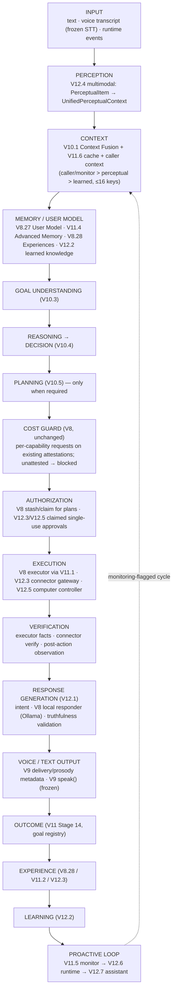

# DOOM Personal AI OS — Architecture

This is the authoritative map of the cognitive OS as of the completion program (branch `DOOM-V10`). Per-phase detail lives in the phase reports (`V11.*`, `V12.*`).

## 1. Pipeline

## 2. Entry points

| Entry | Path |
|---|---|
| `python doom.py` (voice) / dashboard | `core.commands.submit_user_input` → **default: V8 `doom_core.process_request`**; with `DOOM_COGNITIVE_OS=1`: `core.v12.doom_os.get_doom_os().handle_text()` |
| Library | `core.v12.doom_os.DoomOS` (facade), `core.v12.cognitive_orchestrator.process_v12_cognitive_cycle` |
| Proactive | `DoomOS.start(with_monitor=True)` / `DoomOS.tick()` |

`DoomOS.handle_text` routes every input either to the **declared-connector path** (deterministic `ToolSelector` proposal → `IntegrationGateway`) or to the **V12 cognitive cycle**. There is no third path.

## 3. Module map

| Layer | Modules |
|---|---|
| V8 foundation (frozen) | `orchestration/*` (executor, authorization, goal registry, experience store, user model, conversation responder), `proactive/*`, `core/cost_guard/*` |
| V9 voice (frozen) | `core/voice/*`, `core/cinematic_voice.py`; STT `core/stt/*` (frozen) |
| V10 cognition (frozen) | `core/v10/*` (context fusion, goal understanding, reasoning/decision, planning) |
| V11 execution/learning integration (frozen, tag `V11-FINAL-FREEZE`) | `core/v11/cognitive_orchestrator.py`, `execution_layer.py`, `experience_integration.py`, `advanced_memory.py`, `proactive_behavior.py` |
| V12 completion layers | `core/v12/response_intelligence.py` (12.1), `adaptive_learning.py` (12.2), `integrations/` (12.3), `multimodal.py` (12.4), `computer_interaction.py` (12.5), `runtime.py` (12.6), `proactive_assistant.py` (12.7), `cognitive_orchestrator.py` (V12 orchestrator), `doom_os.py` (facade) |

**Dependency rule (tested):** V10 and V11 never import V12, and there are no import cycles among `core/v10`, `core/v11` and `core/v12`.

**Single execution paths (tested):**
- Only `core.v11.execution_layer` calls the V8 executor.
- Only the V12.3 gateway calls `connector.execute`.
- Only the V12.5 controller drives a UI backend.
- Only `connectors.py` and `sandbox.py` use `subprocess`/`sqlite3`.

## 4. Invariants

1. **HARD $0:** the Cost Guard is consulted before any execution. Only existing LOCAL_FREE attestations allow (`ollama@localhost`, `local_filesystem`, `local_uia`, `postgres@localhost`, …). Unattested → blocked.
2. **Authorization:** any MEDIUM+ or mutating action needs an approval that is claimed by the user, single-use, bound to the exact plan or request, and TTL-limited. Knowing a hash is never sufficient for V12 approvals.
3. **Truthfulness:** no execution claims, execution IDs or experience records unless something actually executed. Verification is derived from executor facts. Responses never expose internal reasoning summaries.
4. **Isolation:** owner and session flow from trusted identities into every store (context, memory, learning, perception, approvals, outbox, inbox, audit).
5. **Autonomy limits:** proactive behaviour produces suggestions. Only LOW_RISK actions may run unattended, and only when the owner opts in. HIGH and IRREVERSIBLE actions always need explicit authorization (plus confirmation and verification for IRREVERSIBLE).
6. **Browser automation OFF.** Computer control acts only through a declared catalog with stale-screen detection and an emergency stop. The real desktop backend isn't enabled by V12.
7. **V9 and STT frozen:** V12 never constructs `VoiceEngine` or audio outputs; voice input arrives as STT transcripts.

## 5. Configuration (environment, never committed)

| Variable | Effect |
|---|---|
| `DOOM_COGNITIVE_OS=1` | route production input through the V12 unified OS (default: V8 core) |
| `DOOM_OWNER_ID`, `DOOM_SESSION_ID` | local owner and session (default `sujal` / `local`) |
| `DOOM_WORKSPACE_ROOT`, `DOOM_GIT_REPO`, `DOOM_SQLITE_DB` | enable the corresponding local connectors (unset = no access) |
| `DOOM_LEARNING_STORE_PATH` | persist learned knowledge (atomic local JSON) |
| `DOOM_CONTEXT_FUSION_DEBUG=1` | value-free Context Fusion diagnostics |
| `PROACTIVE_*` | existing V8 feature flags (local `.env`) |
