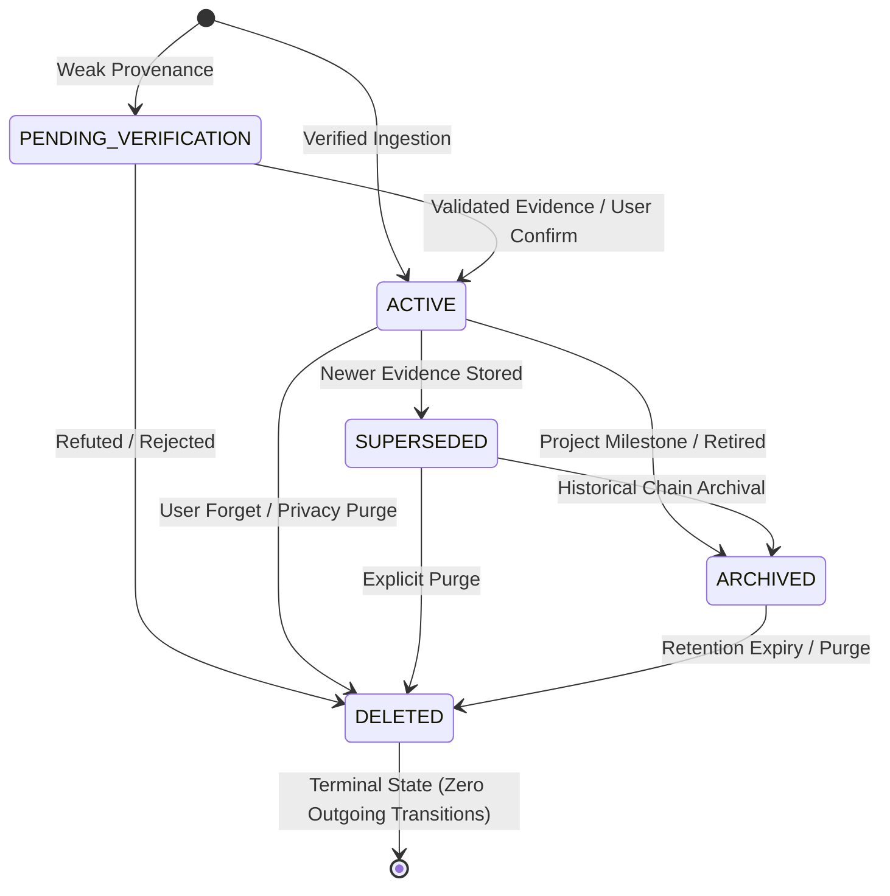

# DOOM V5.3.2 — ARCHITECTURE AUDIT & DESIGN SPECIFICATION
## State Machine & Transaction Engine Architecture

**Document Type**: Architectural & Forensic Design Specification Only (Read-Only Audit)  
**Target Release**: DOOM V5.3.2 — State Machine & Transaction Engine  
**Protected Baseline**: Branch `DOOM-V5.2` | Commit `353f1d479e99843e06c66e3064ff3b48a292cee4` (`353f1d4`) | Tag `v5.3.1`  
**Verified Baseline Test Suite**: **259 / 259 PASS (100%)** (234 Baseline Regression + 25 V5.3.1 Foundation)  
**Date**: September 2026  
**Author**: Principal Backend Engineer, Database Reliability Engineer, Distributed Systems Architect  

---

## 1. Executive Summary

DOOM V5.3.1 established the structural foundation of the Memory Lifecycle subsystem by codifying:
1. The 5 canonical lifecycle states (`PENDING_VERIFICATION`, `ACTIVE`, `SUPERSEDED`, `ARCHIVED`, `DELETED`).
2. A typed, sanitized exception hierarchy rooted at `MemoryLifecycleError`.
3. A declarative state transition matrix (`LIFECYCLE_TRANSITIONS`) with transition validation helpers.
4. An immutable audit event model (`MemoryLifecycleEvent`) and PostgreSQL table `memory_lifecycle_events` with indexing and foreign-key cascading.

However, forensic analysis of the V5.3.1 runtime confirms an essential architectural limitation: **state mutations and lifecycle audit event insertions currently occur in separate database transactions on independent connection lifecycles.** Furthermore, repository methods such as `update_status()` can be called directly without going through transition validation or generating audit records.

**DOOM V5.3.2 is the State Machine & Transaction Engine.** Its core mission is to promote PostgreSQL to the authoritative, ACID-compliant transactional boundary for all memory lifecycle operations. Under V5.3.2, every memory lifecycle transition must execute within an atomic transaction envelope:
$$\text{LOCK} \longrightarrow \text{READ CURRENT} \longrightarrow \text{VALIDATE} \longrightarrow \text{APPLY STATUS} \longrightarrow \text{LOG AUDIT} \longrightarrow \text{COMMIT}$$

If any step fails, the entire transition rolls back cleanly. Stale-state races, partial updates, and unrecorded status mutations become mathematically and physically impossible.

---

## 2. Baseline Verification

The architecture audit was conducted strictly against the verified, released V5.3.1 baseline:

```text
Active Branch:    DOOM-V5.2
HEAD Commit:      353f1d479e99843e06c66e3064ff3b48a292cee4 (Short: 353f1d4)
Git Tag:          v5.3.1 (Tag object: fd1b91fac1e363bf0bc7560f354f029464d3eb3a)
Regression Suite: 259 / 259 PASS (100%)
  - V5.2.6 Baseline Regression : 234 / 234 PASS
  - V5.3.1 Foundation Tests    :  25 /  25 PASS
Working Tree:     Clean across all tracked files
```

**ABSOLUTE AUDIT RULE**: Zero modifications to production source code, existing tests, database schemas, or Git history are performed during this audit.

---

## 3. Current Lifecycle Architecture Forensic Analysis

Forensic inspection of [`memory/lifecycle.py`](file:///c:/Users/dell/Desktop/DOOM/memory/lifecycle.py), [`memory/repository.py`](file:///c:/Users/dell/Desktop/DOOM/memory/repository.py), [`memory/manager.py`](file:///c:/Users/dell/Desktop/DOOM/memory/manager.py), and [`database/postgres_db.py`](file:///c:/Users/dell/Desktop/DOOM/database/postgres_db.py) reveals the following technical findings:

### 1. State Storage Location:
Lifecycle state is stored in the `status` column of the `memory_records` table (`VARCHAR(30) NOT NULL DEFAULT 'ACTIVE'`).

### 2. Status Mutation Function:
The sole low-level function that mutates state is `MemoryRepository.update_status(memory_id, new_status)` in `memory/repository.py` (lines 211–231).

### 3. Audit Event Persistence:
Audit events are inserted by `MemoryRepository.store_lifecycle_event(event)` in `memory/repository.py` (lines 395–445).

### 4. Connection Ownership:
`PostgresManager.get_connection()` checks out a connection from `psycopg2.pool.SimpleConnectionPool`. `PostgresManager.release_connection(conn)` returns it to the pool. Every repository method manages its own connection lifecycle independently.

### 5. Commit Ownership:
Every repository method contains an explicit `conn.commit()` followed by `pg.release_connection(conn)` inside a `try...except...finally` block. There is no mechanism in `PostgresManager` to pass an existing connection or transaction context across multiple repository calls.

### 6. Validation Bypass Vulnerability:
Callers can invoke `memory_repository.update_status(memory_id, status)` directly, bypassing:
- `validate_transition()`
- Canonical matrix guards
- Reason requirements
- `MemoryLifecycleEvent` generation
- Provenance checks

In fact, forensic inspection discovered an active bypass in production code:
In [`memory/manager.py`](file:///c:/Users/dell/Desktop/DOOM/memory/manager.py) line 160 (`store_and_supersede`):
```python
memory_repository.update_status(old_record.memory_id, MemoryStatus.SUPERSEDED)
```
This line bypasses `MemoryLifecycleManager`, skips `validate_transition()`, omits `supersedes_memory_id` linkage on the new record, and records **zero** lifecycle audit events.

### 7. Lifecycle Manager Role:
In V5.3.1, `MemoryLifecycleManager` acts merely as a procedural coordinator rather than a transactional engine. It validates in memory, then executes sequential calls across separate connections.

---

## 4. Lifecycle Mutation Call Graph

The forensic audit reveals multiple competing, non-atomic code paths for mutating memory status:

```text
PATH A (Canonical V5.3.1 Path — Non-Atomic Sequential Calls):
Caller
 └─► MemoryLifecycleManager.supersede() / archive() / delete() / activate_pending()
      ├─► memory_repository.get_by_id()           [Conn 1: SELECT (Commits/Releases)]
      ├─► validate_transition()                   [In-Memory CPU Validation]
      ├─► memory_repository.store(new_rec)        [Conn 2: INSERT (Commits/Releases)] (supersede only)
      ├─► memory_repository.update_status()       [Conn 3: UPDATE (Commits/Releases)]
      └─► memory_repository.store_lifecycle_event() [Conn 4: INSERT (Commits/Releases)]

PATH B (Direct Bypass via MemoryManager — Zero Validation & Zero Audit):
Caller
 └─► MemoryManager.store_and_supersede()
      ├─► memory_repository.find_conflicting_active() [Conn 1]
      ├─► MemoryManager.store(new_rec)               [Conn 2]
      └─► memory_repository.update_status()          [Conn 3: Direct UPDATE (No Audit Event!)]

PATH C (Direct Bypass via Repository — Zero Validation & Zero Audit):
Caller / External Script / Raw SQL
 └─► memory_repository.update_status()               [Conn 1: Direct UPDATE]

PATH D (Direct Database SQL Mutation — Zero Invariant Enforcement):
Database Operator / External Process
 └─► SQL: UPDATE memory_records SET status = 'ACTIVE' WHERE memory_id = ...
```

**Architectural Assessment**: Path B, C, and D violate single-source-of-truth invariants. In V5.3.2, all state mutations must converge into a single transactional engine entry point.

---

## 5. State Machine Analysis

The canonical state machine in V5.3.1 defines 5 formal states:
`PENDING_VERIFICATION`, `ACTIVE`, `SUPERSEDED`, `ARCHIVED`, `DELETED`.



### Forensic State Machine Findings:
1. **Sufficiency of the 5 States**: The 5 canonical states are necessary and sufficient for V5.3.2. No intermediate states (e.g. `MUTATING`, `LOCKED`, `PENDING_DELETION`) should be introduced into the relational schema. Concurrency state is ephemeral and belongs to PostgreSQL row locks, not persistent columns.
2. **Terminal Invariant**: `DELETED` has zero outgoing transitions. `validate_transition` raises `MemoryAlreadyDeletedError`.
3. **Database-Level Enforcement Gap**:
   - The PostgreSQL column `memory_records.status` is a `VARCHAR(30)` with no `CHECK` constraint.
   - An arbitrary string (e.g. `'CORRUPT_STATE'`) can currently be inserted via raw SQL.
   - **V5.3.2 Requirement**: Introduce a database-level `CHECK` constraint:
     `CHECK (status IN ('PENDING_VERIFICATION', 'ACTIVE', 'SUPERSEDED', 'ARCHIVED', 'DELETED'))`.

---

## 6. Transaction Boundary Analysis

In PostgreSQL, ACID guarantees require that all statements within an operation share a single logical transaction on the **same connection**:

```text
Current V5.3.1 Boundary (Broken / Split):
   Connection 1: [BEGIN] -> UPDATE memory_records SET status = 'SUPERSEDED' -> [COMMIT]
   Connection 2: [BEGIN] -> INSERT INTO memory_lifecycle_events -> [COMMIT]

Required V5.3.2 Boundary (Atomic):
   Connection 1:
   ┌────────────────────────────────────────────────────────┐
   │ BEGIN                                                  │
   │   SELECT ... FROM memory_records FOR UPDATE;           │
   │   [In-Engine Transition Validation]                    │
   │   UPDATE memory_records SET status = ..., updated_at.. │
   │   INSERT INTO memory_lifecycle_events (...);           │
   │ COMMIT                                                 │
   └────────────────────────────────────────────────────────┘
```

**Key Finding**: To implement atomic boundaries, `PostgresManager` or a dedicated `TransactionContext` must provide a scoped transaction manager that holds one connection throughout the transition and commits or rolls back atomically.

---

## 7. Atomicity Failure Modes

Because V5.3.1 executes status updates and audit inserts across independent connections, four critical failure modes exist:

| Failure Mode | Failure Trigger Point | Resulting Inconsistent State | Severity |
|--------------|-----------------------|------------------------------|----------|
| **FM-1: State Mutated, Audit Lost** | Crash or DB connection drop between status update and audit insert | `status = 'SUPERSEDED'`, but zero audit trail in `memory_lifecycle_events`. Lineage is broken. | **HIGH** |
| **FM-2: Audit Inserted, State Unchanged** | Status update rolled back or rejected, but audit insert executes independently | Audit record exists stating memory moved to `DELETED`, but record remains `ACTIVE` in `memory_records`. | **CRITICAL** |
| **FM-3: Supersession Orphan** | New record stored, but old record update fails | Both old and new records remain `ACTIVE`. Queries return conflicting, contradictory memories simultaneously. | **HIGH** |
| **FM-4: Re-Activation of Deleted Memory** | Concurrent update overwrites a `DELETED` status | A logically deleted memory is resurrected to `SUPERSEDED` or `ARCHIVED` due to lack of row locking. | **CRITICAL** |

V5.3.2 eliminates all four failure modes by enclosing the entire sequence within a single PostgreSQL transaction block.

---

## 8. Concurrency & Row Locking Analysis

### The Lost-Update / Out-of-Order Transition Race
Consider two concurrent worker threads ($W_1$ and $W_2$) operating on the same memory record $M$ currently in state `ACTIVE`:
1. $W_1$ reads $M$ (`ACTIVE`), intends to transition to `ARCHIVED`.
2. $W_2$ reads $M$ (`ACTIVE`), intends to transition to `DELETED`.
3. $W_1$ validates `ACTIVE -> ARCHIVED` (Permitted).
4. $W_2$ validates `ACTIVE -> DELETED` (Permitted).
5. $W_1$ writes `status = 'ARCHIVED'` and logs event `ACTIVE -> ARCHIVED`.
6. $W_2$ writes `status = 'DELETED'` and logs event `ACTIVE -> DELETED`.

**Consequences**:
- Two conflicting transitions from `ACTIVE` are committed to history.
- If $W_1$ commits after $W_2$, $M$ ends in state `ARCHIVED`, overwriting `DELETED` and violating terminal-state finality!

### Evaluation of Concurrency Strategies:

#### Strategy 1: Optimistic Concurrency Control (Version Column / Conditional Update)
`UPDATE memory_records SET status = %s WHERE memory_id = %s AND status = %s;`
- **Pros**: Zero lock contention during read phase.
- **Cons**: High retry rates under contention; requires complex application-level retry loops; does not protect against multi-row supersession races.

#### Strategy 2: Pessimistic Row Locking (`SELECT ... FOR UPDATE`) — **RECOMMENDED**
```sql
SELECT memory_id, status, confidence, importance, updated_at
FROM memory_records
WHERE memory_id = %s
FOR UPDATE;
```
- **Pros**:
  1. Guaranteed serialization at PostgreSQL kernel level.
  2. The locked state is guaranteed to be the most recent committed state.
  3. Eliminates all race conditions between read and write.
  4. Fully supported by PostgreSQL row-level locks without table locking.
- **Deadlock Prevention**:
  - Single-row transitions: Deadlocks are mathematically impossible.
  - Multi-row supersessions (locking $M_{old}$ and $M_{new}$): Enforce deterministic lock ordering:
    `ORDER BY memory_id ASC`.
  - Lock Timeout: Set `SET LOCAL lock_timeout = '3000ms';` to prevent indefinite thread starvation.

---

## 9. Canonical Transaction API Proposal

V5.3.2 must expose a single authoritative lifecycle transaction interface in `memory/lifecycle.py`:

```python
@dataclass(frozen=True)
class LifecycleTransitionResult:
    success: bool
    memory_id: str
    previous_status: MemoryStatus
    new_status: MemoryStatus
    event_id: Optional[str]
    transition_timestamp: str
    error: Optional[str] = None
    idempotent_replay: bool = False

class MemoryLifecycleEngine:
    """
    Authoritative ACID-compliant Memory Lifecycle State Machine & Transaction Engine.
    Single point of entry for all lifecycle status mutations in DOOM V5.3.2+.
    """

    def transition_memory(
        self,
        memory_id: str,
        target_status: Union[MemoryStatus, str],
        reason: str,
        actor: Union[LifecycleActor, str] = LifecycleActor.SYSTEM,
        source_event_id: Optional[str] = None,
        task_id: Optional[str] = None,
        correlation_id: Optional[str] = None,
        related_memory_id: Optional[str] = None,
        metadata: Optional[Dict[str, Any]] = None,
        idempotency_key: Optional[str] = None,
    ) -> LifecycleTransitionResult:
        """
        Execute an atomic, isolated lifecycle transition.
        Enforces:
          1. Row lock via SELECT FOR UPDATE
          2. Idempotency validation
          3. Matrix transition validation against current locked state
          4. Atomic UPDATE memory_records status
          5. Atomic INSERT memory_lifecycle_events
          6. Commit / Rollback isolation
        """
        ...
```

---

## 10. Idempotency Design

In distributed and agentic environments, task retries, timeout recoveries, and message redeliveries can cause duplicate transition calls.

### Idempotency Invariant:
A duplicate transition request must return a successful `LifecycleTransitionResult` (`idempotent_replay=True`) **without** performing a second state mutation and **without** generating a duplicate audit event.

### Idempotency Detection Protocol:
Within the locked transaction:
1. If `current_status == target_status`:
   - Inspect the latest audit event for `memory_id` in `memory_lifecycle_events`.
   - If `idempotency_key` (or `correlation_id` / `task_id`) matches the latest event, treat as **IDEMPOTENT REPLAY**.
   - Return `LifecycleTransitionResult(success=True, idempotent_replay=True, event_id=latest_event.event_id)`.
2. If `current_status == target_status` but NO matching idempotency key exists:
   - Raise `LifecycleValidationError("Memory is already in target state without idempotency correlation.")`.

---

## 11. Crash Recovery Design

The transaction engine must handle process crashes, OS terminations, and connection drops deterministically:

| Crash Point | System State upon Recovery | Recovery Mechanism |
|-------------|----------------------------|--------------------|
| **Crash before BEGIN** | Zero state changes | Safe: no action required |
| **Crash during lock / query** | Lock automatically released by PostgreSQL backend termination | Safe: connection drop cleans up transaction |
| **Crash after UPDATE, before AUDIT** | PostgreSQL uncommitted transaction aborted | Automatic WAL rollback: status update reverted |
| **Crash after AUDIT, before COMMIT** | PostgreSQL uncommitted transaction aborted | Automatic WAL rollback: both update and audit reverted |
| **Crash during COMMIT** | Either 100% committed or 100% rolled back by PostgreSQL engine | Atomic WAL boundary |
| **Crash during Post-Commit Side Effects** | Database state is 100% committed and consistent | Post-commit hooks (telemetry/broadcast) must be idempotent |

**Critical Invariant**: Post-commit side effects (such as WebSocket broadcasts or in-memory cache evictions) must **never** cause a committed database transaction to be re-run or invalidated.

---

## 12. Supersession Scope Boundary

In V5.3.1, supersession was executed as two separate calls.

### V5.3.2 Supersession Atomicity (1:1):
In V5.3.2, 1:1 supersession will be wrapped into a single atomic transaction:
```text
BEGIN
  1. SELECT FOR UPDATE on old_memory_id
  2. Validate old_memory_id.status == ACTIVE
  3. INSERT new_record into memory_records (supersedes_memory_id = old_memory_id)
  4. UPDATE memory_records SET status = 'SUPERSEDED' WHERE memory_id = old_memory_id
  5. INSERT INTO memory_lifecycle_events (memory_id = old_memory_id, ACTIVE -> SUPERSEDED, related_memory_id = new_memory_id)
COMMIT
```

### Explicitly Deferred to V5.3.4 (Out of Scope for V5.3.2):
- **DAG Traversal**: Traversing deep multi-hop supersession trees ($A \to B \to C \to D$).
- **Multi-Parent Consolidation**: Merging 3 records into 1 ($N:1$) or splitting 1 into 2 ($1:N$).
- **Cycle Detection**: Topological sorting or cycle detection algorithms.
- **Relationship Table**: Introducing `memory_relationships` join table.
- **Semantic Contradiction Scoring**: Embedding distance-based conflict detection.

---

## 13. Audit Immutability & Retention

### Re-evaluation of `ON DELETE CASCADE`:
In V5.3.1, `memory_lifecycle_events` was defined with:
`memory_id VARCHAR(100) NOT NULL REFERENCES memory_records(memory_id) ON DELETE CASCADE`.

### Architectural Determination:
1. **Current Risk**: Physical execution of `DELETE FROM memory_records` purges all corresponding audit history.
2. **Operational Reality**: DOOM uses logical deletion (`status = 'DELETED'`). Physical deletion is never executed during normal cognitive operation.
3. **V5.3.2 Recommendation**:
   - **Do NOT execute a destructive migration in V5.3.2.**
   - Enforce via application code and repository access controls that physical `DELETE` queries on `memory_records` are strictly forbidden outside of test teardown.
   - For long-term enterprise compliance (V5.3.7), evaluate transitioning the foreign key to `ON DELETE RESTRICT` or decoupling `memory_id` into an append-only immutable audit store.

---

## 14. Verification Provenance

### The Provenance Problem:
In V5.3.1, `(PENDING_VERIFICATION, ACTIVE)` has `reason_required = False`. This allows unverified memories to be promoted to active cognitive retrieval without recording verifiable provenance.

### V5.3.2 Enforcement Rule:
Every transition from `PENDING_VERIFICATION -> ACTIVE` must supply verifiable provenance:
1. **Actor Requirement**: Must be an authorized actor:
   - `LifecycleActor.USER`: User explicitly approved memory (e.g. "Yes, that is correct").
   - `LifecycleActor.TASK`: Ground truth verification confirmed by completed task execution.
   - `LifecycleActor.SYSTEM`: Automated corroboration threshold achieved.
2. **Provenance Field Requirement**:
   - If `actor == 'TASK'`: `task_id` or `source_event_id` **MUST** be present and non-empty.
   - If `actor == 'USER'`: `reason` **MUST** be provided (min 5 characters).
   - If neither condition is met, raise `LifecycleValidationError("Activation of pending memory requires verifiable task_id or user rationale.")`.

---

## 15. Security & Authority Analysis

### Zero Tool Authority:
The `MemoryLifecycleEngine` operates entirely within the internal memory persistence layer.
- It has **zero tool execution capability**.
- It cannot make network requests.
- It cannot execute arbitrary code.
- It cannot bypass RiskEngine or ApprovalEngine.

### Privilege Escalation Shield:
Because memory records influence LLM cognitive context, an attacker attempting prompt injection might seek to transition a malicious memory from `PENDING_VERIFICATION` to `ACTIVE`.
- By enforcing strict `actor` and `task_id` provenance checks, unauthorized cognitive promotions are prevented.
- Context fencing (`[DATA_ONLY]`) continues to neutralize any malicious instruction payload regardless of state.

---

## 16. Failure & Error Semantics

V5.3.2 formalizes canonical error classifications:

| Exception Class | Retryable? | Error Classification | Action Required |
|-----------------|------------|----------------------|-----------------|
| `InvalidLifecycleTransitionError` | **NO** | State Machine Invariant Violation | Reject operation; do not retry |
| `MemoryAlreadyDeletedError` | **NO** | Terminal State Violation | Reject operation; log security alert |
| `MemoryNotFoundError` | **NO** | Client / Data Error | Abort transition |
| `LifecycleValidationError` | **NO** | Parameter / Provenance Defect | Reject operation |
| `LifecycleAuditError` | **NO** | Security Blacklist Violation | Abort and alert (forbidden keys) |
| `ConcurrentModificationError` | **YES** | Concurrency Contention | Retry with exponential backoff |
| `LockTimeoutError` | **YES** | Contention / Slow Transaction | Retry after jittered delay |
| `DeadlockDetectedError` | **YES** | Transient Lock Ordering Collision | Immediate rollback and retry |
| `DatabaseConnectionError` | **YES** | Infrastructure Transient Fault | Pool reconnect and retry |

---

## 17. Observability Requirements

Every execution of `transition_memory()` must emit structured telemetry:
```json
{
  "event": "LIFECYCLE_TRANSITION",
  "memory_id": "mem_123abc",
  "previous_status": "ACTIVE",
  "new_status": "ARCHIVED",
  "actor": "USER",
  "event_id": "evt_789xyz",
  "task_id": "task_456",
  "correlation_id": "corr_999",
  "duration_ms": 1.45,
  "success": true,
  "idempotent_replay": false
}
```

### Telemetry Privacy Invariant:
**NEVER** log:
- Raw memory `content`
- Full prompt `query`
- Embedding vector arrays
- API keys, passwords, or tokens

---

## 18. Backward Compatibility Strategy

To ensure zero regressions across existing V5.1/V5.2/V5.3.1 callers:
1. **`MemoryLifecycleManager` (Preserved API)**:
   - Methods `supersede()`, `archive()`, `delete()`, `activate_pending()` remain public.
   - Internally, their implementations are refactored to delegate directly to `MemoryLifecycleEngine.transition_memory()`.
2. **`MemoryRepository.update_status()` (Encapsulated)**:
   - Marked `@deprecated`.
   - Refactored to delegate to `MemoryLifecycleEngine`, or restricted to internal transaction engine use.
3. **`MemoryManager.store_and_supersede()` (Bypass Fixed)**:
   - Updated to call `MemoryLifecycleEngine.transition_memory(old_id, SUPERSEDED, ...)` within the atomic transaction envelope.

---

## 19. Database Design Assessment

### Schema Requirements for V5.3.2:
- **Existing `memory_lifecycle_events` Table**: Sufficient for V5.3.2. All 16 columns and 4 indexes match transaction requirements.
- **Recommended DDL Additions**:
  1. Status check constraint:
     `ALTER TABLE memory_records ADD CONSTRAINT chk_memory_status CHECK (status IN ('PENDING_VERIFICATION', 'ACTIVE', 'SUPERSEDED', 'ARCHIVED', 'DELETED'));`
  2. Index on `memory_lifecycle_events(correlation_id)`: Accelerates idempotency lookups.

### Deferred to V5.3.4+:
- `memory_relationships` table (DAG architecture).
- Explicit version counter column (`version INTEGER DEFAULT 1`).

---

## 20. Performance Considerations

### Transaction Latency Budget:
- **Lock Acquisition (`SELECT ... FOR UPDATE`)**: $\approx 0.2 - 0.4\text{ ms}$ (local PostgreSQL).
- **In-Memory Validation**: $< 0.005\text{ ms}$.
- **Status Update**: $\approx 0.3 - 0.6\text{ ms}$.
- **Audit Insert**: $\approx 0.4 - 0.8\text{ ms}$.
- **Commit**: $\approx 0.5 - 1.2\text{ ms}$.
- **Total Expected Transition Latency**: **$1.5 - 3.0\text{ ms}$** on local NVMe storage.

### Benchmark Methodology:
Formal latency benchmarking must measure p50, p95, and p99 over 1,000 iterations under both zero-contention and multi-worker contention scenarios during V5.3.7.

---

## 21. V5.3.2 Test Strategy

A dedicated test suite [`test_v532_transaction_engine.py`](file:///c:/Users/dell/Desktop/DOOM/test_v532_transaction_engine.py) must be designed prior to implementation:

```text
TEST SUITE STRUCTURE:

PART 1: UNIT TESTS (In-Memory Validation & Engine Logic)
  - Canonical API argument validation
  - Actor & provenance verification rules
  - Idempotency key parsing
  - Error classification & hierarchy

PART 2: REAL POSTGRESQL ATOMIC INTEGRATION TESTS
  - Atomic state + audit commit verification
  - Rollback isolation (forced audit insert failure rolls back status update)
  - Missing memory handling (raises MemoryNotFoundError)
  - Terminal state rejection (DELETED cannot transition)
  - 1:1 atomic supersession (both records updated atomically)

PART 3: REAL POSTGRESQL CONCURRENCY & LOCK TESTS
  - Concurrent conflicting transitions on same record (Thread A: ARCHIVE vs Thread B: DELETE)
  - Verification of zero lost updates and zero contradictory audit histories
  - Lock timeout handling

PART 4: IDEMPOTENCY & CRASH SAFETY TESTS
  - Repeated identical transition requests return idempotent_replay=True
  - Idempotent request generates zero duplicate audit rows

PART 5: REGRESSION INVARIANTS
  - All 234 Baseline Tests PASS
  - All 25 V5.3.1 Tests PASS
  - Total 259 Tests remain 100% green
```

---

## 22. Required Architectural Invariants

| # | Invariant Description | Enforcement Mechanism |
|---|-----------------------|-----------------------|
| **INV-1** | Only valid lifecycle transitions are allowed | `validate_transition()` against canonical matrix |
| **INV-2** | State update and audit event commit atomically | Single PostgreSQL transaction envelope (`with conn:`) |
| **INV-3** | A failed transaction leaves state completely unchanged | PostgreSQL automatic WAL rollback |
| **INV-4** | Concurrent workers cannot produce contradictory transitions | Pessimistic row locking (`SELECT ... FOR UPDATE`) |
| **INV-5** | `DELETED` remains strictly terminal | `MemoryAlreadyDeletedError` raised before any SQL write |
| **INV-6** | Every committed transition has exactly one audit event | Single atomic transaction guarantees 1:1 coupling |
| **INV-7** | Duplicate requests are idempotent | Idempotency key check under row lock |
| **INV-8** | Post-commit side effects cannot alter transaction success | Executed strictly after successful `conn.commit()` |
| **INV-9** | Non-ACTIVE memories remain excluded from standard retrieval | `MemoryRetriever` SQL filter (`status = 'ACTIVE'`) |
| **INV-10**| Zero tool authority for lifecycle engine | Engine restricted to relational data persistence |
| **INV-11**| Zero sensitive content in audit events | Key-level blacklist + newline stripping |
| **INV-12**| 100% backward compatibility for existing callers | Wrapper delegation on legacy public APIs |

---

## 23. Explicit Scope Boundary

### In Scope for V5.3.2:
- Authoritative `MemoryLifecycleEngine.transition_memory()` API.
- PostgreSQL connection & transaction context manager.
- Atomic state update + audit insert within single transaction envelope.
- Pessimistic row locking (`SELECT ... FOR UPDATE`) with lock timeouts.
- Idempotency deduplication protocol.
- Provenance enforcement for pending verification promotions.
- Error taxonomy and classification.
- Refactoring `MemoryLifecycleManager` and `MemoryManager` to eliminate bypasses.

### Out of Scope for V5.3.2 (Strictly Deferred):
- Vector synchronization & reconciliation (Deferred to **V5.3.3**).
- Supersession DAG traversal & relationship tables (Deferred to **V5.3.4**).
- Freshness scoring & confidence evolution (Deferred to **V5.3.5**).
- Project milestone lifecycle management (Deferred to **V5.3.6**).
- Chaos engineering & final benchmarking (Deferred to **V5.3.7**).

---

## 24. Implementation Phase Plan

To minimize blast radius and ensure continuous regression passing, V5.3.2 should be executed in 5 strictly bounded sub-phases:

```text
┌────────────────────────────────────────────────────────┐
│ V5.3.2.1: Transaction Infrastructure & Connection Scoping│
│  - Objective: Add transactional context manager to DB  │
│  - Files: database/postgres_db.py                      │
│  - Deliverable: Isolated connection transaction helper │
└──────────────────────────┬─────────────────────────────┘
                           │
┌──────────────────────────▼─────────────────────────────┐
│ V5.3.2.2: Authoritative Transaction Engine Core         │
│  - Objective: Implement MemoryLifecycleEngine          │
│  - Files: memory/lifecycle.py                          │
│  - Deliverable: transition_memory() with row locking   │
└──────────────────────────┬─────────────────────────────┘
                           │
┌──────────────────────────▼─────────────────────────────┐
│ V5.3.2.3: Atomic 1:1 Supersession & Provenance          │
│  - Objective: Atomic supersession & activation guards  │
│  - Files: memory/lifecycle.py, memory/repository.py    │
│  - Deliverable: Single-transaction supersession       │
└──────────────────────────┬─────────────────────────────┘
                           │
┌──────────────────────────▼─────────────────────────────┐
│ V5.3.2.4: Compatibility Refactoring & Bypass Closure   │
│  - Objective: Route MemoryLifecycleManager & Manager   │
│  - Files: memory/manager.py, memory/lifecycle.py       │
│  - Deliverable: Zero un-audited status update paths    │
└──────────────────────────┬─────────────────────────────┘
                           │
┌──────────────────────────▼─────────────────────────────┐
│ V5.3.2.5: Concurrency Hardening & Acceptance Testing   │
│  - Objective: Multi-threaded stress tests & regression │
│  - Files: test_v532_transaction_engine.py              │
│  - Deliverable: 259/259 baseline + V5.3.2 suite PASS   │
└────────────────────────────────────────────────────────┘
```

---

## 25. Acceptance Criteria

V5.3.2 implementation shall be accepted if and only if:
1. **Atomicity**: Intentional fault injection during audit insert proves that status update is rolled back 100% of the time.
2. **No Orphan Audits**: Zero audit events exist without corresponding status changes.
3. **Concurrency Safety**: Concurrent conflicting worker threads produce deterministic, serialized state transitions with zero lost updates.
4. **Terminal Finality**: A `DELETED` memory cannot be transitioned under any concurrency condition.
5. **Idempotency**: Identical retry requests return success with `idempotent_replay=True` and zero duplicate audit records.
6. **Bypass Closure**: `MemoryManager.store_and_supersede()` generates audit events and links `supersedes_memory_id`.
7. **Regression Invariant**: All 234 baseline regression tests and all 25 V5.3.1 tests pass (259/259 PASS).
8. **New Test Suite**: Dedicated `test_v532_transaction_engine.py` passes 100%.

---

## 26. Risks & Open Architectural Decisions

| # | Risk Description | Proposed Mitigation |
|---|------------------|---------------------|
| **R-1** | Lock Contention on High-Frequency Memory Updates | Keep transaction blocks minimal ($< 5\text{ ms}$); execute zero LLM or embedding operations inside transaction. |
| **R-2** | Deadlock during Multi-Row Supersession | Enforce strict alphabetical row locking order (`ORDER BY memory_id ASC`). |
| **R-3** | Audit Table Storage Growth | Schema is compact ($\approx 200\text{ bytes/row}$); V5.3.1 indexes ensure performant filtering. |
| **R-4** | Connection Pool Depletion | Explicit `release_connection()` in `finally` blocks ensures connections return to pool immediately. |

---

## 27. Final Architecture Verdict

### **APPROVED — READY FOR V5.3.2 IMPLEMENTATION**

The architectural design for **DOOM V5.3.2 — State Machine & Transaction Engine** is complete, technically sound, and fully specified. It eliminates all identified atomicity gaps from V5.3.1 while maintaining 100% backward compatibility and strictly respecting the boundaries of future V5.3 phases.
