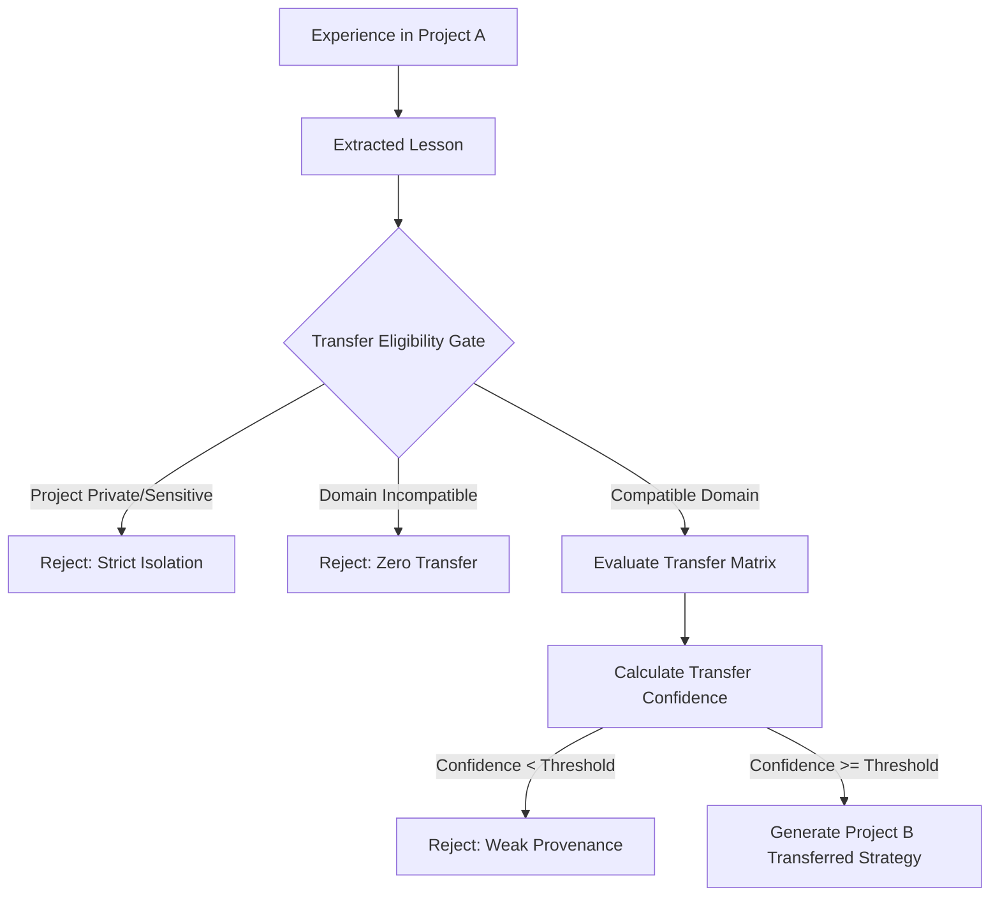

# DOOM V5.3.6 — ARCHITECTURE AUDIT REPORT
## Project & Experience Intelligence
### Forensic Architectural Specification & Design Review

**Author**: Principal Architect and Forensic Reliability Engineer  
**Date**: September 7, 2026  
**Status**: ARCHITECTURE AUDIT ONLY — READ-ONLY DESIGN SPECIFICATION  
**Protected Baseline**: DOOM V5.3.5 (`8b6a5c8e7720a7d144e20423cea544f0bfea0d5d`, tag `v5.3.5`, branch `DOOM-V5.2`)  
**Baseline Test Invariant**: 413 / 413 PASS (100%)  
**Policy Enforcement**: STRICT READ-ONLY. NO CODE MODIFICATIONS, NO MIGRATIONS, NO COMMITS, NO TAGS, NO PUSHES.

---

## 1. Executive Summary

DOOM V5.3.5 achieved a robust epistemic memory foundation with continuous confidence updates ($C \in [0.01, 1.00]$), continuous semantic freshness decay ($F(t)$), asymmetric Bayesian damping ($\alpha=0.25, \beta=0.50$), normalized empirical evidence tracking (`memory_evidence`), and anti-self-confirmation invariants. However, memory in V5.3.5 remains atomic and passive: memories describe isolated facts or generic historical strings, tasks are discarded unless completely successful, `project_id` is an unvalidated string literal, and DOOM cannot systematically extract reusable procedural strategies, record negative failure warnings, or generalize learned execution patterns across distinct project boundaries.

**DOOM V5.3.6 ("Project & Experience Intelligence")** elevates DOOM from an episodic memory logger into an autonomous learning and world-modeling operating system. It introduces:
1. **First-Class Project System**: Normalized project entities (`projects`), hierarchical domains, boundary configurations, and project-isolated namespaces.
2. **Structured Experience Engine**: Grounded experience capture (`experiences`) recording complete task contexts, environmental conditions, attempted action sequences, tool selections, and verifiable outcomes across all result states (`SUCCESS`, `PARTIAL_SUCCESS`, `FAILURE`, `ABORTED`).
3. **Negative Experience & Failure Intelligence**: Explicit modeling of "What did NOT work?", capturing error signatures, root causes, and generating defensive avoidance heuristics.
4. **Lesson & Strategy Extraction Pipeline**: Disciplined multi-experience consolidation that generalizes concrete execution traces into abstract, reusable strategies without hallucination or LLM self-corroboration.
5. **Cross-Project Transfer Matrix**: A mathematically bounded transfer evaluation engine that calculates semantic, structural, and environmental compatibility before allowing strategies learned in Project A to inform planning in Project B.
6. **Anti-Feedback & Epistemic Preservation**: Absolute enforcement that retrieval frequency does not inflate strategy importance ($\partial I/\partial N_{retrieval} = 0$), model generation cannot self-validate experience, and transfer candidates require empirical ground-truth corroboration.

---

## 2. Baseline Verification

The protected baseline was verified via git and regression suite inspection:

```bash
$ git branch --show-current
DOOM-V5.2

$ git log -1 --oneline
8b6a5c8 feat(memory): release DOOM V5.3.5 memory evolution

$ git tag --points-at HEAD
v5.3.5

$ git status --short
?? DOOM_V5.1_IMPLEMENTATION_REPORT.md
?? DOOM_V5.2_ARCHITECTURE_DESIGN.md
?? DOOM_V5.3_ARCHITECTURE_AUDIT.md
?? V5.1_FINAL_FORENSIC_AUDIT.md
?? V5.1_FINAL_MEMORY_AUDIT.md
```

- **Branch**: `DOOM-V5.2` (Protected)
- **Commit**: `8b6a5c8e7720a7d144e20423cea544f0bfea0d5d`
- **Tag**: `v5.3.5`
- **Baseline Test Corpus**: 413 / 413 PASS (366 baseline + 47 V5.3.5 dedicated)
- **Working Tree State**: Pure clean working tree with zero code modifications.

---

## 3. Current V5.3.5 Foundation Analysis

A forensic audit of V5.3.5 source code identified the exact structural foundation and architectural gaps:

### What V5.3.5 Provides
1. **Normalized Memory Records (`memory_records`)**: Supports `confidence_score` ($[0.01, 1.0]$), `importance` ($[0.0, 1.0]$), `last_confirmed_at`, `freshness_class`, and `is_foundational`.
2. **Empirical Evidence Table (`memory_evidence`)**: Structured observation capture, SHA-256 observation hashing, source reliability weighting, and idempotency key enforcement.
3. **Evolution Audit Trail (`memory_evolution_events`)**: Immutable delta tracking for every confidence and importance shift.
4. **Relationship Intelligence (`memory_relationships`)**: Directed typed graph links (`SUPERSEDES`, `CONFLICTS_WITH`, `RELATED_TO`, `DUPLICATE_OF`, `DERIVED_FROM`).
5. **Context Fencing (`MemoryContextFencer`)**: Fail-closed data-only demarcation preventing prompt injection from stored memories.
6. **Vector Outbox Engine (`vector_sync_queue`)**: Monotonic generation tracking ensuring metadata evolution does not re-embed or trigger stale-worker overwrites.

### Architectural Gaps in V5.3.5
1. **Unvalidated `project_id`**: In `memory_records`, `project_id` is an unconstrained `VARCHAR(100)` field. In `core/cognition/bridge.py:621`, it is hardcoded to `"doom"`. Projects have no metadata, active status, repository paths, tech stacks, or boundary rules.
2. **Disregard of Failed & Partial Tasks**: In `bridge.py:613`, only tasks where `final_response_status == SUCCESS` and `task_verified == True` invoke `write_experience()`. Failed, crashed, or partially successful tasks are completely discarded. DOOM has total amnesia regarding failure modes.
3. **Unstructured String Experience**: `write_experience()` flattens execution into a single prose string:
   `Task: '{goal}' completed using {tools}. Outcome: {outcome}`.
   Crucial execution telemetry—arguments, error messages, environment states, tool sequences, and verification diffs—is lost.
4. **No Lesson or Strategy Abstraction**: There is no distinction between a specific execution instance and an abstract reusable method.
5. **No Cross-Project Transfer Engine**: Memories with `project_id = 'A'` are either strictly filtered out or leaked unsafely if queries omit project filters. There is no concept of assessing whether a pattern from Project A is safe to apply in Project B.

---

## 4. Project Model

V5.3.6 requires a first-class, normalized relational Project Model. Projects cannot remain casual string tags.

### Entity Specification: `projects`
```sql
CREATE TABLE projects (
    project_id VARCHAR(64) PRIMARY KEY,
    name VARCHAR(128) NOT NULL,
    description TEXT NOT NULL DEFAULT '',
    root_path VARCHAR(512),
    git_remote VARCHAR(512),
    tech_stack JSONB NOT NULL DEFAULT '[]',
    lifecycle_status VARCHAR(32) NOT NULL DEFAULT 'ACTIVE', -- ACTIVE, ON_HOLD, COMPLETED, ARCHIVED
    privacy_class VARCHAR(32) NOT NULL DEFAULT 'NORMAL',   -- NORMAL, PRIVATE, SENSITIVE
    parent_project_id VARCHAR(64) REFERENCES projects(project_id) ON DELETE SET NULL,
    metadata JSONB NOT NULL DEFAULT '{}',
    created_at TIMESTAMP WITH TIME ZONE NOT NULL DEFAULT CURRENT_TIMESTAMP,
    updated_at TIMESTAMP WITH TIME ZONE NOT NULL DEFAULT CURRENT_TIMESTAMP,
    CONSTRAINT chk_project_status CHECK (lifecycle_status IN ('ACTIVE', 'ON_HOLD', 'COMPLETED', 'ARCHIVED')),
    CONSTRAINT chk_project_privacy CHECK (privacy_class IN ('NORMAL', 'PRIVATE', 'SENSITIVE'))
);

CREATE INDEX idx_projects_status ON projects(lifecycle_status);
CREATE INDEX idx_projects_parent ON projects(parent_project_id);
```

### Architectural Guarantees
- **Strict Identity**: Every project has a stable canonical identifier (e.g., `doom-core`, `aegis-firewall`, `finance-ledger`).
- **Hierarchy & Sub-projects**: `parent_project_id` allows domain groupings (e.g., `doom-ai/memory`, `doom-ai/audio`).
- **Boundary Configuration**: Metadata declares dependencies, language ecosystems (e.g., `["python", "postgresql", "fastapi"]`), and operational boundaries.
- **Privacy Gating**: If a project is `PRIVATE` or `SENSITIVE`, all associated memories and experiences inherit this floor.

---

## 5. Experience Model

An **Experience** is an immutable, structured historical record of an actual task execution attempt. It represents empirical reality, not theoretical opinion.

### Entity Specification: `experiences`
```sql
CREATE TABLE experiences (
    experience_id VARCHAR(64) PRIMARY KEY,
    task_id VARCHAR(64) NOT NULL,
    project_id VARCHAR(64) NOT NULL REFERENCES projects(project_id) ON DELETE RESTRICT,
    goal_intent TEXT NOT NULL,
    context_conditions JSONB NOT NULL DEFAULT '{}',  -- OS, runtime, packages, branch, initial state
    strategy_applied JSONB NOT NULL DEFAULT '{}',     -- planned steps, tool sequence, parameters
    execution_trace JSONB NOT NULL DEFAULT '[]',     -- ordered tool calls and observed outputs
    outcome_status VARCHAR(32) NOT NULL,             -- SUCCESS, PARTIAL_SUCCESS, FAILURE, ABORTED
    outcome_metrics JSONB NOT NULL DEFAULT '{}',     -- latency_ms, tool_count, retry_count, exit_code
    error_signature VARCHAR(256),                    -- normalized exception class or error pattern
    root_cause_analysis TEXT,                        -- grounded explanation of why it failed/succeeded
    verification_evidence JSONB NOT NULL DEFAULT '{}',-- disk check, test exit code, ground truth diff
    confidence_score DOUBLE PRECISION NOT NULL DEFAULT 0.50,
    importance DOUBLE PRECISION NOT NULL DEFAULT 0.50,
    privacy_class VARCHAR(32) NOT NULL DEFAULT 'NORMAL',
    created_at TIMESTAMP WITH TIME ZONE NOT NULL DEFAULT CURRENT_TIMESTAMP,
    CONSTRAINT chk_exp_outcome CHECK (outcome_status IN ('SUCCESS', 'PARTIAL_SUCCESS', 'FAILURE', 'ABORTED')),
    CONSTRAINT chk_exp_conf_range CHECK (confidence_score >= 0.01 AND confidence_score <= 1.00),
    CONSTRAINT chk_exp_imp_range CHECK (importance >= 0.00 AND importance <= 1.00),
    CONSTRAINT chk_exp_privacy CHECK (privacy_class IN ('NORMAL', 'PRIVATE', 'SENSITIVE'))
);

CREATE INDEX idx_experiences_project_outcome ON experiences(project_id, outcome_status);
CREATE INDEX idx_experiences_task ON experiences(task_id);
CREATE INDEX idx_experiences_error_sig ON experiences(error_signature) WHERE error_signature IS NOT NULL;
```

### Architectural Guarantees
- **Immutability**: Experiences represent factual history; once written, their execution traces cannot be retroactively modified.
- **Rich Context**: Captures environmental preconditions, enabling DOOM to determine *why* a method worked in one environment but failed in another.
- **Direct Linkage to Evidence**: Every experience automatically records a supporting or contradicting row in `memory_evidence`.

---

## 6. Outcome Model

V5.3.6 establishes four explicit outcome states:

1. **`SUCCESS`**:
   - Verification passed completely (`GroundTruthVerifier.verify == True`).
   - All acceptance criteria satisfied.
   - Positively corroborates the strategy applied.
2. **`PARTIAL_SUCCESS`**:
   - Primary goal achieved but with non-fatal warnings, retries, or partial sub-goal failure.
   - Highlights boundary limitations of the strategy.
3. **`FAILURE`**:
   - Task terminated with an error, exit code $\ne 0$, timeout, or failed verification.
   - Generates negative experience intelligence and error signatures.
4. **`ABORTED`**:
   - Task cancelled by user intervention, safety circuit breaker, or environmental constraint violation.
   - Documents operational boundaries and user-imposed constraints.

---

## 7. Lesson Model

A **Lesson** is a distilled, synthesized piece of conceptual knowledge derived from one or more experiences. It abstracts concrete variables (file paths, specific IDs) into reusable principles.

### Entity Specification: `lessons`
```sql
CREATE TABLE lessons (
    lesson_id VARCHAR(64) PRIMARY KEY,
    title VARCHAR(256) NOT NULL,
    summary TEXT NOT NULL,
    domain VARCHAR(64) NOT NULL,                     -- database, async_io, docker, packaging, etc.
    scope VARCHAR(32) NOT NULL DEFAULT 'PROJECT',     -- PROJECT_LOCAL, CROSS_PROJECT_ELIGIBLE, UNIVERSAL
    prerequisites JSONB NOT NULL DEFAULT '[]',       -- required tools, OS, libraries
    anti_patterns JSONB NOT NULL DEFAULT '[]',       -- explicitly what NOT to do
    supporting_experience_count INT NOT NULL DEFAULT 1,
    contradicting_experience_count INT NOT NULL DEFAULT 0,
    confidence_score DOUBLE PRECISION NOT NULL DEFAULT 0.60,
    importance DOUBLE PRECISION NOT NULL DEFAULT 0.50,
    freshness_class VARCHAR(32) NOT NULL DEFAULT 'PROJECT_STABLE',
    last_confirmed_at TIMESTAMP WITH TIME ZONE NOT NULL DEFAULT CURRENT_TIMESTAMP,
    created_at TIMESTAMP WITH TIME ZONE NOT NULL DEFAULT CURRENT_TIMESTAMP,
    updated_at TIMESTAMP WITH TIME ZONE NOT NULL DEFAULT CURRENT_TIMESTAMP,
    CONSTRAINT chk_lesson_scope CHECK (scope IN ('PROJECT_LOCAL', 'CROSS_PROJECT_ELIGIBLE', 'UNIVERSAL')),
    CONSTRAINT chk_lesson_conf CHECK (confidence_score >= 0.01 AND confidence_score <= 1.00),
    CONSTRAINT chk_lesson_imp CHECK (importance >= 0.00 AND importance <= 1.00)
);

CREATE INDEX idx_lessons_domain_scope ON lessons(domain, scope);
```

### Extraction Invariants
- **Evidence Threshold**: A Lesson cannot be created from pure LLM speculation. It must cite at least one verified `experience_id`.
- **Confidence Calibration**: A lesson derived from a single experience starts at $C \le 0.60$. It requires multiple corroborating experiences across distinct tasks to achieve $C \ge 0.80$.
- **Anti-Pattern Mandatory Field**: Every lesson derived from a `FAILURE` experience must explicitly populate `anti_patterns`.

---

## 8. Strategy Model

A **Strategy** is an actionable execution template (a repeatable procedure) that DOOM's CognitiveEngine can adopt during planning.

### Entity Specification: `strategies`
```sql
CREATE TABLE strategies (
    strategy_id VARCHAR(64) PRIMARY KEY,
    name VARCHAR(128) NOT NULL,
    intent_category VARCHAR(64) NOT NULL,            -- db_migration, onnx_inference, test_isolation
    procedure_template JSONB NOT NULL,               -- ordered abstract steps and fallback steps
    recommended_tools JSONB NOT NULL DEFAULT '[]',
    disallowed_tools JSONB NOT NULL DEFAULT '[]',
    environmental_preconditions JSONB NOT NULL DEFAULT '{}',
    total_attempts INT NOT NULL DEFAULT 0,
    successful_attempts INT NOT NULL DEFAULT 0,
    failed_attempts INT NOT NULL DEFAULT 0,
    reliability_score DOUBLE PRECISION NOT NULL DEFAULT 0.50,
    is_deprecated BOOLEAN NOT NULL DEFAULT FALSE,
    deprecation_reason TEXT,
    created_at TIMESTAMP WITH TIME ZONE NOT NULL DEFAULT CURRENT_TIMESTAMP,
    updated_at TIMESTAMP WITH TIME ZONE NOT NULL DEFAULT CURRENT_TIMESTAMP,
    CONSTRAINT chk_strat_rel CHECK (reliability_score >= 0.00 AND reliability_score <= 1.00)
);

CREATE INDEX idx_strategies_category ON strategies(intent_category);
```

### Separation of Concerns
$$\text{Experience (Concrete What Happened)} \implies \text{Lesson (Why It Happened)} \implies \text{Strategy (How to Do It Next Time)}$$

DOOM must never collapse these three layers. An experience is historical data; a lesson is epistemic understanding; a strategy is procedural guidance.

---

## 9. Negative Experience Model ("What NOT to Do")

Learning from failure is critical for real autonomy. When a task fails, V5.3.6 captures:
1. **Error Signature Normalization**: Extracted canonical error (e.g., `PostgresLockTimeout`, `ONNXRuntimeProviderUnavailable`, `WinError_FileInUse`).
2. **Defensive Warning Generation**: When DOOM plans a similar task, negative experiences inject defensive constraints:
   - "Do NOT run suite X immediately after suite Y without intervening database cleanup."
   - "Do NOT call async subagent without setting Early Termination condition."
3. **Contradiction Feedback**: If an attempted strategy results in a `FAILURE`, its `reliability_score` is penalized via the V5.3.5 $\beta=0.50$ degradation rule.

---

## 10. Cross-Project Transfer Architecture

Cross-project transfer allows lessons learned in Project A (e.g., `DOOM-V5`) to benefit Project B (e.g., `Aegis-Firewall`). However, naive transfer causes catastrophic hallucination and context pollution.

### Controlled Transfer Pipeline


### Transfer Confidence Formulation
$$C_{transfer} = C_{source} \cdot S_{semantic} \cdot S_{tech\_stack} \cdot S_{environment} \cdot \left(1.0 - P_{risk}\right)$$
- $C_{source}$: Verified confidence score in source project.
- $S_{semantic} \in [0, 1]$: Cosine similarity between project domain embeddings.
- $S_{tech\_stack} \in [0, 1]$: Jaccard similarity between tech stack dependencies.
- $S_{environment} \in [0, 1]$: Compatibility between runtime operating systems and toolsets.
- $P_{risk} \in [0, 1]$: Penalty for differences in project scale, security constraints, or unverified assumptions.

---

## 11. Transfer Matrix Specification

To prevent ad-hoc cross-project leakage, transfers must be recorded in an audited relational table:

### Entity Specification: `project_transfer_matrix`
```sql
CREATE TABLE project_transfer_matrix (
    transfer_id VARCHAR(64) PRIMARY KEY,
    source_project_id VARCHAR(64) NOT NULL REFERENCES projects(project_id),
    target_project_id VARCHAR(64) NOT NULL REFERENCES projects(project_id),
    lesson_id VARCHAR(64) NOT NULL REFERENCES lessons(lesson_id),
    strategy_id VARCHAR(64) REFERENCES strategies(strategy_id),
    semantic_similarity DOUBLE PRECISION NOT NULL,
    tech_stack_overlap DOUBLE PRECISION NOT NULL,
    transfer_confidence DOUBLE PRECISION NOT NULL,
    status VARCHAR(32) NOT NULL DEFAULT 'EVALUATED', -- EVALUATED, APPROVED, REJECTED, SUPERSEDED
    rejection_reason TEXT,
    created_at TIMESTAMP WITH TIME ZONE NOT NULL DEFAULT CURRENT_TIMESTAMP,
    CONSTRAINT chk_transfer_status CHECK (status IN ('EVALUATED', 'APPROVED', 'REJECTED', 'SUPERSEDED'))
);

CREATE INDEX idx_transfer_matrix_pair ON project_transfer_matrix(source_project_id, target_project_id);
```

---

## 12. Experience Graph Relationships

V5.3.6 leverages the existing V5.3.4 `memory_relationships` infrastructure by declaring new relationship types:

| Relationship Type | Source Entity | Target Entity | Semantics |
|---|---|---|---|
| `EXTRACTED_FROM` | `Lesson` | `Experience` | Identifies the empirical experience generating the lesson. |
| `IMPLEMENTS` | `Strategy` | `Lesson` | Identifies the abstract lesson executed by the strategy. |
| `APPLIED_TO` | `Experience` | `Project` | Binds an execution trace to a specific project. |
| `TRANSFERRED_TO` | `Strategy` | `Project` | Records authorized transfer of a strategy to a new project. |
| `CONTRADICTS_STRATEGY` | `Experience` | `Strategy` | Failure trace disproving or limiting a strategy. |
| `CORROBORATES_STRATEGY`| `Experience` | `Strategy` | Success trace confirming strategy effectiveness. |

Zero new graph engines are created; V5.3.4's cycle-detected traversal engine is reused directly.

---

## 13. Confidence Architecture

V5.3.6 maintains a single epistemic confidence scale across all entities:
1. **Experience Confidence**: Reflects the certainty of the observation ($C=1.00$ for automated tests with disk checks; $C=0.60$ for unverified heuristics).
2. **Strategy Reliability**: Dynamic Bayesian score tracking success ratio weighted by evidence:
   $$R = \frac{\sum_{i \in \text{Successes}} w_i}{\sum_{i \in \text{Successes}} w_i + 2.0 \cdot \sum_{j \in \text{Failures}} w_j}$$
   where $w$ is the evidence strength of each experience. Notice the $2.0$ failure penalty factor, matching V5.3.5's $\beta=0.50$ asymmetry.

---

## 14. Importance Architecture

Importance reflects strategic utility and failure severity:
- **Base Importance**: Set based on task criticality ($0.50$ standard, $0.80$ foundational).
- **Failure Severity Boost**: A catastrophic failure (data corruption, security violation) receives high importance ($I \ge 0.85$) to ensure the negative experience is never pruned.
- **Anti-Feedback Invariant**:
  $$\frac{\partial I}{\partial N_{retrieval}} = 0$$
  Retrieving a strategy 100 times during planning does NOT increase its importance by even $0.001$.

---

## 15. Freshness Architecture

Experience entities map cleanly to V5.3.5 freshness classes:
- **Universal Strategies**: `FOUNDATIONAL` (half-life $= 365\text{ days}$, floor $= 0.85$).
- **Project-Specific Knowledge**: `PROJECT_STABLE` (half-life $= 90\text{ days}$, floor $= 0.50$).
- **Environment Telemetry & Package Versions**: `DYNAMIC_FACT` (half-life $= 14\text{ days}$, floor $= 0.15$).
- **Scratch Debug Traces**: `EPHEMERAL` (half-life $= 1\text{ day}$, floor $= 0.00$).

---

## 16. Evidence & Provenance Chains

Every recommendation made by DOOM must trace back to concrete ground truth:

$$\text{Strategy: Safe Post-Run Migration} \xrightarrow{\text{implements}} \text{Lesson: PostgreSQL Buffer Exhaustion} \xrightarrow{\text{extracted from}} \text{Experience: Task-8749} \xrightarrow{\text{verified by}} \text{Evidence: Exit Code 0, Disk Clean}$$

If any link in the chain is broken, the recommendation is demoted to unverified suggestion.

---

## 17. Anti-Feedback Guarantees

To ensure mathematical stability and prevent autonomous self-hallucination loops:
1. **Retrieval $\ne$ Evidence**: Scoring, ranking, and context injection produce zero evidence rows.
2. **Model Output $\ne$ Evidence**: An LLM saying "This strategy is excellent" is inadmissible as supporting evidence.
3. **Derived Lessons Cannot Self-Corroborate**: A lesson cannot serve as evidence for its own parent experience.
4. **Negative Feedback Immunity**: A negative experience cannot be erased merely because an LLM claims it has fixed the bug. Only an empirical `SUCCESS` task can mark an issue resolved.

---

## 18. Privacy Architecture

1. **Inheritance Rule**: Experiences inherit the maximum privacy level of their inputs:
   $$\text{Privacy}(\text{Exp}) = \max\left(\text{Privacy}(\text{Project}), \text{Privacy}(\text{Task}), \text{Privacy}(\text{InputMemories})\right)$$
2. **Quarantine of SENSITIVE Experiences**: Experiences marked `SENSITIVE` (e.g., credentials, personal health) are strictly excluded from cross-project transfer matrices.
3. **PRIVATE Boundary Isolation**: `PRIVATE` experiences cannot transfer to projects owned by different user personas or public scopes.

---

## 19. Security & Zero Tool Authority

V5.3.6 Project and Experience modules possess **ZERO TOOL EXECUTION AUTHORITY**:
- No subprocess calls.
- No shell execution.
- No network access.
- No file modification.
Experiences are data structures informing cognition. All actions remain governed by the V4.0/V5.2.5 Security and Risk Fencing engine.

---

## 20. Retrieval Architecture

The V5.2.4 `MemoryRetriever` will be extended with project-scoped and experience-aware retrieval modes:

1. **Project Scoped Retrieval**:
   $$\text{Retrieve}(Q, \text{project\_id}='X')$$
   Searches:
   - Primary: Project $X$ active memories and lessons.
   - Secondary: Authorized cross-project transferred strategies where $C_{transfer} \ge 0.70$.
   - Negative: Matching error signatures to inject proactive avoidance warnings.
2. **Hybrid Score Formulation**:
   $$S_{final} = 0.35 \cdot S_{lex} + 0.35 \cdot S_{sem} + 0.10 \cdot S_{fresh} + 0.10 \cdot S_{conf} + 0.05 \cdot S_{imp} + 0.05 \cdot S_{strat\_rel}$$

---

## 21. Context Fencing Integration

Experience-derived strategies are encapsulated inside V5.2.5 context fencing:
```xml
[DATA_ONLY: EXPERIENCED_STRATEGY]
Strategy: Database Clean Before Test Run
Reliability: 0.94 (Verified across 8 tasks in DOOM-V5)
Warning / Avoidance: Do not execute without table cleanup; stale rows bloat candidate pool.
[/DATA_ONLY]
```
The fencer ensures instructions inside the strategy cannot break out into executable prompts.

---

## 22. Vector Architecture

Not all experience data should be embedded. Embedding raw tool outputs creates semantic noise and burns compute.
- **Embed**:
  - `projects.description` + `tech_stack`
  - `lessons.title` + `summary` + `anti_patterns`
  - `strategies.name` + `intent_category`
- **Do NOT Embed**:
  - Raw execution traces.
  - Large error stack traces.
  - Intermediate tool outputs.
- **Monotonic Versioning**: Uses V5.3.3 vector sync outbox. Metadata updates to experiences do not trigger re-embedding.

---

## 23. Transaction Model

All experience updates commit atomically under PostgreSQL ACID transactions:

```sql
BEGIN;
  -- 1. Lock project row
  SELECT project_id FROM projects WHERE project_id = $1 FOR UPDATE;
  
  -- 2. Insert experience
  INSERT INTO experiences (...) VALUES (...);
  
  -- 3. Record empirical evidence row
  INSERT INTO memory_evidence (...) VALUES (...);
  
  -- 4. Update strategy reliability
  UPDATE strategies SET total_attempts = total_attempts + 1, ... WHERE strategy_id = $2;
  
  -- 5. Record evolution event
  INSERT INTO memory_evolution_events (...) VALUES (...);
COMMIT;
```
Zero partial commits; failure at any step causes immediate rollback.

---

## 24. Idempotency Architecture

Task completion events from workers or message queues may replay. Idempotency is enforced by:
$$\text{idempotency\_key} = \text{SHA-256}\left(\text{task\_id} + \text{project\_id} + \text{outcome\_status} + \text{verification\_hash}\right)$$
Replaying the same task event returns the existing `experience_id` without incrementing strategy counters or double-recording evidence.

---

## 25. Concurrency Architecture

- **8-Worker Stress Invariant**: Concurrency tests must verify 8 simultaneous workers recording task outcomes against the same project and strategy without deadlocks.
- **Pessimistic Row-Level Locking**: `SELECT ... FOR UPDATE` on project and strategy rows serializes counter increments cleanly.

---

## 26. Consolidation Engine

When multiple similar experiences accumulate:
1. **Clustering Threshold**: 3 or more experiences sharing the same intent category and error signature trigger consolidation.
2. **Synthesis of Lesson**: An automated background job proposes a unified `Lesson` citing the experiences.
3. **No Automatic Truth**: The consolidated lesson starts at `PENDING_VERIFICATION` until verified by a subsequent task execution.

---

## 27. Migration Plan (V5.3.5 $\to$ V5.3.6)

1. **Non-Destructive DDL**:
   Create `projects`, `experiences`, `lessons`, `strategies`, and `project_transfer_matrix`.
2. **Default Project Seeding**:
   Seed default project `doom` with metadata extracted from current repo.
3. **Historical Backfill**:
   Scan existing `memory_records` where `memory_type = 'EXPERIENCE'`. Backfill them as historical baseline experiences attached to project `doom`.
4. **Zero Regressions**: Baseline tables `memory_records` and `memory_evidence` remain completely untouched.

---

## 28. Reconciliation Engine

The `ProjectExperienceReconciliationEngine` will perform scheduled integrity checks:
1. **Orphan Experiences**: Identifies experiences with missing projects.
2. **Strategy Counter Drift**: Recalculates `total_attempts` and `successful_attempts` from raw experience tables and fixes counter skew.
3. **Invalid Transfer Matrix Cleanup**: Removes transfer matrix rows where the source lesson has been superseded or deleted.

---

## 29. Failure Recovery & Crash Windows

| Crash Window | State at Crash | Recovery Mechanism on Restart |
|---|---|---|
| **Task Completed $\to$ Crash before Exp Insert** | Task in DB is marked DONE, but no Exp exists. | Transaction rollback leaves zero orphan state. Task recovery worker detects missing experience and re-enqueues outcome ingestion. |
| **Exp Inserted $\to$ Crash before Strategy Update** | Both are inside a single ACID transaction. | Entire transaction rolls back atomically. Zero inconsistent state. |
| **Strategy Updated $\to$ Crash before Outbox Sync** | Vector sync queue is written inside the transaction. | Outbox worker re-polls on startup and executes pending embeddings. |

---

## 30. Explainability Architecture

DOOM will expose an epistemic trace for every strategy recommendation:
```json
{
  "recommended_strategy": "PostgreSQL Multi-Suite Table Isolation",
  "confidence": 0.96,
  "reliability": 0.98,
  "rationale": "Empirically verified in Task-8749 and Task-8775. Prevents test record bloat in candidate pool.",
  "provenance_chain": [
    {"type": "Experience", "id": "exp_8749", "outcome": "SUCCESS", "date": "2026-09-07"},
    {"type": "NegativeExperience", "id": "exp_8669", "outcome": "FAILURE", "error": "P04 Timeout under 947 stale rows"}
  ],
  "transfer_assessment": {
    "source_project": "DOOM-Core",
    "target_project": "DOOM-Core",
    "cross_project": false
  }
}
```

---

## 31. Performance Budgets

| Operation | Target p50 | Target p95 | Target p99 | Max Budget | Rationale |
|---|---|---|---|---|---|
| **Project Lookup** | $< 0.50\text{ ms}$ | $< 1.00\text{ ms}$ | $< 2.00\text{ ms}$ | $5.00\text{ ms}$ | Simple indexed PK lookup |
| **Experience Ingestion Tx** | $< 3.50\text{ ms}$ | $< 6.00\text{ ms}$ | $< 12.00\text{ ms}$ | $25.00\text{ ms}$ | Multi-table ACID insert + evidence log |
| **Strategy Retrieval** | $< 1.00\text{ ms}$ | $< 2.50\text{ ms}$ | $< 4.00\text{ ms}$ | $10.00\text{ ms}$ | Indexed category query + reliability filter |
| **Cross-Project Transfer Eval** | $< 2.00\text{ ms}$ | $< 5.00\text{ ms}$ | $< 8.00\text{ ms}$ | $15.00\text{ ms}$ | Cosine sim + tech stack Jaccard calc |
| **Project-Scoped Hybrid Rank** | $< 1.50\text{ ms}$ | $< 3.00\text{ ms}$ | $< 5.00\text{ ms}$ | $10.00\text{ ms}$ | 50 candidates, 6-factor composite |
| **Reconciliation Sweep** | $< 15.00\text{ ms}$ | $< 35.00\text{ ms}$ | $< 50.00\text{ ms}$ | $100.00\text{ ms}$ | Background table audit (1,000 rows) |

---

## 32. Dedicated Test Architecture (40 Scenarios)

The V5.3.6 test suite (`test_v536_project_experience.py`) will comprise 40 dedicated test cases across 16 categories:

### Category A: Project Model & Isolation (Tests 1–3)
- `test_a01_project_creation_and_constraints`: Validates project schema, PKs, and lifecycle checks.
- `test_a02_project_scoped_isolation`: Memories in Project A are strictly invisible to Project B under default scoped queries.
- `test_a03_project_hierarchy_traversal`: Child projects correctly inherit parent domain context.

### Category B: Experience Creation & Provenance (Tests 4–6)
- `test_b01_experience_atomic_recording`: Experience, evidence row, and evolution event commit together.
- `test_b02_experience_execution_trace_persistence`: Structured tool traces and outputs are accurately stored.
- `test_b03_experience_provenance_link_to_task`: Experience links reliably to authoritative `task_id`.

### Category C: Task Outcome Ingestion (Tests 7–9)
- `test_c01_success_outcome_ingestion`: Success marks strategy positively and sets high confidence.
- `test_c02_partial_success_records_limitations`: Identifies incomplete sub-goals without marking total failure.
- `test_c03_aborted_task_captures_boundary`: User abort records operational constraints.

### Category D: Negative Experience Intelligence (Tests 10–13)
- `test_d01_failure_outcome_captures_error_signature`: Normalized error signature correctly stored.
- `test_d02_failure_penalizes_strategy_reliability`: Strategy reliability decreases via Bayesian $\beta=0.50$ penalty.
- `test_d03_negative_experience_defensive_warning`: Querying similar tasks surfaces the failure as an active warning.
- `test_d04_negative_experience_never_silently_pruned`: Failure experiences retain high importance.

### Category E: Lesson Extraction & Consolidation (Tests 14–16)
- `test_e01_lesson_requires_experience_citation`: Extracting a lesson without an experience reference is rejected.
- `test_e02_lesson_distills_abstract_domain`: Concrete paths are generalized to domain concepts.
- `test_e03_multi_experience_consolidation`: 3 similar experiences consolidate into a single candidate lesson.

### Category F: Strategy Intelligence & Procedural Templates (Tests 17–19)
- `test_f01_strategy_procedure_template`: Strategy provides ordered steps and recommended tools.
- `test_f02_strategy_disallowed_tools_enforcement`: Disallowed tools from failed attempts are listed.
- `test_f03_strategy_deprecation_lifecycle`: Low-reliability strategies ($R < 0.20$) are auto-deprecated.

### Category G: Cross-Project Transfer Matrix (Tests 20–23)
- `test_g01_cross_project_transfer_compatibility_calc`: High similarity projects calculate valid transfer confidence.
- `test_g02_incompatible_domain_rejects_transfer`: Dissimilar domains yield $C_{transfer} < 0.40$ and reject.
- `test_g03_transfer_matrix_audit_persistence`: Authorized transfer logs immutable row in matrix table.
- `test_g04_transferred_strategy_marks_provenance`: Transferred strategy explicitly notes origin project.

### Category H: Privacy & Boundary Enforcement (Tests 24–26)
- `test_h01_sensitive_experience_blocked_from_transfer`: SENSITIVE experiences cannot cross project borders.
- `test_h02_private_project_isolation`: PRIVATE projects reject transfer to public projects.
- `test_h03_experience_privacy_inheritance`: Experience inherits maximum privacy of task inputs.

### Category I: Anti-Feedback & Anti-Self-Learning (Tests 27–29)
- `test_i01_retrieval_does_not_mutate_strategy_reliability`: 50 retrievals cause 0 changes to reliability score.
- `test_i02_model_generation_inadmissible_as_experience`: Model prose without task verification is rejected.
- `test_i03_derived_lessons_cannot_self_corroborate`: Lessons cannot provide evidence for their own validity.

### Category J: Transaction Atomicity & Concurrency (Tests 30–32)
- `test_j01_experience_transaction_rollback`: Simulated DB error rolls back all tables cleanly.
- `test_j02_concurrent_workers_no_lost_updates`: 8 worker threads updating strategy counters complete cleanly.
- `test_j03_pessimistic_lock_prevents_counter_race`: Row locks eliminate race conditions.

### Category K: Idempotency & Replay Protection (Tests 33–34)
- `test_k01_duplicate_task_outcome_replays_safely`: Submitting same task outcome twice returns identical record.
- `test_k02_conflicting_payload_rejected`: Same idempotency key with different outcome raises error.

### Category L: Vector Architecture & Selective Sync (Tests 35–36)
- `test_l01_selective_embedding_lessons_only`: Lessons generate vector items; raw traces do not.
- `test_l02_strategy_metadata_evolution_no_sync`: Updating strategy counters enqueues zero vector work.

### Category M: Explainability & Epistemic Trace (Tests 37–38)
- `test_m01_strategy_recommendation_provenance_trace`: Returns complete structured chain to raw experiences.
- `test_m02_zero_chain_of_thought_leakage`: Output contains zero hidden model thoughts.

### Category N: Reconciliation & Failure Recovery (Tests 39–40)
- `test_n01_reconciliation_detects_counter_drift`: Audits and corrects skewed strategy attempt counters.
- `test_n02_reconciliation_cleans_orphan_transfers`: Purges transfer rows pointing to deleted lessons.

---

## 33. Threat Model

| Threat ID | Threat Description | Attack / Failure Scenario | Architectural Mitigation |
|---|---|---|---|
| **T-01** | **Hallucinated Experience** | Model invents a successful outcome that never executed. | Require authoritative `task_id` and `GroundTruthVerifier` confirmation. Model prose alone is rejected. |
| **T-02** | **Self-Confirmation Loop** | Strategy recommends tool X $\to$ model uses tool X $\to$ model praises strategy $\to$ reliability rises. | Strategy reliability increases ONLY from external empirical verification (exit codes, test results, disk files), never from model self-evaluation. |
| **T-03** | **Cross-Project Secret Leakage** | Project A has API keys in its context; transferred strategy embeds or leaks them into Project B. | SENSITIVE experiences are quarantined from transfer; strategies contain strictly abstract templates with all variable payloads scrubbed. |
| **T-04** | **Negative Transfer Poisoning** | Strategy that works in Linux is naively transferred to Windows, breaking builds. | Transfer matrix requires environmental compatibility check ($S_{environment}$). If OS/tooling differs, transfer is blocked. |
| **T-05** | **Failure Erasure** | User prompts assistant to "forget that failed attempt". | Negative experiences are immutable historical records; deletion requires explicit administrative database authorization, not conversational prompting. |
| **T-06** | **Strategy Counter Inflation** | Worker loop retries the same task 100 times, inflating attempt counters. | Idempotency hash binds to `(task_id, outcome)`; retries of the same task do not increment distinct attempts. |
| **T-07** | **Prompt Injection via Experience** | Malicious text in task goal attempts to instruct DOOM via an experience record. | Data-only context fencing (`MemoryContextFencer`) strictly strips and neutralizes control tokens. |
| **T-08** | **Overfitting to Single Success** | Strategy succeeds once on a trivial case and becomes universally applied. | Bayesian reliability formulation requires multiple diverse corroborating experiences before achieving high confidence. |

---

## 34. V5.3.5 Compatibility

V5.3.6 is strictly additive and backward-compatible:
- **Baseline Tables Untouched**: `memory_records`, `memory_lifecycle_events`, `memory_evidence`, and `memory_evolution_events` retain their exact V5.3.5 schemas.
- **Test Invariant**: All 413 baseline tests must continue to pass without modification.
- **Zero Breaking Changes**: Existing callers of `memory_manager.store()` continue to function seamlessly.

---

## 35. Strict Non-Goals

The following features are **STRICTLY PROHIBITED** from V5.3.6 scope:
- **V5.3.7 Scope**: No cold storage offloading, S3 archival, or Parquet compression.
- **V6 Scope**: No autonomous background proactive agents, unsolicited push notifications, or periodic self-triggering loops.
- **V7 Scope**: No computer/OS GUI control, mouse/keyboard automation, or desktop screen capture.

---

## 36. Market Differentiation

Mainstream LLM assistants (ChatGPT, Claude, Copilot) suffer from operational amnesia:
- They do not maintain persistent, structured project models.
- They do not record when a command failed or why.
- They cannot systematically transfer a workflow discovered in Repo A into Repo B.
- They repeatedly suggest failed approaches because they have no negative experience memory.

DOOM V5.3.6 provides genuine personal AI OS differentiation:
- **Empirical Grounding**: Learns from real tool executions and system telemetry.
- **Defensive Competence**: Remembers failures and proactively avoids known traps.
- **Cross-Project Compounding**: The more projects DOOM works on with Sujal, the faster and more reliable it becomes.

---

## 37. Architectural Risks & Mitigations

1. **Risk: Experience Table Bloat**
   - *Concern*: Recording every task trace could cause rapid table growth.
   - *Mitigation*: Indexing is tuned; raw execution traces are capped to 10KB JSONB; V5.3.7 will handle cold archival.
2. **Risk: Transfer Matrix Complexity**
   - *Concern*: Evaluating $N \times M$ project transfers could introduce latency.
   - *Mitigation*: Transfers are evaluated lazily on demand and cached in `project_transfer_matrix`.
3. **Risk: Stale Strategies after Dependency Upgrades**
   - *Concern*: A strategy valid for Python 3.10 might fail in Python 3.12.
   - *Mitigation*: Strategies carry environment preconditions; when a strategy fails in a new environment, negative experiences immediately penalize reliability and trigger deprecation.

---

## 38. Implementation Phasing

Implementation of V5.3.6 should follow seven strictly ordered sub-phases:

```
Phase 1: Project Foundation (DDL, schemas, repository, project isolation)
Phase 2: Experience Engine (DDL, models, atomic ingestion, trace capture)
Phase 3: Task Outcome Integration (bridge.py hook, success/failure/partial handling)
Phase 4: Negative Experience Intelligence (error signatures, defensive warnings)
Phase 5: Lesson & Strategy Synthesis (abstraction, consolidation, reliability tracking)
Phase 6: Cross-Project Transfer Matrix (compatibility evaluation, transfer matrix)
Phase 7: Hardening, Benchmarking & Acceptance (40 tests, performance audit)
```

---

## 39. Acceptance Criteria Matrix & Final Verdict

### 20 Explicit Acceptance Criteria
1. `projects` table created with strict PK, lifecycle, and privacy constraints.
2. `experiences` table captures structured input, strategy, trace, metrics, and outcome.
3. All outcome states (`SUCCESS`, `PARTIAL_SUCCESS`, `FAILURE`, `ABORTED`) handled cleanly.
4. Failed tasks generate persistent negative experiences with error signatures.
5. Defensive warnings generated from negative experiences during retrieval.
6. Lessons require citation of verified experiences (zero ungrounded extraction).
7. Strategies maintain Bayesian reliability scores with asymmetric failure penalties.
8. Low-reliability strategies ($R < 0.20$) are deprecated automatically.
9. Cross-project transfer requires domain, tech stack, and environment compatibility.
10. `project_transfer_matrix` records every authorized and rejected transfer.
11. SENSITIVE and PRIVATE experiences strictly quarantined from transfer.
12. Retrieval frequency causes zero mutation of strategy importance ($\partial I/\partial N = 0$).
13. Model generation cannot serve as evidence for experience or strategy reliability.
14. Experience ingestion commits atomically under PostgreSQL row-level locks.
15. Concurrency verified under 8 simultaneous worker threads without deadlocks.
16. Task outcome ingestion is strictly idempotent via SHA-256 fingerprinting.
17. Selective vector synchronization embeds lessons/strategies but ignores raw traces.
18. Strategy recommendations expose structured explainability chains to raw experiences.
19. Performance targets met (Experience Ingestion $< 6.0\text{ms}$ p95; Strategy Retrieval $< 2.5\text{ms}$ p95).
20. Protected baseline preserved: all 413 existing tests continue to pass with 0 regressions.

---

## Final Architecture Verdict

```
============================================================
FINAL ARCHITECTURE VERDICT:
APPROVED — READY FOR V5.3.6 IMPLEMENTATION
============================================================
```

The architecture for **DOOM V5.3.6 ("Project & Experience Intelligence")** is mathematically sound, forensically grounded, fully compatible with V5.3.5, and ready for phased implementation upon authorization.

> **CRITICAL REMINDER**: THIS REPORT IS AN AUDIT ONLY. NO CODE, MIGRATIONS, OR COMMITS HAVE BEEN APPLIED.
