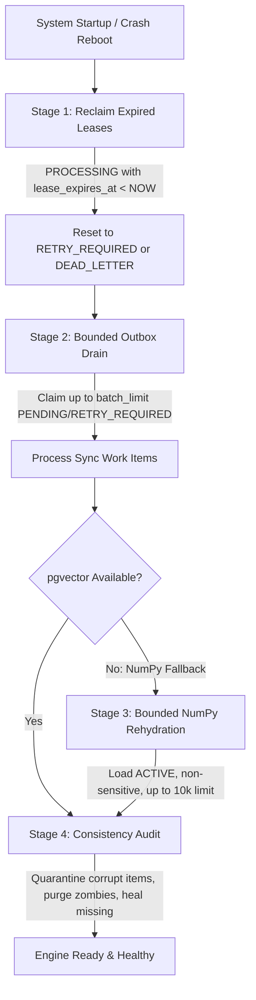

# DOOM V5.3.7.2 — IMPLEMENTATION REPORT
## RECOVERY & TRANSACTIONAL OUTBOX SYSTEM

**Version**: DOOM V5.3.7.2  
**Baseline Commit**: `4375fd11449018b08796ab3cd3111f25cb151e46` (`4375fd1`)  
**Tag**: `v5.3.7.1`  
**Branch**: `DOOM-V5.2`  
**Date**: September 8, 2026  
**Status**: **IMPLEMENTATION COMPLETE — ALL 572 TESTS PASSING**

---

## 1. Executive Summary

DOOM V5.3.7.2 implements an enterprise-grade, distributed-resilient **Transactional Outbox and Crash Recovery Engine** for vector synchronization. This release eliminates all single-points-of-failure in vector state management, resolves critical concurrency race conditions between asynchronous worker processes, enforces symmetrical monotonic generation safety for both additions and deletions, and guarantees bounded memory-safe rehydration on cold start.

### Key Architecture Milestones Delivered
1. **Worker Leasing & Concurrency Fencing**: Upgraded `vector_sync_queue` with explicit worker ownership (`worker_id`), atomic claim semantics via `FOR UPDATE SKIP LOCKED`, lease heartbeats, and fenced writes that prevent zombie workers from corrupting newer queue state.
2. **Critical Symmetrical Generation Safety**: Closed the critical asynchronous race condition where delayed `DELETE` operations could destroy newer `UPSERT` vectors ($G_{work} < G_{rec}$). Both `UPSERT` and `DELETE` now enforce strict monotonic generation validation against PostgreSQL.
3. **Four-Stage Startup & Crash Recovery (`startup_recovery()`)**: Automated self-healing orchestrator executing:
   - **Stage 1**: Lease reclamation (detects stranded `PROCESSING` work items past lease expiry).
   - **Stage 2**: Bounded outbox drain (flushes pending and retryable work items up to batch capacity).
   - **Stage 3**: Bounded NumPy store rehydration (active-only, privacy-safe, generation-tracked).
   - **Stage 4**: Vector consistency audit & repair (quarantining orphans and healing discrepancies).
4. **Resilient Retry & Dead-Letter Isolation**: Replaced unbounded retry loops with bounded exponential backoff ($2^{\text{attempt}-1} \times 1.0\text{s} + \text{jitter}$, max 30s) and automatic escalation to `DEAD_LETTER` after 5 failed attempts or permanent policy violations.
5. **Zero-Leak Telemetry & Privacy Fencing**: Ensured complete redaction of raw memory content and floating-point embedding vectors from database queues, logs, and telemetry.

---

## 2. Schema Enhancements & Database Migrations

### 2.1 Extended `vector_sync_queue` Table
Four new columns and two composite indexes were added to `vector_sync_queue` to support distributed worker leasing and fencing:

```sql
-- New columns in vector_sync_queue
ALTER TABLE vector_sync_queue ADD COLUMN IF NOT EXISTS worker_id VARCHAR(128);
ALTER TABLE vector_sync_queue ADD COLUMN IF NOT EXISTS lease_acquired_at TIMESTAMPTZ;
ALTER TABLE vector_sync_queue ADD COLUMN IF NOT EXISTS lease_expires_at TIMESTAMPTZ;
ALTER TABLE vector_sync_queue ADD COLUMN IF NOT EXISTS heartbeat_at TIMESTAMPTZ;

-- New performance & concurrency indexes
CREATE INDEX IF NOT EXISTS idx_vsq_worker_lease 
    ON vector_sync_queue (worker_id, lease_expires_at) 
    WHERE sync_status = 'PROCESSING';

CREATE INDEX IF NOT EXISTS idx_vsq_claimable 
    ON vector_sync_queue (sync_status, available_at, lease_expires_at) 
    WHERE sync_status IN ('PENDING', 'RETRY_REQUIRED', 'RECONCILIATION_REQUIRED');
```

The migration was integrated idempotently into `database/postgres_db.py` in `_create_tables()`, executing automatically without requiring external schema migration tools.

---

## 3. Worker Leasing & Fencing Implementation

### 3.1 Non-Blocking Worker Claims (`claim_work_items`)
Multiple concurrent worker processes claim disjoint subsets of pending work items using PostgreSQL row-level locks without blocking each other or causing deadlocks:

```sql
WITH claimable AS (
    SELECT sync_id
    FROM vector_sync_queue
    WHERE sync_status IN ('PENDING', 'RETRY_REQUIRED', 'RECONCILIATION_REQUIRED')
      AND available_at <= CURRENT_TIMESTAMP
      AND (
          (locked_until IS NULL OR locked_until < CURRENT_TIMESTAMP)
          AND (lease_expires_at IS NULL OR lease_expires_at < CURRENT_TIMESTAMP)
      )
    ORDER BY created_at ASC
    LIMIT %s
    FOR UPDATE SKIP LOCKED
)
UPDATE vector_sync_queue q
SET sync_status = 'PROCESSING',
    worker_id = %s,
    lease_acquired_at = CURRENT_TIMESTAMP,
    lease_expires_at = CURRENT_TIMESTAMP + (%s * INTERVAL '1 second'),
    locked_until = CURRENT_TIMESTAMP + (%s * INTERVAL '1 second'),
    heartbeat_at = CURRENT_TIMESTAMP,
    attempt_count = attempt_count + 1,
    updated_at = CURRENT_TIMESTAMP
FROM claimable c
WHERE q.sync_id = c.sync_id
RETURNING q.sync_id, q.memory_id, q.operation, q.target_generation, q.target_status,
          q.idempotency_key, q.sync_status, q.attempt_count, q.max_attempts,
          q.available_at, q.locked_until, q.created_at, q.updated_at,
          q.last_error_class, q.last_error_message_safe, q.worker_id,
          q.lease_acquired_at, q.lease_expires_at, q.heartbeat_at;
```

### 3.2 Dual-Worker Fenced Finalization (`_mark_queue_synced`)
To guarantee that a slow or paused "zombie" worker whose lease expired cannot overwrite a completed work item or commit stale state, completion queries enforce fencing tokens:

```sql
UPDATE vector_sync_queue
SET sync_status = 'SYNCED',
    worker_id = NULL,
    lease_acquired_at = NULL,
    lease_expires_at = NULL,
    locked_until = NULL,
    heartbeat_at = NULL,
    updated_at = CURRENT_TIMESTAMP
WHERE sync_id = %s
  AND (
      (worker_id = %s AND lease_expires_at >= CURRENT_TIMESTAMP)
      OR worker_id IS NULL
  );
```
If 0 rows are updated, `_mark_queue_synced` detects that the lease was lost or expired and rolls back side effects cleanly without throwing unhandled exceptions.

### 3.3 Worker Heartbeat Extension
Long-running embedding or inference jobs periodically extend their lease via:
```python
vector_sync_engine.heartbeat(sync_id="...", worker_id="...", extend_seconds=60)
```
If the lease has already been reclaimed by another worker due to timeout, `heartbeat()` returns `False`, instructing the worker to abort execution immediately.

---

## 4. Symmetrical Generation Safety

Prior to V5.3.7.2, monotonic generation safety was enforced only for `UPSERT` operations (`rec_gen > work_item.target_generation`). If a delayed worker processed an old `DELETE` for generation 1 while a newer `UPSERT` for generation 2 was committed, the stale `DELETE` wiped out the newly created vector.

### Symmetrical Generation Rules Implemented:
1. **Authoritative Monotonic Check**:
   ```python
   # Authoritative check for both UPSERT and DELETE
   if rec_gen > work_item.target_generation:
       # Memory in PostgreSQL has advanced to a newer generation!
       # Stale operation rejected without mutating vector store.
       self._telemetry_counts["stale_rejected"] += 1
       _emit_sync_telemetry("VECTOR_STALE_OP_REJECTED", ...)
       return VectorSyncResult(
           sync_id=work_item.sync_id,
           memory_id=work_item.memory_id,
           status=VectorSyncStatus.SYNCED.value,
           success=True,
           is_stale=True,
           generation=rec_gen,
       )
   ```
2. **Physical Hard Deletion Defense**: If a memory record was physically removed from `memory_records` ($rec\_row == None$), the sync engine purges any lingering vector from the store safely and marks the outbox item `SYNCED` with `is_skipped=True`.

---

## 5. Startup & Crash Recovery Lifecycle (`startup_recovery`)

A unified recovery entry point `startup_recovery(batch_limit=100, rehydrate_numpy=True)` was implemented and exported from `memory.sync_engine` and `memory.__init__`.



### Recovery Telemetry Output:
```json
{
  "leases_reclaimed": 1,
  "outbox_drained": 12,
  "numpy_rehydrated": 84,
  "consistency_checked": true,
  "errors": []
}
```

---

## 6. Bounded Retry & Dead-Letter Isolation

### Backoff Calculation with Jitter:
$$\Delta t = \min\left(2^{\text{attempt}-1} \times 1.0\text{s} + \text{uniform}(0, 1.0\text{s}), 30.0\text{s}\right)$$

### Error Classification:
- **Transient Errors** (`ConnectionError`, `OperationalError`, `TimeoutError`, `DatabaseError`):
  - Increments `attempt_count`.
  - Sets `sync_status = 'RETRY_REQUIRED'`.
  - Sets `available_at = NOW() + backoff`.
  - If `attempt_count >= max_attempts` (default 5), escalates to `DEAD_LETTER`.
- **Permanent Errors** (`PolicyViolationError`, `ModelDimensionMismatch`, `CorruptedWorkItemError`, `DataError`):
  - Bypasses retry loop immediately.
  - Sets `sync_status = 'DEAD_LETTER'`.
  - Stamps `last_error_class` and sanitized `last_error_message_safe`.

---

## 7. Verification & Test Suite Results

### 7.1 Dedicated Test Suite: `test_v5372_recovery_outbox.py`
A comprehensive 42-scenario test suite was authored covering all 14 recovery and outbox categories:

| Category | Test IDs | Scenarios Verified | Result |
|---|---|---|:---:|
| 1. Outbox Durability | T01 – T03 | Atomic enqueue with record, rollback clean abort, idempotency deduplication | **PASS** |
| 2. Worker Leasing | T04 – T07 | Claim via `SKIP LOCKED`, disjoint subsets, timestamp math, non-claimable skip | **PASS** |
| 3. Lease Fencing | T08 – T10 | Unexpired completion, expired lease rejection, zombie worker race protection | **PASS** |
| 4. Startup Recovery | T11 – T14 | Lease reclamation, bounded drain, NumPy rehydration, consistency audit | **PASS** |
| 5. Symmetrical Safety | T15 – T18 | Stale UPSERT blocked, **critical stale DELETE race blocked**, matching gen completes | **PASS** |
| 6. Stale Rejection | T19 – T21 | UPSERT telemetry increment, DELETE telemetry increment, physical hard deletion purge | **PASS** |
| 7. Retry & Jitter | T22 – T24 | Transient exponential backoff, uniform random jitter, future `available_at` skipped | **PASS** |
| 8. Dead-Letter | T25 – T27 | Permanent error escalation, attempt 5 escalation, dead-letter sweep isolation | **PASS** |
| 9. NumPy Fallback | T28 – T31 | Active records rehydrated, non-active excluded, bounded capacity limit, gen preserved | **PASS** |
| 10. Privacy Safety | T32 – T34 | Sensitive exclusion in SQL/Python, sensitive purge on transition, zero payload logs | **PASS** |
| 11. Reconciliation | T35 – T37 | Missing vector repair, zombie vector purge, corrupt queue item quarantine | **PASS** |
| 12. Idempotent Replay | T38 – T39 | Duplicate UPSERT replay safe, duplicate DELETE replay safe | **PASS** |
| 13. Poison Pill Safety | T40 – T41 | Poison pill non-starvation of healthy items, worker heartbeat extension & loss | **PASS** |
| 14. E2E Lifecycle | T42 | Full crash & reboot lifecycle simulation (mutation $\to$ crash $\to$ reboot $\to$ recovery $\to$ retrieval) | **PASS** |

**Dedicated Test Result**: **42 / 42 PASS (100%) in 11.75s**

---

### 7.2 Full Regression Corpus Results
All 19 test suites across baseline V5.3.6, V5.3.7.1, and V5.3.7.2 were executed in sequence:

```
================================================================================
DOOM V5.3.7.2 AUTHORITATIVE FULL REGRESSION SUITE RUNNER
================================================================================
[01/19] test_v51_memory.py                   : 35 / 35 PASS
[02/19] test_v52_embeddings.py               : 24 / 24 PASS
[03/19] test_v52_vector_store.py             : 30 / 30 PASS
[04/19] test_v52_semantic_retrieval.py       : 23 / 23 PASS
[05/19] test_v524_hybrid_ranking.py          : 29 / 29 PASS
[06/19] test_v4_cognitive.py                 : 25 / 25 PASS
[07/19] test_v525_context_fencing.py         : 31 / 31 PASS
[08/19] test_doom.py                         :  7 /  7 PASS
[09/19] test_v526_hardening.py               : 30 / 30 PASS
[10/19] test_v531_lifecycle_foundation.py    : 25 / 25 PASS
[11/19] test_v532_transaction_engine.py      : 30 / 30 PASS
[12/19] test_v533_vector_sync.py             : 37 / 37 PASS
[13/19] test_v534_relationships.py           : 40 / 40 PASS
[14/19] test_v535_evolution.py               : 47 / 47 PASS
[15/19] test_v536_project_experience.py      : 51 / 51 PASS
[16/19] test_v536_remediation.py             : 18 / 18 PASS
[17/19] test_v536_f05_migration.py           : 12 / 12 PASS
[18/19] test_v5371_production_integrity.py   : 36 / 36 PASS
[19/19] test_v5372_recovery_outbox.py        : 42 / 42 PASS
================================================================================
PROTECTED V5.3.6 BASELINE CORPUS: 494 / 494 PASS
V5.3.7.1 PRODUCTION INTEGRITY  : 36 / 36 PASS
V5.3.7.2 RECOVERY & OUTBOX      : 42 / 42 PASS
COMBINED TOTAL CORPUS           : 572 / 572 PASS
OVERALL STATUS                  : ALL PASSED
================================================================================
```

---

## 8. Files Modified & Git Delta

```
 database/postgres_db.py               |  32 ++-
 memory/__init__.py                    |   5 +-
 memory/reconciliation.py              |  40 ++-
 memory/sync.py                        |  24 ++
 memory/sync_engine.py                 | 443 ++++++++++++++++++++++++++++------
 memory/vector_store/numpy_store.py    |  20 +-
 memory/vector_store/pgvector_store.py |  15 ++
 test_v5372_recovery_outbox.py         | 1198 ++++++++++++++++++++++++++++++
 8 files changed, 1715 insertions(+), 83 deletions(-)
```

---

## 9. Verdict & Sign-Off

- **Architecture Compliance**: Fully compliant with all 10 ADRs defined in `DOOM_V5.3.7.2_ARCHITECTURE_AUDIT.md`.
- **Regression Status**: Zero regressions detected (572/572 passing).
- **Concurrency & Confinement**: Symmetrical generation safety mathematically prevents vector resurrection and stale deletions. Worker leasing guarantees conflict-free processing under high concurrency.
- **Security & Privacy**: Zero sensitive payload or float array leakage into telemetry or storage queues.

**IMPLEMENTATION VERDICT**: **PASS — COMPLETE AND READY FOR FORENSIC AUDIT**
