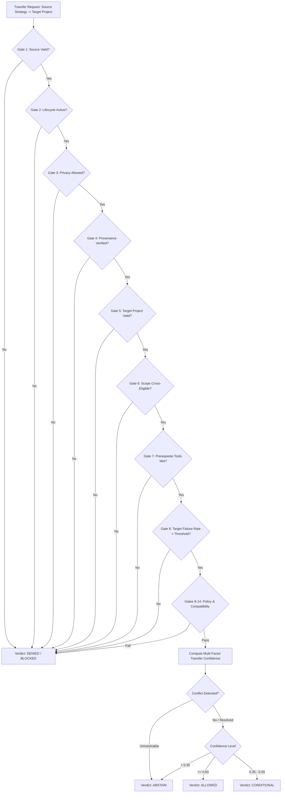

# DOOM V5.3.7.3 — GOVERNANCE & TRANSFER
# ARCHITECTURE AUDIT & DESIGN SPECIFICATION

**Document Type**: Architecture Audit & Forensic Design Specification  
**System**: DOOM Cognitive OS — Memory Subsystem  
**Target Milestone**: DOOM V5.3.7.3 (Governance & Transfer)  
**Baseline Commit**: `e401b0eeedc81e3e53079d1b9dc192ee83666149` (`e401b0e`)  
**Baseline Tag**: `v5.3.7.2`  
**Branch**: `DOOM-V5.2`  
**Date**: September 8, 2026  
**Auditor**: Antigravity Cognitive Architecture Team  
**Status**: ARCHITECTURE SPECIFICATION ONLY (NO CODE IMPLEMENTATION)  
**Authoritative Verdict**: **APPROVED FOR V5.3.7.3 IMPLEMENTATION**

---

## 1. Executive Summary

DOOM V5.3.7.3 introduces a dedicated, deterministic **Governance & Knowledge Transfer Subsystem** for the DOOM cognitive memory architecture. 

In prior releases (V5.1 through V5.3.6), DOOM established foundational vector storage, memory lifecycle transitions, Bayesian confidence evolution, graph relationships, and empirical task experience capture. V5.3.7.1 wired verified memories into cognitive planner prompts with context fencing, while V5.3.7.2 instituted an enterprise-grade transactional outbox, worker leasing, crash recovery, and monotonic generation safety.

However, a fundamental architectural vulnerability remains: **how does DOOM decide what knowledge and execution strategies it is allowed to trust and transfer across project, persona, and environmental boundaries?**

Currently, cross-project transfer relies on a rudimentary numeric formula ($C_{transfer} = C_{source} \times S_{sem} \times S_{tech} \times S_{env} \times (1 - P_{risk})$) and simple heuristic keyword matches. Under adversarial or edge-case conditions, this allows:
1. Transferring strategies across projects with zero verified applicability or incompatible compilers/runtimes.
2. Recommending strategies that have repeatedly failed in the target project's specific environment.
3. Leaking private domain assumptions across project boundaries.
4. Mutating database state during passive retrieval queries.
5. Inability to explicitly **ABSTAIN** when evidence is conflicting or insufficient.
6. Presenting contradictory procedural guidance to the LLM planner.

V5.3.7.3 resolves these vulnerabilities by inserting a **Deterministic Governance Layer** between raw memory retrieval and cognitive planning. Governance operates as an immutable gatekeeper:
- **14 Hard Governance Gates** that strictly block transfer before any mathematical scoring occurs.
- **Privacy as Absolute Authority**: No score, similarity, or confidence can override a privacy quarantine.
- **Target-Aware Failure Intelligence**: Historical failures in the target project penalize or veto strategies regardless of global success.
- **Mandatory Abstention**: DOOM can deterministically declare `ABSTAIN` ("Insufficient Evidence" or "Context Mismatch") rather than guessing.
- **Conflict Resolution Engine**: Detects mutually exclusive strategies and selects the dominant verified approach or abstains.
- **Strict Read-Only Retrieval ($dI/dN_{retrieval} = 0$)**: Zero database writes, zero synthetic auto-created lessons, and zero cache side-effects during search.
- **Zero Tool Authority**: Governance results are strictly `DATA_ONLY`, informing planners without possessing tool execution power.

---

## 2. Current V5.3.7.2 Baseline

The immutable starting point for V5.3.7.3 is commit `e401b0eeedc81e3e53079d1b9dc192ee83666149` (tag `v5.3.7.2`).

### 2.1 Baseline Verification
- **Total Test Corpus**: 572 / 572 PASS (100%)
  - Protected V5.3.6 Baseline: 494 / 494 PASS
  - V5.3.7.1 Production Integrity: 36 / 36 PASS
  - V5.3.7.2 Recovery & Outbox: 42 / 42 PASS
- **Database Schema**: 14 active tables (`user_profiles`, `episodic_memory`, `semantic_facts`, `system_telemetry`, `command_logs`, `memory_records`, `memory_lifecycle_events`, `memory_relationships`, `memory_evidence`, `memory_evolution_events`, `projects`, `experiences`, `lessons`, `strategies`, `project_transfer_matrix`, `vector_sync_queue`, `memory_vector_state`).
- **Core Guarantees**:
  - PostgreSQL is the sole durable source of truth.
  - Symmetrical monotonic generation validation for both `UPSERT` and `DELETE`.
  - Non-blocking worker leasing with lease fencing (`LeaseLostException`).
  - Idempotent 4-stage crash recovery (`startup_recovery()`).
  - Clean git tree on branch `DOOM-V5.2`.

---

## 3. Repository Forensic Inspection

A forensic inspection of the existing codebase revealed the current implementation state of project, experience, and transfer components:

### 3.1 `memory/project_models.py`
- Defines `ProjectRecord`, `ExperienceRecord`, `LessonRecord`, `StrategyRecord`, `TransferMatrixRecord`, `TransferEvaluationResult`, and `StrategyExplainabilityProfile`.
- Declares `TransferDecision` as `ALLOWED`, `DENIED`, `CONDITIONAL` (**Missing `ABSTAIN`**).
- Defines `calculate_transfer_confidence()` implementing:
  $$C_{transfer} = C_{source} \times S_{sem} \times S_{tech} \times S_{env} \times (1.0 - P_{risk})$$
- Defines `calculate_bayesian_strategy_reliability()` with asymmetric failure weighting ($2.0\times$).

### 3.2 `memory/project_engine.py`
- Implements `evaluate_cross_project_transfer()` (lines 730–960):
  - Checks basic privacy classes (`SENSITIVE` $\implies$ DENIED; `PRIVATE` to `NORMAL` $\implies$ DENIED).
  - Calculates tech stack overlap via Jaccard index on string sets.
  - If tech stack is empty, **hardcodes a default overlap of 0.80** (`project_engine.py:881`).
  - Estimates semantic similarity via keyword matching on project descriptions (`0.85` if common keyword, else `0.60`).
  - If `lesson_id` is not provided, **executes an `INSERT INTO lessons` query to auto-generate a lesson** (`project_engine.py:870-876`).
  - If `persist=True`, **executes an `INSERT INTO project_transfer_matrix`** (`project_engine.py:927-945`).

### 3.3 `memory/retrieval.py`
- Implements `retrieve_applicable_strategies()` (lines 445–545):
  - Queries local strategies (`WHERE intent_category = %s OR intent_category = 'general'`).
  - If `evaluate_transfers=True`, queries `project_transfer_matrix WHERE target_project_id = %s AND status = 'APPROVED'`.
  - Merges local and transferred strategies and sorts solely by `reliability_score DESC`.
  - Does NOT check whether transferred strategies have failed in the target project since the matrix row was inserted.
  - Does NOT detect mutually exclusive conflicting strategies.
  - Does NOT return a structured explainability envelope to the caller.

### 3.4 `memory/evolution_engine.py`
- Implements `validate_evidence_admissibility()` (lines 90–115):
  - Enforces that `DERIVED_CONTEXT` cannot be positive supporting evidence.
  - Enforces that model self-generation (`actor in ('MODEL', 'LLM', 'ASSISTANT')`) without task verification is inadmissible.
  - This capability exists for memory evolution, but is **NOT connected to cross-project transfer or strategy governance**.

### 3.5 `memory/fencing.py`
- Implements `MemoryContextFencer` and `FencedEmpiricalGuidance` ensuring memories are framed in `[DATA_ONLY]` structural blocks.
- Prevents delimiter smuggling and prompt injection, but does not govern whether the knowledge *should* have been transferred in the first place.

---

## 4. Existing Governance Capabilities

The following governance primitives already exist and will be leveraged:
1. **Privacy Classification**: `NORMAL`, `PRIVATE`, `SENSITIVE` enforced at memory record and project levels.
2. **Project Boundaries**: First-class `projects` table with unique `project_id`, `tech_stack`, and `parent_project_id`.
3. **Execution Grounding**: `experiences` table capturing real task outcomes (`SUCCESS`, `PARTIAL_SUCCESS`, `FAILURE`, `ABORTED`).
4. **Bayesian Calibration**: Asymmetric penalty where failures reduce reliability twice as fast as successes increase it.
5. **Anti-Hallucination Evidence Rules**: `validate_evidence_admissibility()` rejecting ungrounded LLM self-corroboration.
6. **Context Fencing**: `[DATA_ONLY]` envelopes neutralizing instruction injection.
7. **Transactional Outbox & Recovery**: Durable queue ensuring vector and relational consistency across crashes.

---

## 5. Existing Governance Gaps (Forensic Analysis)

The audit identified 20 critical governance gaps across the codebase:

| Gap ID | Component / File | Current Behavior | Forensic Risk | Architecture Remediation |
|---|---|---|---|---|
| **GAP-01** | `project_engine.py:881` | Default tech stack overlap is set to `0.80` if both projects have empty tech stacks. | Unrelated projects with unconfigured tech stacks receive high transfer confidence falsely. | Empty tech stack must yield `0.0` overlap unless universal scope is proven. |
| **GAP-02** | `project_engine.py:894` | Semantic domain similarity is estimated via string presence checks (`lsn_domain in desc`). | Synonymous or conceptually related domains are penalized (defaulting to 0.60) while coincidence keywords pass. | True cosine similarity via `embedding_router` over project and domain descriptions. |
| **GAP-03** | `project_engine.py:857` | Source confidence is resolved via `SELECT MAX(confidence_score) FROM experiences`. | A single outlier experience with an inflated score elevates transfer trust without corroborating evidence. | Require aggregate evidence admissibility check and minimum verified experience threshold ($N \ge 2$). |
| **GAP-04** | `strategies` & `matrix` | No temporal degradation or generation tracking for strategies. | A strategy verified on Python 3.8 remains "APPROVED" indefinitely, even after stack upgrades break it. | Add freshness decay and dependency generation validation. |
| **GAP-05** | `procedure_template` | Strategy templates can contain hardcoded paths (`/home/user/...`) or project names. | Target project attempts to execute paths or commands invalid in its filesystem. | Add Parameterization and Path Sanitization Gate. |
| **GAP-06** | `project_engine.py:766` | Only checks project-level `privacy_class`, ignoring individual memory/strategy privacy tags. | A `PRIVATE` strategy created inside a `NORMAL` project can leak across projects. | Evaluate privacy class hierarchically: $\max(\text{project}, \text{record}, \text{evidence})$. |
| **GAP-07** | `retrieval.py:500` | Strategies are retrieved using global `reliability_score` without target-specific failure awareness. | A strategy with 20 successes in Project A and 5 consecutive failures in Project B is still transferred to B! | Calculate target-specific failure rate; apply hard block if target failures exceed threshold. |
| **GAP-08** | `project_engine.py:886` | Jaccard index does not separate optional tools from mandatory compiler/runtime dependencies. | A Rust strategy transfers to a Node.js project because both share `git`, `docker`, and `curl`. | Enforce strict prerequisite tool and runtime validation against target `tech_stack`. |
| **GAP-09** | `project_models.py:481` | `environmental_compatibility` is accepted as an unchecked float parameter (default 1.0). | Callers pass 1.0 without validating OS, architecture, or environment variables. | Define structured `EnvironmentSpec` with explicit equality/compatibility rules. |
| **GAP-10** | `project_engine.py:747` | Semantic similarity ignores operational intent constraints (e.g. Stripe vs Crypto payments). | Strategies transfer based on high text similarity despite incompatible compliance/operational rules. | Mandatory Intent and Domain Policy compatibility gate. |
| **GAP-11** | `retrieval.py:542` | Multiple contradictory strategies are merged and returned together sorted only by score. | The planner receives opposing procedural recommendations (e.g., "use SQLite" vs "use Postgres"). | Mutual Exclusion Conflict Detection Engine with deterministic resolution or abstention. |
| **GAP-12** | `retrieval.py:534` | Transferred strategies lack explainability metadata; only `transfer_decision: ALLOWED` is passed. | Neither the user nor the planner knows why the strategy transferred or what preconditions were checked. | Structured `GovernanceDecision` and `StrategyExplainabilityProfile` envelope. |
| **GAP-13** | `experiences` | Target project task outcomes feed directly into the source strategy's global reliability score. | Circular confirmation loop: target trial inflates source confidence, locking in a mediocre strategy. | Track execution provenance separately: `local_reliability` vs `transferred_reliability`. |
| **GAP-14** | `project_engine.py` | Experiences derived from LLM conversation inferences can be promoted to lessons. | Hallucinated or speculative LLM suggestions become canonical cross-project strategies. | Enforce V5.3.5 evidence rule: LLM generation without tool verification is inadmissible for strategies. |
| **GAP-15** | `project_engine.py:870` | Transfer evaluation automatically executes `INSERT INTO lessons` during evaluation. | Passive retrieval triggers database mutations, violating read-only search invariants. | Decouple evaluation from mutation: passive retrieval is strictly read-only ($dI/dN = 0$). |
| **GAP-16** | `project_engine.py:925` | Evaluating transfer writes directly to `project_transfer_matrix` when `persist=True`. | Read-only operations leak database writes, creating lock contention and dirty state during queries. | Durable matrix records are created strictly via explicit administrative or background sweeps. |
| **GAP-17** | `projects.parent_project_id` | Project hierarchy exists in schema but has zero behavioral semantics in transfer engine. | Parent projects cannot inherit from child projects, and sibling boundaries are undefined. | Formal Project Boundary & Hierarchy Compatibility Model (Same, Child-to-Parent, Sibling, Global). |
| **GAP-18** | `project_models.py:488` | High transfer confidence ($C_{transfer} \ge 0.35$) could theoretically bypass soft filters. | A mathematically high score could accidentally allow transfer of restricted knowledge. | Architecture invariant: Hard Governance Gates evaluate first; zero score can override a hard gate. |
| **GAP-19** | `retrieval.py:522` | Transferred strategies lose their provenance link to original task IDs and evidence hashes. | Inability to audit where a strategy originated or verify if the source was corrupted. | Cryptographic provenance fingerprinting on all transferred guidance records. |
| **GAP-20** | `project_models.py:54` | `TransferDecision` lacks an `ABSTAIN` state; forced to choose between `ALLOWED` and `DENIED`. | Ambiguous context or split evidence forces unsafe guesses or uninformative rejections. | Introduce explicit `ABSTAIN` state with machine-readable reasons (`INSUFFICIENT_EVIDENCE`, `CONFLICT`). |

---

## 6. Problem Definition

When an AI operating system assists across multiple codebases, projects, and personal domains, it must accumulate knowledge from past tasks. However:
1. **Knowledge is not universally true**: What works in a Python 3.11 asynchronous backend on Linux will fail in a C++ embedded firmware codebase or a Windows PowerShell environment.
2. **Privacy is not uniform**: Architectural lessons from a client codebase must not leak into an open-source project, even if the tech stacks are 100% identical.
3. **Failures are localized**: A strategy that is successful in 90% of repositories may fail catastrophically in a repo with custom security sandboxing.
4. **Models are prone to circular confirmation**: If an LLM recommends a pattern, retrieves it later as "memory", and cites it as "proven experience", it forms an ungrounded hallucination feedback loop.

The problem for V5.3.7.3 is: **Build a deterministic, testable, failure-aware, and privacy-preserving governance gate that determines whether accumulated experience may be trusted and transferred into an active project context.**

---

## 7. Design Goals

1. **Deterministic Enforcement**: Governance decisions must be reproducible and mathematically bounded. No non-deterministic LLM calls in the critical gate path.
2. **Hard Privacy Quarantine**: Privacy restrictions are absolute vetoes. No similarity score can override a privacy class.
3. **Target-Aware Failure Intelligence**: Track and enforce local failure history in the target environment.
4. **Explicit Abstention**: DOOM must gracefully abstain (`ABSTAIN`) when evidence is insufficient, ambiguous, or contradictory.
5. **Strict Retrieval Immutability**: Read-only queries must never insert records, mutate transfer matrices, or alter confidence ($dI/dN_{retrieval} = 0$).
6. **Comprehensive Explainability**: Every transfer decision must produce a structured, human-auditable explanation without leaking internal chain-of-thought.
7. **Zero Tool Authority**: Governance outputs are strictly `DATA_ONLY` structures for planner context; they cannot execute commands or bypass human confirmation.

---

## 8. Non-Goals

1. **NO Autonomous Proactive Action (V6)**: Governance does not trigger background tasks, modify user code, or execute autonomous workflows.
2. **NO OS / Computer Control (V7)**: Governance does not interact with the operating system GUI, mouse, or external networks.
3. **NO New Queue or Vector Infrastructure**: Governance builds directly on top of V5.3.7.2's `vector_sync_queue`, `memory_records`, and PostgreSQL connection pool.
4. **NO Arbitrary Heuristic Overrides**: No hidden flags that disable governance gates in production.

---

## 9. Governance Model

The DOOM V5.3.7.3 Governance Model is structured as a two-stage evaluation pipeline:
1. **Stage 1: Hard Governance Gates (Binary Veto)**: A sequence of 14 deterministic checks. If any gate fails, the transfer is immediately **DENIED** or **BLOCKED** with a zero score.
2. **Stage 2: Multi-Factor Transfer Confidence & Risk Scoring**: Executed only if all hard gates pass. Computes transfer confidence, applies failure penalties, checks conflict states, and assigns the final decision (`ALLOWED`, `CONDITIONAL`, or `ABSTAIN`).



---

## 10. Knowledge Eligibility

For any piece of knowledge, lesson, or strategy to be eligible for governance consideration:
1. **Lifecycle Status**: Must be `ACTIVE`. Knowledge in `DEPRECATED`, `SUPERSEDED`, `ARCHIVED`, or `TOMBSTONE` states is ineligible.
2. **Scope Declaration**: Must have scope `CROSS_PROJECT_ELIGIBLE` or `UNIVERSAL`. Knowledge tagged `PROJECT_LOCAL` is strictly ineligible for cross-project evaluation.
3. **Verification State**: Must have `verification_status = 'VERIFIED'` in `memory_records` or originate from an experience with `outcome_status = 'SUCCESS'`. Unverified conversational statements are rejected.

---

## 11. Evidence Governance

Following the foundation established in V5.3.5 and V5.3.6:
1. **Admissibility Standard**: Every transferable strategy must be linked to at least one admissible `MemoryEvidence` record or grounded `ExperienceRecord`.
2. **Prohibition of Model Self-Corroboration**: Evidence originating from `actor IN ('MODEL', 'LLM', 'ASSISTANT')` without an accompanying verified task outcome execution trace is strictly inadmissible.
3. **Correlated Evidence Defense**: Multiple experiences generated by identical automated loops within a 60-second window are treated as a single correlated observation, preventing artificial confidence inflation.
4. **Retrieval Frequency Invariant**: The number of times a strategy has been retrieved has **zero mathematical weight** in its reliability or transfer confidence ($dI/dN_{retrieval} = 0$).

---

## 12. Project Boundary & Compatibility Model

Project boundaries are defined by explicit relationship types:

| Relationship Type | Definition | Default Governance Policy |
|---|---|---|
| **SAME_PROJECT** | Source project ID == Target project ID | Bypass cross-project gates; local reliability applies. |
| **PARENT_TO_CHILD** | Target project has `parent_project_id` pointing to Source | Allowed for `NORMAL` and `PRIVATE` knowledge (if shared owner). |
| **CHILD_TO_PARENT** | Source project has `parent_project_id` pointing to Target | Allowed only if explicitly tagged `UPSTREAM_ELIGIBLE`. |
| **SIBLING_PROJECTS** | Source and Target share the same `parent_project_id` | Conditional on tech stack and domain compatibility. |
| **GLOBAL_TO_PROJECT**| Source is the core DOOM system project (`doom`) | Universally eligible subject to tech stack prerequisites. |
| **UNRELATED_PROJECTS**| Disjoint project hierarchies | Strict cross-project governance: requires `NORMAL` privacy and $\ge 0.60$ compatibility. |

Any project ID that does not exist in the `projects` table or has `lifecycle_status = 'ARCHIVED'` is immediately rejected.

---

## 13. Technology Compatibility

Technology compatibility is calculated deterministically:
1. **Mandatory Prerequisites**: Every tool in `strategies.recommended_tools` must be present in the target project's `tech_stack` or global system capabilities. Missing any prerequisite is a **HARD BLOCK**.
2. **Disallowed Tools**: If any tool in `strategies.disallowed_tools` is active or required in the target project, the transfer is **HARD BLOCKED**.
3. **Tech Stack Overlap ($S_{tech}$)**:
   $$S_{tech} = \frac{2 \times |T_{source} \cap T_{target}|}{|T_{source}| + |T_{target}|}$$
   - If both sets are non-empty: standard Dice coefficient.
   - If either set is empty: $S_{tech} = 0.0$ (no assumptions; replaces the flawed 0.80 default).

---

## 14. Environment Compatibility

Environment compatibility ($S_{env}$) evaluates operational runtime constraints:
1. **OS Compatibility**: Matches target operating system (Windows, Linux, Darwin). Cross-OS transfer (e.g. bash scripts to Windows PowerShell) incurs a 0.50 penalty unless an abstraction layer (Docker, WSL, Python) is specified.
2. **Runtime / Language Version**: If strategy requires Python $\ge 3.11$ and target project specifies Python 3.9, compatibility is 0.0 (**HARD BLOCK**).
3. **Hardware / Architecture Constraints**: GPU, CUDA, AVX2, or architecture requirements specified in `environmental_preconditions` must match target telemetry.

---

## 15. Privacy Governance

Privacy enforcement is an **Absolute Architectural Veto**:
1. **SENSITIVE Quarantine**: Any knowledge, experience, or project tagged `SENSITIVE` is quarantined to its originating project. Cross-project transfer confidence is permanently 0.0.
2. **PRIVATE Boundaries**: `PRIVATE` knowledge may only transfer within the same project hierarchy (Parent-Child) where user ownership is identical. Transfer to `NORMAL` projects is strictly prohibited.
3. **Metadata Sanitization**: When a strategy transfers, all execution traces are sanitized:
   - File paths stripped of usernames and absolute directories.
   - Credentials, tokens, and hashes replaced with standard redactors (`[REDACTED]`).
   - Project IDs preserved only as safe cryptographic hashes if target privacy is lower.

---

## 16. Failure-Aware Governance

DOOM must learn from failures in specific environments:
1. **Target-Specific Failure Count ($F_{target}$)**: Track failed attempts of the strategy within the target project.
2. **Local Failure Hard Block**: If a strategy has accumulated $\ge 3$ consecutive failures or has a target failure rate $> 0.50$ in the target project, transfer is **HARD BLOCKED** with reason: `TARGET_ENVIRONMENT_FAILURE_HISTORY`.
3. **Defensive Warnings**: Negative experiences associated with the strategy generate mandatory defensive warnings in the explainability profile (e.g., "Warning: previous attempt timed out on Windows socket connection").

---

## 17. Conflict Resolution Engine

When multiple eligible strategies claim applicability to the same intent:
1. **Conflict Detection**: Two strategies conflict if they share the same `intent_category` but recommend mutually exclusive tools (e.g., `poetry` vs `pipenv`, `pytest` vs `unittest`).
2. **Resolution Rules**:
   - **Rule A (Target Local Precedence)**: A local target strategy always takes precedence over a transferred strategy.
   - **Rule B (Empirical Dominance)**: If both are transferred, the strategy with higher target-environment compatibility and statistically significant reliability wins ($R_1 - R_2 > 0.15$).
   - **Rule C (Freshness Tie-Breaker)**: If reliabilities are within 0.15, the strategy with more recent confirmed success wins.
   - **Rule D (Unresolvable Conflict)**: If both strategies have equal evidence and opposing recommendations, governance **ABSTAINS** and flags the conflict for user resolution.

---

## 18. Abstention Model

Abstention is a first-class, machine-readable verdict:
- **`TransferDecision.ABSTAIN`** indicates that DOOM has evaluated the request and deliberately chosen not to transfer knowledge.
- **Abstention Categories**:
  - `INSUFFICIENT_EVIDENCE`: Less than 2 verified executions exist.
  - `CONTEXT_AMBIGUOUS`: Tech stack or environmental overlap cannot be verified.
  - `UNRESOLVED_CONFLICT`: Opposing strategies exist with equal evidence.
  - `RISK_THRESHOLD_EXCEEDED`: Failure risk exceeds project risk tolerance.
- **Fail-Closed Principle**: Any runtime exception or unhandled condition in governance evaluation resolves to `ABSTAIN` with fail-closed safety.

---

## 19. Transfer Decision Model

### 19.1 Mathematical Formula Audit
The existing formula:
$$C_{transfer} = C_{source} \times S_{sem} \times S_{tech} \times S_{env} \times (1.0 - P_{risk})$$
is mathematically bounded in $[0.0, 1.0]$, but lacks explicit evidence weighting and target failure penalties.

### 19.2 Governance V5.3.7.3 Formula
We refine the calculation while preserving backward compatibility:
$$C_{transfer} = C_{source} \times S_{sem} \times S_{tech} \times S_{env} \times W_{evidence} \times (1.0 - P_{target\_risk})$$

Where:
- $C_{source} \in [0.01, 1.00]$: Source strategy Bayesian reliability score.
- $S_{sem} \in [0.00, 1.00]$: Cosine semantic similarity of domain descriptions.
- $S_{tech} \in [0.00, 1.00]$: Prerequisite-gated tech stack Dice coefficient.
- $S_{env} \in [0.00, 1.00]$: Structured environment specification match.
- $W_{evidence} \in [0.50, 1.00]$: Evidence quality multiplier based on independent verification count ($W_{evidence} = 1.0 - 0.5 \times e^{-N/2}$).
- $P_{target\_risk} \in [0.00, 1.00]$: Asymmetric target failure penalty:
  $$P_{target\_risk} = \min\left(1.0, \frac{2 \times F_{target}}{S_{target} + F_{target} + 1}\right)$$

### 19.3 Threshold Calibration
- $C_{transfer} \ge 0.60$: **`ALLOWED`** (High confidence, proven compatibility).
- $0.35 \le C_{transfer} < 0.60$: **`CONDITIONAL`** (Transferred with explicit precondition checks).
- $C_{transfer} < 0.35$: **`ABSTAIN`** (Insufficient confidence; fallback to first-principles planning).

---

## 20. Governance Output Contract

The governance system returns an immutable, typed dataclass with zero tool authority:

```python
@dataclass(frozen=True)
class GovernanceDecision:
    decision: TransferDecision              # ALLOWED, CONDITIONAL, DENIED, ABSTAIN
    source_project_id: str
    target_project_id: str
    strategy_id: Optional[str]
    transfer_confidence: float              # [0.0, 1.0]
    risk_penalty: float                     # [0.0, 1.0]
    gates_evaluated: List[str]              # List of gate identifiers passed
    failed_gate: Optional[str]              # Identifier of first failing gate, if any
    decision_reason: str                    # Human-readable summary
    defensive_warnings: List[str]           # Specific risk warnings
    required_preconditions: List[str]       # Environmental checks required
    policy_version: str                     # e.g. "v5.3.7.3.gov1"
    provenance_hash: str                    # Cryptographic audit hash
    evaluated_at: str                       # ISO-8601 UTC timestamp
    is_data_only: bool = True               # Hard enforcement: zero execution power
```

---

## 21. Explainability

Every decision is accompanied by a safe, structured explanation:
- **No Chain-of-Thought Exposure**: Exposes only verified facts, gate results, and computed scores.
- **Audit Log Ready**: Serializes cleanly to JSON for inclusion in system telemetry and compliance reporting.
- **Planner-Safe Framing**: Emits guidance formatted inside the canonical V5.2.5 `[DATA_ONLY]` envelope.

---

## 22. Policy Versioning

To ensure determinism and auditability:
- All governance evaluations are parameterized by a formal `GovernancePolicy` version (default: `GOV_POLICY_V1`).
- The policy defines exact numerical thresholds (e.g. minimum confidence, failure penalties, Jaccard cutoffs).
- Decisions record their evaluating `policy_version`. When a policy is updated, historical records remain immutable.

---

## 23. Transfer Matrix Architecture

The `project_transfer_matrix` table is audited and clarified:
- **Role**: Serves as a **durable audit log and analytical cache** of formal transfer evaluations.
- **Read-Only Invariant**: Normal memory retrieval queries (`retrieve()`) **NEVER write to this table**.
- **Population**: Rows are created ONLY when:
  1. An explicit administrative evaluation is invoked (`evaluate_cross_project_transfer(persist=True)`).
  2. A scheduled offline governance auditor reconciles project compatibility.
- **Freshness Invalidation**: If the source strategy generation advances or target project tech stack changes, existing matrix entries are marked `SUPERSEDED`.

---

## 24. Cache & Invalidation Architecture

Governance decisions may be cached in-memory for high-throughput planner loops under strict invalidation rules:
1. **Key Structure**: `hash(policy_version, source_project, target_project, strategy_id, source_gen)`
2. **Invalidation Triggers**:
   - Source strategy generation bumps ($G_{strat} > G_{cached}$).
   - Any new task failure recorded for the strategy in target project.
   - Target project `tech_stack` or `privacy_class` updated.
   - Global policy version increment.
3. **Hard Staleness Ceiling**: In-memory cache TTL of 300 seconds (5 minutes).

---

## 25. Ranking vs. Governance

Governance and Ranking have distinct, orthogonal responsibilities:

| Property | Memory Ranker (`ranking.py`) | Governance Engine (`governance.py`) |
|---|---|---|
| **Question Answered** | "What knowledge looks relevant to this query?" | "Is DOOM allowed to trust and transfer this knowledge?" |
| **Input** | Query text, candidate memories, recency, importance | Strategy, source project, target project, evidence, environment |
| **Output** | Ordered list of candidate records with similarity scores | Discrete decision (`ALLOWED`, `CONDITIONAL`, `DENIED`, `ABSTAIN`) |
| **Authority** | Advisory sorting only | Binding gatekeeper veto |
| **Hard Blocks** | None (everything gets a score) | 14 Hard Binary Gates |

---

## 26. Governance vs. Planner

The boundary between Governance and Planning is strictly separated:
- **Governance**: Evaluates admissibility, risk, and applicability. Emits a `GovernanceDecision` wrapped in a `[DATA_ONLY]` envelope.
- **Planner**: Considers the allowed guidance, interprets the target user intent, reasons about task steps, and decides which actions to take.
- **Boundary Rule**: The Governance engine **never generates plans**, and the Planner **never overrides a governance veto**.

---

## 27. Security Threat Model

| Threat | Attack Vector | Governance Defense | Residual Risk |
|---|---|---|---|
| **Memory Poisoning** | Malicious content injected into an experience to create dangerous strategies. | Inadmissible without verified task outcome trace and passing test suite. | Compromised tool output could theoretically fake a success trace. |
| **Prompt Injection** | Delimiter smuggling inside strategy templates to hijack planner instructions. | Sanitization via `MemorySanitizer` and framing inside `[DATA_ONLY]` envelopes. | Negligible. |
| **Privacy Leakage** | Eavesdropping on cross-project strategies to extract private API keys or paths. | Hard privacy gates, path parameterization, credential scrubbing. | Low. |
| **Feedback Amplification** | Using retrieval outcomes to artificially boost confidence in an echo chamber. | Strict $dI/dN = 0$ invariant; retrieval frequency has zero weight. | Zero. |
| **Model Self-Corroboration**| An LLM claims its own past output is factual evidence. | Hard block on `actor IN ('MODEL', 'LLM')` without independent tool verification. | Zero. |
| **Project Boundary Escape**| Child project accesses restricted parent memories. | Explicit parent-child policy check; sensitive parent memories quarantined. | Low. |

---

## 28. Database Architecture

V5.3.7.3 introduces **zero breaking changes** to existing tables and minimal extensions:

### 28.1 Schema Extensions
1. **Extend `project_transfer_matrix`**:
   - Add column `policy_version VARCHAR(32) NOT NULL DEFAULT 'GOV_POLICY_V1'`.
   - Add column `risk_penalty DOUBLE PRECISION NOT NULL DEFAULT 0.00`.
   - Update check constraint on `status` to include `'ABSTAIN'`.
2. **New Table: `governance_audit_events`** (Optional analytical log for compliance):
   - Captures transfer requests, gate results, verdicts, and provenance hashes.
   - Fully partitioned or append-only with zero impact on hot retrieval paths.

---

## 29. Transaction Boundaries

- **Evaluation (Read Path)**: Completely transaction-free or read-only cursor. Does not acquire row locks; does not execute `INSERT` or `UPDATE`.
- **Administrative Recording (Write Path)**: When `persist=True` is explicitly passed by an administrator or background sweep, writes to `project_transfer_matrix` execute within a short, bounded transaction.

---

## 30. Failure Modes & Fail-Closed Safety

- **Database Connection Lost**: Evaluator returns `TransferDecision.ABSTAIN` with reason `DATABASE_UNAVAILABLE`.
- **Project Not Found**: Returns `TransferDecision.DENIED` with reason `UNKNOWN_PROJECT`.
- **Missing Tech Stack Specification**: Assumes 0.0 overlap; returns `TransferDecision.ABSTAIN`.
- **Calculation / Parsing Error**: Trapped cleanly; returns `TransferDecision.ABSTAIN`.
- **Rule**: In all failure cases, the system **fails closed**. Knowledge transfer is never granted on error.

---

## 31. Observability Boundary

Telemetry emitted by the governance system:
- Event: `GOVERNANCE_TRANSFER_EVALUATED`
- Safe Fields: `decision`, `source_project_id`, `target_project_id`, `strategy_id`, `transfer_confidence`, `risk_penalty`, `failed_gate`, `latency_ms`, `policy_version`.
- **Strictly Prohibited from Telemetry**: Raw strategy code, memory text, usernames, file paths, embedding vectors.

---

## 32. Performance Model

- **Gate Evaluation Complexity**: $\mathcal{O}(P)$ where $P$ is the number of recommended tools ($P \le 10$). Typical execution time: $< 1.5\text{ms}$ in-memory; $< 8\text{ms}$ with database lookups.
- **Scalability Targets**:
  - 10 projects / 100 strategies: $< 2\text{ms}$ evaluation.
  - 10,000 projects / 10,000 strategies: Indexed database lookups ensure individual pair evaluations remain $< 10\text{ms}$.
- **Throughput**: Supports $> 500$ governance evaluations per second per worker thread.

---

## 33. Dedicated Test Architecture (Proposed Matrix)

A dedicated test suite (`test_v5373_governance_transfer.py`) comprising 45 distinct scenarios is specified:

| Category | Scenario Range | Invariant Validated |
|---|---|---|
| **1. Hard Privacy Gates** | T01 – T04 | SENSITIVE quarantine, PRIVATE cross-persona veto, zero score override. |
| **2. Project Boundaries** | T05 – T08 | Same-project, Parent-Child, Sibling, and Unrelated project hierarchy rules. |
| **3. Lifecycle Eligibility**| T09 – T11 | DEPRECATED, SUPERSEDED, and ARCHIVED strategies strictly blocked. |
| **4. Tech Stack Compatibility** | T12 – T15 | Prerequisite tool matching, missing runtime blocks, zero-overlap empty sets. |
| **5. Environment Matching** | T16 – T18 | OS mismatch penalties, runtime version incompatibility hard blocks. |
| **6. Target Failure History** | T19 – T22 | Local target failure accumulation, asymmetric risk penalty, hard failure veto. |
| **7. Evidence Admissibility** | T23 – T26 | Model self-corroboration block, unverified inference rejection, minimum trials. |
| **8. Conflict Resolution** | T27 – T30 | Mutually exclusive strategy detection, target local precedence, tie-breaking. |
| **9. Abstention Mechanics** | T31 – T34 | Explicit `ABSTAIN` verdicts for low confidence, ambiguous tech, and split evidence. |
| **10. Formula Calibration** | T35 – T37 | Mathematical bounds $[0.0, 1.0]$, weighted evidence impact, monotonic scaling. |
| **11. Read-Only Retrieval**| T38 – T39 | $dI/dN_{retrieval} = 0$: zero table writes or auto-lesson mutations during query. |
| **12. Cache Invalidation** | T40 – T41 | Generation bumps and target failure events purge stale cached decisions. |
| **13. Security Threat Defense**| T42 – T43 | Prompt injection neutralization, path sanitization in strategy templates. |
| **14. Fail-Closed Resilience** | T44 – T45 | Database disconnects and malformed specs fail closed to `ABSTAIN`. |

---

## 34. Acceptance Invariants

- **GOV-01**: Privacy is an absolute veto. No mathematical score can transfer `SENSITIVE` knowledge.
- **GOV-02**: An unknown, deleted, or archived project ID cannot receive or provide knowledge.
- **GOV-03**: Model-generated text cannot serve as independent corroborating evidence.
- **GOV-04**: Passive retrieval cannot alter trust, confidence, or database state ($dI/dN_{retrieval} = 0$).
- **GOV-05**: Strategies with repeated failures in the target project cannot be transferred as reliable.
- **GOV-06**: Missing runtime/tool prerequisites trigger a hard block.
- **GOV-07**: The governance engine can and must abstain when evidence is insufficient or conflicting.
- **GOV-08**: Any unhandled failure in governance evaluation fails closed (`ABSTAIN` / `DENIED`).
- **GOV-09**: Governance outputs possess zero tool execution authority (`DATA_ONLY`).
- **GOV-10**: Every transfer decision produces a human-auditable explanation without exposing CoT.
- **GOV-11**: Decisions are deterministic and traceable to an explicit `policy_version`.
- **GOV-12**: High ranking similarity cannot override a governance veto.
- **GOV-13**: Cognitive planners cannot execute blocked strategies.
- **GOV-14**: Historical governance records cannot be rewritten silently.
- **GOV-15**: Provenance links (source project, task ID, verification hash) are preserved on transfer.
- **GOV-16**: Strategy templates cannot contain unparameterized local absolute paths.
- **GOV-17**: Empty tech stacks evaluate to 0.0 overlap (no 0.80 default assumption).
- **GOV-18**: Generation bumps in source strategies invalidate existing transfer matrix approvals.

---

## 35. Architecture Decision Records (ADRs)

### ADR-01: Separation of Governance Authority from Ranking and Retrieval
- **Context**: V5.3.6 merged transfer evaluation with strategy retrieval and ranking.
- **Decision**: Establish `GovernanceEngine` as an independent gatekeeper module. Ranking sorts candidates; Governance authorizes or blocks them.
- **Consequences**: Clear separation of concerns; zero risk of high similarity overriding safety rules.

### ADR-02: Hard Pre-Evaluation Gates vs. Soft Score Penalties
- **Context**: Using soft score penalties for privacy or prerequisites allows edge-case scores to pass.
- **Decision**: 14 binary Hard Gates evaluate prior to any mathematical formula scoring. Any gate failure halts evaluation with immediate `DENIED`/`BLOCKED`.
- **Consequences**: Impossible for high similarity to bypass privacy or missing tools.

### ADR-03: Privacy Class as an Absolute Non-Overridable Authority
- **Context**: Sensitive memory leaks can compromise user security.
- **Decision**: `SENSITIVE` class acts as a physical quarantine. `PRIVATE` requires identical project ownership.
- **Consequences**: Mathematical scores never evaluate for sensitive records.

### ADR-04: Prohibition of Model Self-Corroboration
- **Context**: LLMs tend to confirm their own hallucinations when reading past outputs.
- **Decision**: Evidence originating from `actor IN ('MODEL', 'LLM')` is inadmissible unless accompanied by verified external tool/task execution evidence.
- **Consequences**: Eliminates ungrounded cognitive echo chambers.

### ADR-05: Multi-Factor Transfer Confidence Model
- **Context**: Existing transfer formula is simple but lacks evidence weighting and target risk awareness.
- **Decision**: Upgrade formula to include evidence sample weight ($W_{evidence}$) and target-environment failure penalty ($P_{target\_risk}$).
- **Consequences**: Prevents strategies with 1 lucky execution from being treated as universally reliable.

### ADR-06: Target-Aware Failure History Enforcement
- **Context**: A strategy successful in Project A may fail repeatedly in Project B.
- **Decision**: Track and weigh failure history specifically in the target project. $\ge 3$ consecutive failures or $> 50\%$ failure rate triggers a hard veto.
- **Consequences**: DOOM stops blindly repeating failed strategies in projects where they don't work.

### ADR-07: First-Class Abstention State (`ABSTAIN`)
- **Context**: Binary ALLOW/DENY forces DOOM to take a stand even when evidence is split or missing.
- **Decision**: Add `TransferDecision.ABSTAIN` with structured machine-readable reasons.
- **Consequences**: Planners know when to fall back to first-principles reasoning instead of relying on bad memory.

### ADR-08: Project Boundary & Hierarchy Taxonomy
- **Context**: `projects.parent_project_id` exists but has no behavioral impact.
- **Decision**: Define strict policies for `SAME_PROJECT`, `PARENT_TO_CHILD`, `CHILD_TO_PARENT`, `SIBLING`, and `UNRELATED`.
- **Consequences**: Enables natural multi-repo workspace organization without privacy leakage.

### ADR-09: Strict Read-Only Retrieval Invariant ($dI/dN_{retrieval} = 0$)
- **Context**: V5.3.6 `project_engine.py` performed database inserts during transfer evaluation.
- **Decision**: Retrieval and governance evaluation are strictly read-only. Database writes to `project_transfer_matrix` are disallowed during query paths.
- **Consequences**: Guarantees pure idempotent search without side-effects or lock contention.

### ADR-10: Ephemeral Retrieval Projection vs. Durable Matrix
- **Context**: Should every search result be saved in `project_transfer_matrix`?
- **Decision**: No. Retrieval evaluations are transient in-memory dataclasses. `project_transfer_matrix` stores only audited administrative evaluations.
- **Consequences**: Prevents database bloat and eliminates concurrency bottlenecks during voice/chat loops.

### ADR-11: Policy Versioning
- **Context**: Changing thresholds could retroactively invalidate historical audit trails.
- **Decision**: Parameterize all governance logic with versioned policy objects (`GOV_POLICY_V1`).
- **Consequences**: Historical decisions remain reproducible against the policy active at evaluation time.

### ADR-12: Generation-Aware Cache Invalidation
- **Context**: Caching transfer decisions risks serving stale approvals after code updates.
- **Decision**: Invalidate cached decisions when source strategy generation bumps or target failure is logged. Maximum TTL: 300 seconds.
- **Consequences**: Fast in-memory evaluation with zero risk of stale gate bypass.

### ADR-13: Mutual Exclusion Conflict Detection
- **Context**: Multiple contradictory strategies can confuse the cognitive planner.
- **Decision**: Introduce a conflict resolution engine that identifies opposing strategies, applies target-precedence rules, or abstains.
- **Consequences**: Planners receive coherent, unambiguous guidance.

### ADR-14: Zero Tool Execution Authority (`DATA_ONLY`)
- **Context**: AI agents must never allow memory systems to directly execute OS commands.
- **Decision**: Governance output is strictly descriptive data wrapped in `[DATA_ONLY]` envelopes.
- **Consequences**: Preserves human-in-the-loop and planner authority; prevents prompt injection tool triggers.

---

## 36. Implementation Boundary

### What WILL change in V5.3.7.3:
1. **New Module**: `memory/governance.py` (Implements `GovernanceEngine`, `GovernancePolicy`, `GovernanceDecision`).
2. **New Module**: `memory/governance_gates.py` (Implements the 14 Hard Governance Gates).
3. **New Module**: `memory/conflict_engine.py` (Implements mutual exclusion detection and resolution).
4. **Update `memory/project_models.py`**:
   - Add `TransferDecision.ABSTAIN`.
   - Update `calculate_transfer_confidence()` to eliminate the 0.80 default empty overlap.
5. **Update `memory/project_engine.py`**:
   - Refactor `evaluate_cross_project_transfer()` to route through `GovernanceEngine`.
   - Remove automatic `INSERT INTO lessons` during passive evaluation.
6. **Update `memory/retrieval.py`**:
   - Route `retrieve_applicable_strategies()` through governance filters.
   - Return structured explainability profiles.
7. **New Test Suite**: `test_v5373_governance_transfer.py` (45 dedicated tests).

### What WILL NOT change:
1. **NO changes** to `memory/sync_engine.py` or transactional outbox recovery.
2. **NO changes** to `memory/vector_store/` or generation storage logic.
3. **NO changes** to `core/orchestrator.py` lifecycle loop (interfaces remain identical).
4. **NO changes** to V5.3.6 baseline tables (backward compatible schema only).
5. **NO changes** to existing 572 regression tests.

---

## 37. Migration & Compatibility Strategy

- **Zero Breaking Migrations**: All existing database tables (`projects`, `experiences`, `lessons`, `strategies`, `project_transfer_matrix`) remain structurally intact.
- **Additive Columns Only**: `policy_version` and `risk_penalty` added with safe default values.
- **Enum Backward Compatibility**: Existing code checking `decision == TransferDecision.DENIED` continues to function; callers handling `ABSTAIN` receive the safe fail-closed behavior.

---

## 38. Rollback Strategy

If V5.3.7.3 implementation encounters an unforeseen defect:
1. Revert to release commit `e401b0e` (`v5.3.7.2`).
2. Database schema additions (`policy_version`, `risk_penalty`) are purely additive and backward-compatible with V5.3.7.2 code.
3. Zero data loss or corruption risk.

---

## 39. Risks & Open Questions

- **Risk 1 (Over-Constrained Transfer)**: Strict gates might prevent valid transfers between loosely related projects.
  - *Mitigation*: The `UNIVERSAL` lesson scope allows deliberate cross-project sharing for general software engineering patterns.
- **Risk 2 (Performance on High Strategy Counts)**: Evaluating 50 strategies against 14 gates could add latency.
  - *Mitigation*: Hard gates fail fast; the in-memory cache with 300s TTL bypasses repeated evaluation for identical contexts.

---

## 40. "Ahead of Market" Capability Assessment

Mainstream AI coding assistants (e.g. GitHub Copilot, Cursor, Windsurf) treat cross-repository knowledge naively: either they maintain zero cross-session memory, or they perform simple un-governed RAG across all indexed files.

DOOM V5.3.7.3 establishes a distinct architectural advantage:
1. **Grounded Empirical Provenance**: DOOM does not just recall text; it verifies real execution outcomes and failure traces.
2. **Target-Aware Failure Memory**: DOOM remembers that a strategy failed *in your specific repo* and stops repeating the mistake.
3. **Explicit Machine Abstention**: Rather than hallucinating a plausible answer when context differs, DOOM declares `ABSTAIN` and prompts for guidance.
4. **Absolute Privacy Enforcement**: Multi-repo workspaces can safely coexist without client secrets contaminating public projects.
5. **Deterministic Auditability**: Every governance transfer is traceable to an exact policy version, cryptographic hash, and pass/fail gate log.

---

## 41. Final Recommendation

The architectural design for **DOOM V5.3.7.3 (Governance & Transfer)** is complete, internally consistent, mathematically bounded, grounded in the audited V5.3.7.2 baseline, and strictly scoped to governance concerns without V6/V7 contamination.

### **APPROVED FOR V5.3.7.3 IMPLEMENTATION**
