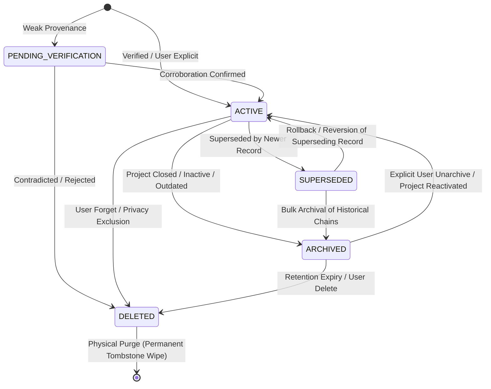

# DOOM V5.3 — ARCHITECTURE AUDIT & DESIGN SPECIFICATION
## Memory Lifecycle, Retention, Supersession & Evolution Architecture

**Phase**: V5.3 — Memory Lifecycle Architecture  
**Status**: ARCHITECTURE AUDIT & SPECIFICATION ONLY — NO IMPLEMENTATION  
**Protected Baseline**: DOOM V5.2.6 (`478633b909e549f59c44ce5db0aa9f654cfc7d5d`, Tag `v5.2.6`, Branch `DOOM-V5.2`)  
**Verified Baseline Test Suite**: 234 / 234 PASS (100%)  
**Target Release**: DOOM V5.3  
**Date**: September 2026  
**Author**: Principal AI Systems Architect & Production Reliability Engineer  

---

## 1. Executive Summary

Between V5.1 and V5.2, the DOOM AI Operating System constructed a sovereign, robust, and empirically hardened memory retrieval pipeline:
- **V5.1**: Canonical typed memory schema (`MemoryRecord`), PostgreSQL relational persistence, initial write policy, and baseline context building.
- **V5.2.1 – V5.2.3**: Local ONNX-accelerated 384-dimensional FastEmbed embeddings, dual-backend vector storage (PostgreSQL `pgvector` with process-local NumPy fallback), and bounded semantic vector retrieval.
- **V5.2.4 – V5.2.6**: Six-factor hybrid ranking ($S_{lex}, S_{sem}, S_{imp}, S_{rec}, S_{conf}, S_{proj}$), context safety & `[DATA_ONLY]` structural fencing, comprehensive failure-injection hardening, and empirical benchmarking (234/234 passing tests).

However, V5.2 focused strictly on **memory retrieval**—locating, ranking, and fencing active memories in response to cognitive queries. V5.2 intentionally postponed **memory lifecycle management**:
- How does DOOM determine whether an active memory remains valid or has become obsolete?
- How are contradictions between new evidence and older stored memories resolved without silent historical data loss?
- How are duplicate and near-duplicate memories detected, merged, or superseded?
- How do confidence and importance evolve over time without unbounded runaway drift?
- How does memory archival and privacy-compliant deletion interact with vector storage indices?

**DOOM V5.3 is the Memory Lifecycle Architecture.** Its objective is to design a deterministic, reversible, auditable, and fail-safe lifecycle subsystem that governs memory records from creation through verification, active utility, supersession, archival, and ultimate retirement.

---

## 2. Protected Baseline

The V5.3 architecture is built strictly on top of the approved, tested, and sealed V5.2.6 baseline:
- **Active Branch**: `DOOM-V5.2`
- **Release Commit SHA**: `478633b909e549f59c44ce5db0aa9f654cfc7d5d` (Short SHA: `478633b`)
- **Git Tag**: `v5.2.6`
- **Regression Suite Invariant**: **234 / 234 PASS (100%)** across 9 test suites:
  1. `test_v51_memory.py` (35 tests)
  2. `test_v52_embeddings.py` (24 tests)
  3. `test_v52_vector_store.py` (30 tests)
  4. `test_v52_semantic_retrieval.py` (23 tests)
  5. `test_v524_hybrid_ranking.py` (29 tests)
  6. `test_v4_cognitive.py` (25 tests)
  7. `test_v525_context_fencing.py` (31 tests)
  8. `test_doom.py` (7 tests)
  9. `test_v526_hardening.py` (30 tests)

**CRITICAL BASELINE RULE**: Zero modifications to V5.2.6 release history or protected production files are permitted during this phase. This document is strictly an architecture audit and engineering design.

---

## 3. Current Memory Architecture Audit [CURRENT IMPLEMENTATION]

A forensic inspection of the existing codebase reveals the following component layout:

```text
DOOM Memory Subsystem Architecture (V5.2 Baseline):

       [User / Task Execution / System Observation]
                           │
                           ▼
                  [memory/writers.py]
                           │
                           ▼
                  [memory/policy.py] (Write Policy & Content Sanitization)
                           │
                           ▼
                  [memory/manager.py] (Authoritative Write Interface)
                     │           │
                     │           ▼
                     │   [memory/lifecycle.py] (V5.1 Skeleton Lifecycle)
                     ▼
             [memory/repository.py] ───► [PostgreSQL: memory_records table]
                     │
         ┌───────────┴───────────┐
         ▼                       ▼
[memory/embedding/]     [memory/vector_store/]
FastEmbed Provider      NumPy / pgvector Storage
         │                       │
         └───────────┬───────────┘
                     ▼
           [memory/retrieval.py] (Lexical + Semantic Retrieval)
                     │
                     ▼
            [memory/ranking.py] (6-Factor Hybrid Ranking)
                     │
                     ▼
            [memory/context.py] & [memory/fencing.py] ([DATA_ONLY] Envelope)
                     │
                     ▼
          [core/cognition/engine.py] ───► [ReasoningEngine]
```

### Forensic Observations:
1. **Authoritative Write Path**: Writes go through `memory_manager.store()` in `memory/manager.py`. It invokes `memory_write_policy.evaluate()` to check content length, regex blacklist for sensitive credentials, privacy class defaults, and assigns confidence/verification.
2. **Persistence Path**: `memory_repository.store()` in `memory/repository.py` executes an `INSERT ... ON CONFLICT (memory_id) DO UPDATE SET` on PostgreSQL table `memory_records`.
3. **Retrieval Path**: `memory_retriever.retrieve()` in `memory/retrieval.py` performs two-phase candidate fetching:
   - Phase 1: Fetches lexical candidates via `memory_repository.search()`.
   - Phase 2: Generates query vector via `embedding_router.embed()` and searches vector storage via `vector_store.search_similar()`.
4. **Lifecycle Skeleton**: `memory/lifecycle.py` currently contains an early V5.1 stub with rudimentary methods: `supersede()`, `archive()`, `delete()`, `expire_temporary()`, and `activate_pending()`.

---

## 4. Current Schema Audit (`memory_records`) [CURRENT IMPLEMENTATION]

Inspection of `memory/schemas.py` and `database/postgres_db.py` (lines 175–205) confirms the exact physical PostgreSQL table definition:

```sql
CREATE TABLE IF NOT EXISTS memory_records (
    memory_id VARCHAR(100) PRIMARY KEY,
    memory_type VARCHAR(50) NOT NULL,
    content TEXT NOT NULL,
    source VARCHAR(50) NOT NULL DEFAULT 'DERIVED_CONTEXT',
    confidence VARCHAR(20) NOT NULL DEFAULT 'MEDIUM',
    importance REAL NOT NULL DEFAULT 0.5,
    status VARCHAR(30) NOT NULL DEFAULT 'ACTIVE',
    project_id VARCHAR(100),
    task_id VARCHAR(100),
    entity_ids JSONB DEFAULT '[]',
    tags JSONB DEFAULT '[]',
    supersedes_memory_id VARCHAR(100),
    source_event_id VARCHAR(100),
    verification_status VARCHAR(30) DEFAULT 'UNVERIFIED',
    privacy_class VARCHAR(20) DEFAULT 'NORMAL',
    metadata JSONB DEFAULT '{}',
    created_at TIMESTAMP WITH TIME ZONE DEFAULT CURRENT_TIMESTAMP,
    updated_at TIMESTAMP WITH TIME ZONE DEFAULT CURRENT_TIMESTAMP,
    last_accessed_at TIMESTAMP WITH TIME ZONE
);
```

### Existing Indexes:
- `idx_memory_type ON memory_records(memory_type)`
- `idx_memory_status ON memory_records(status)`
- `idx_memory_project ON memory_records(project_id)`
- `idx_memory_task ON memory_records(task_id)`
- `idx_memory_created ON memory_records(created_at DESC)`
- `idx_memory_importance ON memory_records(importance DESC)`
- `idx_memory_privacy ON memory_records(privacy_class)`

### Field Reusability & Extension Analysis:
| Field | Type | Current Purpose | V5.3 Lifecycle Assessment |
|:---|:---:|:---|:---|
| `memory_id` | `VARCHAR(100)` | Unique primary key (`mem_<hex16>`) | Retain unchanged as immutable record identity. |
| `status` | `VARCHAR(30)` | `ACTIVE`, `SUPERSEDED`, `ARCHIVED`, `DELETED`, `PENDING_VERIFICATION` | Retain column; formalize valid state transitions via state machine. |
| `confidence` | `VARCHAR(20)` | `HIGH`, `MEDIUM`, `LOW`, `UNKNOWN` | Retain column; define deterministic reinforcement/penalty rules based on empirical evidence. |
| `importance` | `REAL` | Float in $[0.0, 1.0]$ | Retain column; define access/utility adjustment boundaries without retrieval count bias. |
| `supersedes_memory_id` | `VARCHAR(100)` | Scalar ID of replaced memory | **Insufficient**: only supports 1:1 scalar replacement. Retain for 1:1 backward compatibility, but augment with `memory_relationships` for 1:N and N:1 relationships. |
| `verification_status` | `VARCHAR(30)` | `VERIFIED`, `UNVERIFIED`, `CONTRADICTED`, `SUPERSEDED` | **Architectural Overlap**: `SUPERSEDED` exists in both `status` and `verification_status`. Clean demarcation required (status = existential state; verification = empirical validation state). |
| `created_at` | `TIMESTAMPTZ` | Timestamp of initial insertion | Retain unchanged (provenance anchor). |
| `updated_at` | `TIMESTAMPTZ` | Timestamp of last record update | Retain unchanged; update on every state transition. |
| `last_accessed_at` | `TIMESTAMPTZ` | Timestamp of last retrieval | Currently updated via `touch_accessed()`; evaluate utility without high-write DB lock churn. |
| `metadata` | `JSONB` | Extensible key-value storage | Can store lifecycle metadata temporarily, but critical lifecycle attributes require indexed schema columns. |

---

## 5. Current Memory Types Audit [CURRENT IMPLEMENTATION]

`memory/types.py` (lines 9–17) defines 6 canonical memory types:

| Memory Type | Intended Role | Stability | Supersession Permitted? | Archival Permitted? | Deletion Policy | Verification Role |
|:---|:---|:---:|:---:|:---:|:---|:---:|
| `SHORT_TERM` | Ephemeral conversation turn buffer | Ephemeral ($< 1$ session) | No (buffered in-memory) | No | Session discard | None |
| `SEMANTIC` | System facts, domain definitions, tool specs | Long-term / Permanent | Yes (when facts change) | Yes | Logical / User request | Recommended |
| `EPISODIC` | Historical logs of completed task episodes | Historical / Immutable | No (history is permanent) | Yes (after project closure)| Restricted | Required (GroundTruth) |
| `PREFERENCE` | User directives, coding styles, UI themes | Dynamic / User-guided | Yes (high frequency) | Yes | User request | Explicit / Inferred |
| `PROJECT` | Architecture decisions, repo specs, milestones | Medium / Project duration| Yes (milestone evolution) | Yes (on project archive)| Admin / Project scope | Recommended |
| `EXPERIENCE` | Distilled task lessons, error workarounds | Long-term heuristic | Yes (when better fix found) | Yes | Obsolescence / User | Required |

---

## 6. Current Lifecycle Behavior Audit [CURRENT IMPLEMENTATION]

Inspecting `memory/repository.py` and `memory/lifecycle.py`:
1. **Status Updating Mechanism**: `update_status(memory_id, new_status)` performs a direct `UPDATE memory_records SET status = %s WHERE memory_id = %s`.
   - **Flaw**: It does **zero validation** of the prior status. A record in `DELETED` can be directly set to `ACTIVE` by accident.
   - **Flaw**: It does not log an audit trail (who changed it, why, or when).
   - **Flaw**: It does not synchronize with the vector storage layer.
2. **Supersession Mechanism**: `memory_lifecycle.supersede(old_id, new_rec)` stores `new_rec` with `new_rec.supersedes_memory_id = old_id`, then calls `update_status(old_id, SUPERSEDED)`.
   - **Flaw**: Non-transactional. If the `update_status` fails, the new record exists, but the old record remains `ACTIVE`. Both will match queries simultaneously as contradictory active memories.
   - **Flaw**: Keyword overlap search `find_conflicting_active()` uses SQL `ILIKE` on arbitrary keywords. It cannot detect semantic paraphrases or conceptual contradictions.
3. **Deletion Mechanism**: `memory_lifecycle.delete(memory_id)` sets `status = DELETED`.
   - **Flaw**: The vector store embedding in `NumPyVectorStorageAdapter` or `pgvector` is **not de-indexed**.
   - **Flaw**: Semantic vector search retrieves the top-25 nearest vector candidates. If deleted vectors are among the nearest 25, they consume candidate slots and are only discarded after fetching the parent record from PostgreSQL. This creates **candidate starvation**.

---

## 7. Current V5.2 Retrieval Integration Audit [CURRENT IMPLEMENTATION]

In `memory/retrieval.py` (lines 139 and 193):
- **Lexical Phase**:
  ```python
  if r.status != MemoryStatus.ACTIVE:
      continue
  ```
- **Semantic Phase**:
  ```python
  if rec.status != MemoryStatus.ACTIVE:
      continue
  ```
- **Retrieval Result**: Any record whose status is not strictly `ACTIVE` (`SUPERSEDED`, `ARCHIVED`, `DELETED`, `PENDING_VERIFICATION`) is discarded from cognitive context.
- **Context Fencing**: In `memory/fencing.py`, only active records reach the fencer.

---

## 8. Lifecycle Gaps & Vulnerabilities [CURRENT GAPS]

Forensic analysis identifies 10 critical architectural gaps in the current system:

1. **Absence of a Formal State Machine**: State transitions are arbitrary string updates with zero guardrails against illegal transitions.
2. **Vector Store Inconsistency (Zombie Vectors)**: When a memory is superseded, archived, or deleted in PostgreSQL, its embedding remains in the vector store, polluting vector nearest-neighbor calculations.
3. **Naive Conflict Detection**: Conflicts are detected by string matching (`ILIKE`) rather than semantic distance and schema-level entity keys.
4. **Scalar Supersession Chains (1:1 limitation)**: Cannot represent consolidation where three separate experiences are merged into one distilled rule, or where one rule splits into two.
5. **Supersession Cycles**: No cycle detection. A circular chain ($A \to B \to C \to A$) can be formed, creating infinite loops in chain traversal.
6. **Conflation of Age and Value**: Exponential recency decay ($t_{1/2} = 30\text{ days}$) penalizes older foundational facts (e.g. "Workstation has AMD Ryzen 7") simply because they were recorded weeks ago.
7. **Lack of Lifecycle Audit Trail**: No table records status change history, reasons, or automated policy evaluations.
8. **Experience Staleness**: Experiences recorded under older tool versions or environments never become stale or re-evaluated when the underlying environment changes.
9. **No Transactional Atomicity in Database**: Supersession and archival are split across multiple independent database calls without PostgreSQL transaction envelopes (`BEGIN ... COMMIT`).
10. **Unchecked Duplicate Growth**: Re-storing the same observation creates duplicate records with distinct `memory_id`s, diluting candidate pools and wasting vector storage.

---

## 9. V5.3 Goals [PROPOSED]

1. **Deterministic Lifecycle State Machine**: Implement a formalized state machine with strict transition guards, transition validation, and idempotent operations.
2. **Post-Commit Vector Synchronization & Deterministic Reconciliation**: PostgreSQL remains the single authoritative store for lifecycle state. Post-commit hooks remove non-active embeddings, backed by periodic reconciliation to repair any index drift.
3. **Structured Candidate Classification**: Use FastEmbed embeddings to identify `DUPLICATE_CANDIDATE`, `CONFLICT_CANDIDATE`, and `RELATED_MEMORY`, without assuming embedding similarity alone proves contradiction.
4. **Structured Supersession DAG & Relationship Model**: Support 1:1, 1:N, and N:1 supersession with cycle-prevention and chain-depth limits.
5. **Freshness vs. Recency Separation**: Establish an explicit Freshness model that distinguishes volatile contextual facts from permanent historical anchors.
6. **Evidence-Based Confidence & Importance Evolution**: Define bounded, deterministic rules for confidence reinforcement and penalty based on empirical task outcomes and explicit user feedback, never retrieval frequency.
7. **Complete Auditability**: Introduce a dedicated relational audit log table (`memory_lifecycle_events`) tracking every state change, actor, and rationale.
8. **Hard Retrieval Safety Invariant**: Guarantee that **non-ACTIVE memories must never be returned as valid semantic retrieval results**, strictly decoupling index consistency from retrieval correctness.
9. **Fail-Closed Safety & Zero Tool Authority**: Maintain the absolute invariant that memory lifecycle operations cannot invoke tools, bypass RiskEngine, or execute arbitrary code.

---

## 10. Non-Goals [OUT OF SCOPE]

To prevent architectural scope creep, V5.3 explicitly declares:
- **NO V6 Proactive Autonomous Agent**: V5.3 will not autonomously crawl the web, self-initiate background tasks, or make autonomous code edits.
- **NO External Cloud Dependencies**: V5.3 remains 100% sovereign, local, and offline-capable.
- **NO LLM Self-Training / Weight Fine-Tuning**: Lifecycle updates affect structured data records, not neural network weights.
- **NO Replacement of V5.2 Ranking**: V5.2.4 hybrid ranking remains the authoritative retrieval scoring engine.
- **NO Complex Graph Database Engine**: Relational PostgreSQL with JSONB and foreign keys is sufficient. No Neo4j or separate graph infrastructure will be added.
- **NO Automatic Deletion Solely by Age**: Old memories will not be expired or deleted simply because time has elapsed.

---

## 11. Proposed Lifecycle Model [PROPOSED V5.3 DESIGN]

The DOOM V5.3 Memory Lifecycle separates memory existence into distinct lifecycle tiers:

```text
                                  ┌────────────────────────┐
                                  │  INGESTION / WRITER    │
                                  └───────────┬────────────┘
                                              │
                                              ▼
                                 [Policy / Safety Check]
                                              │
                     ┌────────────────────────┴────────────────────────┐
                     │ (if unverified / requires check)                │ (if explicit / task verified)
                     ▼                                                 ▼
        ┌─────────────────────────┐                       ┌─────────────────────────┐
        │  PENDING_VERIFICATION   │                       │         ACTIVE          │
        └────────────┬────────────┘                       └────────────┬────────────┘
                     │                                                 │
                     │ (verification confirmed)                        │
                     └────────────────────────►────────────────────────┤
                                                                       │
                                      ┌────────────────────────────────┼────────────────────────────────┐
                                      │                                │                                │
                         (superseded by newer)               (archived / obsolete)           (explicit delete / privacy)
                                      ▼                                ▼                                ▼
                        ┌─────────────────────────┐      ┌─────────────────────────┐      ┌─────────────────────────┐
                        │       SUPERSEDED        │      │        ARCHIVED         │      │         DELETED         │
                        └─────────────┬───────────┘      └─────────────┬───────────┘      └─────────────┬───────────┘
                                      │                                │                                │
                                      │                                │ (restore)                      │ (purge after grace)
                                      │                                └────────►[ACTIVE]               ▼
                                      │                                                          [PURGED / WIPED]
                                      └────────────────►───────────────┘
                                             (archive superseded records)
```

### The 5 Formal Lifecycle States:
1. **`PENDING_VERIFICATION`**: Memory ingested from weak provenance (e.g. conversational inference) awaiting corroborating evidence before entering active cognitive context.
2. **`ACTIVE`**: Fully valid, live, indexed, and retrievable by V5.2 search.
3. **`SUPERSEDED`**: Replaced by newer or more authoritative evidence. Retained in relational storage for lineage and audit; excluded from standard cognitive retrieval.
4. **`ARCHIVED`**: Preserved for historical reference and project post-mortems; excluded from standard retrieval but retrievable via explicit historical query mode.
5. **`DELETED`**: Logically deleted (tombstoned). Excluded from all cognitive processing; scheduled for permanent purge or immediately wiped if privacy-sensitive.

---

## 12. Lifecycle State Machine Specification [PROPOSED V5.3 DESIGN]



---

## 13. State Transition Rules & Invariants [PROPOSED V5.3 DESIGN]

Every state transition must be validated against a formal transition matrix:

| Source State | Target State | Permitted? | Condition / Transition Guard |
|:---|:---|:---:|:---|
| `PENDING_VERIFICATION` | `ACTIVE` | **YES** | Ground-truth verification evidence or explicit user confirmation received. |
| `PENDING_VERIFICATION` | `DELETED` | **YES** | Evidence refuted the fact, or pending timeout elapsed without corroboration. |
| `PENDING_VERIFICATION` | `SUPERSEDED` | **NO** | Cannot supersede an unverified record directly; must reject or verify first. |
| `PENDING_VERIFICATION` | `ARCHIVED` | **NO** | Unverified claims must not be preserved in long-term archives. |
| `ACTIVE` | `SUPERSEDED` | **YES** | Valid new `MemoryRecord` registered with higher or equal authority and causal linkage. |
| `ACTIVE` | `ARCHIVED` | **YES** | Project completion, retention policy trigger, or explicit user archive command. |
| `ACTIVE` | `DELETED` | **YES** | Explicit user command ("forget this"), privacy violation, or security quarantine. |
| `SUPERSEDED` | `ACTIVE` | **YES** | Rare reversion/rollback: only permitted if the superseding record is deleted or refuted. |
| `SUPERSEDED` | `ARCHIVED` | **YES** | Allowed during batch lifecycle maintenance to clean up deep history. |
| `SUPERSEDED` | `DELETED` | **YES** | Allowed if user explicitly commands deletion of historical records. |
| `ARCHIVED` | `ACTIVE` | **YES** | Explicit user reactivation of project or manual restoration. |
| `ARCHIVED` | `DELETED` | **YES** | Retention period expiration or user deletion. |
| `DELETED` | `ACTIVE` | **NO** | **FORBIDDEN**. Deleted records cannot be resurrected directly. A new memory must be created. |
| `DELETED` | `ARCHIVED` | **NO** | **FORBIDDEN**. |
| `DELETED` | `SUPERSEDED` | **NO** | **FORBIDDEN**. |

---

## 14. Freshness Model vs. Lifecycle State [PROPOSED V5.3 DESIGN]

### Mandatory Architectural Distinction:
- **Lifecycle State**: Existential availability (`PENDING_VERIFICATION`, `ACTIVE`, `SUPERSEDED`, `ARCHIVED`, `DELETED`). Governs whether a record is eligible to be considered.
- **Freshness**: Information quality (`FRESH`, `AGING`, `STALE`, `UNKNOWN`). Governs whether the content reflects current truth or requires verification.
- **Recency ($S_{rec}$)**: Mathematical time elapsed since creation ($e^{-\lambda \Delta t}$). Governs temporal bias in retrieval ranking.
- **Validity**: Empirical correctness (`VERIFIED`, `UNVERIFIED`, `CONTRADICTED`).
- **Confidence**: Subjective certainty level (`HIGH`, `MEDIUM`, `LOW`, `UNKNOWN`).
- **Importance**: Intrinsic priority score ($[0.0, 1.0]$).

### Freshness Combinations:
- `ACTIVE + STALE`: Perfectly valid. E.g., a user's stated preference for a framework that has not been confirmed in 18 months remains active, but flagged as stale so cognition can gently ask or verify if necessary.
- `ARCHIVED + HISTORICALLY_VALID`: Perfectly valid. E.g., a spec for Project Aegis v1.0 remains 100% historically true, but archived because active development is complete.

### Freshness Categories:
1. **`IMMUTABLE_FACT`**: Truth value does not degrade over time (e.g. "Author of DOOM is Sujal", "Workstation hardware configuration at purchase"). Freshness = `FRESH` permanently.
2. **`CURRENT_STATE`**: Dynamic state that evolves (e.g. "Active branch is DOOM-V5.2", "Current IDE theme is One Dark Pro"). Freshness transitions to `AGING` after 30 days and `STALE` after 90 days without touch.
3. **`HEURISTIC_LESSON`**: Empirical experience (e.g. "PostgreSQL connection leaks prevented by finally block"). Remains fresh until the underlying library/subsystem changes major versions.
4. **`VOLATILE_CONTEXT`**: Highly transient context (e.g. "Working on bug fix in module X"). `STALE` after 48 hours without task association.

---

## 15. Confidence Lifecycle & Safeguards [PROPOSED V5.3 DESIGN]

Confidence represents empirical certainty:
```text
Confidence Scale:
UNKNOWN (0.10) ──► LOW (0.30) ──► MEDIUM (0.60) ──► HIGH (1.00)
```

### Strict Safeguard Rules:
1. **No Retrieval Frequency Mutation**:
   - Retrieving a memory 50 times **must NOT** increase its confidence.
   - Retrieval frequency indicates conversational relevance, not truth.
2. **Permitted Evidence for Confidence Changes**:
   - **Explicit User Confirmation**: User directly confirms the fact ("Yes, that is correct") $\to$ `HIGH`.
   - **Empirical Task Outcome**: GroundTruthVerifier confirms file on disk or tool success $\to$ `HIGH`.
   - **Empirical Contradiction**: Tool returns an error or contrary state $\to$ `CONTRADICTED` with confidence penalized to `0.0`.
   - **Explicit User Correction**: User provides contradictory instruction $\to$ old record confidence penalized, new record created.
3. **Uncontrolled Self-Learning Prevention**:
   - Inferred memories (`USER_CONVERSATION`, `DERIVED_CONTEXT`) start at `MEDIUM` or `LOW` and cannot self-promote to `HIGH` without external grounding.

---

## 16. Importance Lifecycle & Safeguards [PROPOSED V5.3 DESIGN]

Importance represents cognitive utility ($[0.0, 1.0]$):
- **User Explicit Directives**: Initial importance $0.80 - 1.00$. Cannot be automatically decayed below $0.70$ without explicit user instruction.
- **Task Experiences**: Initial importance $0.70$ (verified success) or $0.40$ (unverified).
- **Anti-Inflation Rule**:
   - A memory retrieved 500 times does **not** become permanently 1.0 importance.
   - Frequency of retrieval is handled by recency and relevance in V5.2 ranking. Importance must reflect semantic substance and user-assigned priority.

---

## 17. Duplicate Memory Management & Similarity Boundaries [PROPOSED V5.3 DESIGN]

### Mandatory Principle: Semantic Similarity $\neq$ Contradiction
FastEmbed vector cosine similarity measures topical relatedness, **not logical equivalence or contradiction**.
- Example: `"I prefer Python for backend services"` and `"I prefer Rust for backend services"` have very high cosine similarity ($\sim 0.88$), yet they represent **contradictory** preferences.
- Example: `"Python is my favorite language"` and `"I prefer Python"` have high similarity ($\sim 0.93$) and represent **identical** preferences (duplicates).

### Structured Classification:
1. **`DUPLICATE_CANDIDATE`**: High similarity ($\ge 0.92$, configurable calibration) **AND** identical entity keys/predicates.
2. **`CONFLICT_CANDIDATE`**: High similarity ($\ge 0.80$) **AND** opposing attributes/values for the same entity key.
3. **`RELATED_MEMORY`**: High similarity ($\ge 0.70$), but distinct predicates or complementary details.

### Lifecycle Resolution Protocol:
- **Exact Duplicate on Ingestion** ($\text{hash}(content_A) == \text{hash}(content_B)$):
  - Increment corroboration count in metadata; do not create a redundant record.
- **Duplicate Candidate**:
  - Requires structural comparison. If content expresses the identical assertion with higher confidence, supersede the older record.
- **Conflict Candidate**:
  - Never silently delete! Flag for resolution based on authority hierarchy and temporal succession.
- **Empirical Calibration**: The $0.92$ threshold is an initial baseline; V5.3 must allow empirical tuning per memory type.

---

## 18. Conflict Management & Historical Truth [PROPOSED V5.3 DESIGN]

When conflicting memories occur:
1. **Preserve Historical Truth**:
   - Never perform destructive in-place content overwrites (`UPDATE content = ...`).
   - The previous preference was historically true; the new preference is current truth.
2. **Authority Hierarchy**:
   $$\text{USER\_EXPLICIT} > \text{VERIFIED\_TASK} > \text{SYSTEM\_OBSERVATION} > \text{USER\_CONVERSATION} > \text{DERIVED\_CONTEXT}$$
3. **Scope Specificity**:
   - Project-scoped facts (`project_id = "aegis"`) override global facts (`project_id = None`) within that project context without superseding the global preference.
4. **Deterministic Succession**:
   - If authority and scope are equal, the newer verified timestamp supersedes the predecessor via transactional supersession.

---

## 19. Supersession DAG & Relationship Model [PROPOSED V5.3 DESIGN]

### Evolution of Supersession:
In V5.1, `MemoryRecord` contains a scalar `supersedes_memory_id VARCHAR(100)`. This is sufficient for simple 1:1 replacement, but fails for:
- **1:N Splitting**: One coarse memory is replaced by two specific memories.
- **N:1 Consolidation**: Three related task experiences are distilled into a single canonical rule.

### Conceptual Relationship Architecture (`memory_relationships` table):
To represent rich graph relationships without breaking V5.1 scalar compatibility:
- **Scalar Column (`supersedes_memory_id`)**: Retained for primary 1:1 backward compatibility.
- **Proposed Relationship Table**: Evaluated for N:1 and 1:N lineage tracking:
  ```sql
  CREATE TABLE IF NOT EXISTS memory_relationships (
      relationship_id VARCHAR(100) PRIMARY KEY,
      source_memory_id VARCHAR(100) NOT NULL REFERENCES memory_records(memory_id) ON DELETE CASCADE,
      target_memory_id VARCHAR(100) NOT NULL REFERENCES memory_records(memory_id) ON DELETE CASCADE,
      relationship_type VARCHAR(50) NOT NULL, -- 'SUPERSEDES', 'CONSOLIDATED_INTO', 'CORROBORATES', 'DERIVED_FROM'
      reason VARCHAR(255),
      created_at TIMESTAMP WITH TIME ZONE DEFAULT CURRENT_TIMESTAMP,
      actor VARCHAR(50) DEFAULT 'SYSTEM',
      metadata JSONB DEFAULT '{}',
      CONSTRAINT uq_memory_rel UNIQUE(source_memory_id, target_memory_id, relationship_type),
      CONSTRAINT chk_no_self_ref CHECK(source_memory_id != target_memory_id)
  );
  CREATE INDEX IF NOT EXISTS idx_rel_source ON memory_relationships(source_memory_id);
  CREATE INDEX IF NOT EXISTS idx_rel_target ON memory_relationships(target_memory_id);
  ```

### DAG Invariants & Cycle Rejection:
- **Self-Supersession Rejected**: $A \to A$ is blocked by database constraint and application validation.
- **Cycle Prevention**: Before committing a supersession relationship ($B \to A$), the system executes a DFS traversal of ancestors. If $B$ is found in $A$'s ancestry, the transaction is rejected with `SupersessionCycleError`.
- **Depth Bound**: Traversal depth is hard-bounded to $\le 10$.

---

## 20. Archival Model [PROPOSED V5.3 DESIGN]

- **Definition**: Archived memories are valid, historical records that are no longer part of active conversational context.
- **Authoritative Storage**: Stored durably in PostgreSQL `memory_records` with `status = 'ARCHIVED'`.
- **Vector De-indexing**: To prevent candidate starvation in active retrieval, archived memory embeddings are de-indexed from the active vector search pool.
- **Cognitive Isolation**: Excluded from default cognition. Retrievable only when the user or planner explicitly requests historical context (e.g. "Review past decisions on Project Aegis").

---

## 21. Deletion Model: Logical vs. Physical vs. Privacy [PROPOSED V5.3 DESIGN]

| Deletion Level | Target Scope | Execution Behavior | Vector Store Action | Audit Log Action | Reversible? |
|:---|:---|:---|:---|:---|:---:|
| **Logical Deletion** | Standard lifecycle cleanup / user request | Record marked `status = 'DELETED'` | Vector embedding de-indexed | Logged in `memory_lifecycle_events` | Yes (during grace period) |
| **Physical Purge** | Periodic tombstone cleanup | Row deleted from `memory_records` | Vector embedding deleted | Tombstone record retained in audit log | **NO** |
| **Privacy / Sensitive Erasure** | Credential leak / PII deletion | Immediate physical row delete + cache wipe | Immediate vector delete + cache purge | Cryptographic hash logged; raw text never logged | **NO** |

---

## 22. Retention Policy Framework [PROPOSED V5.3 DESIGN]

1. **`PERMANENT`**: User explicit directives, core system identity, verified user profile facts. Never archived or deleted automatically.
2. **`PROJECT_BOUND`**: Retained while the associated project is `ACTIVE`. When the project transitions to `ARCHIVED`, project memories transition to `ARCHIVED`.
3. **`EPHEMERAL_TASK`**: Low-importance intermediate task outputs. Eligible for archival after 30 days of inactivity.
4. **`EXPERIENCE_HEURISTIC`**: Retained indefinitely until superseded by an upgraded experience for the same tool or workflow.

---

## 23. Experience Memory Lifecycle [PROPOSED V5.3 DESIGN]

- **Successful Tasks**: Ground-truth verified task outcomes are stored as `MemoryType.EXPERIENCE` with `VerificationStatus.VERIFIED` and `ConfidenceLevel.HIGH`.
- **Failed Tasks**:
  - Failed tasks **must never** be stored as successful experience memories.
  - If a workaround is discovered after a failure, the experience records both the failure mode and the working resolution.
- **Obsolescence**: When a tool or library is updated, older heuristics are superseded or archived.

---

## 24. Project Memory Lifecycle [PROPOSED V5.3 DESIGN]

- **Active Development**: Decisions and specs linked to `project_id`.
- **Project Completion**: When project status is updated to `COMPLETED`:
  - Project memories are marked with `metadata["project_lifecycle"] = "COMPLETED"`.
  - Memories remain `ACTIVE` for a 90-day cooldown before being eligible for bulk archival.
- **Cross-Project Isolation**: V5.2.4 project isolation policies strictly apply across all lifecycle states.

---

## 25. Corrected V5.3 Architecture & Dual-Store Consistency Model [PROPOSED V5.3 DESIGN]

### Dual-Store Consistency: PostgreSQL Authority & Post-Commit Synchronization
The previous architecture proposal incorrectly suggested an "atomic dual-store transaction" across PostgreSQL and NumPy.
**Architectural Correction**:
1. **PostgreSQL is the Sole Authoritative Store**:
   - All lifecycle state mutations occur inside a strict PostgreSQL transaction (`BEGIN ... COMMIT`).
   - If the database transaction fails, nothing changes.
2. **NumPy Vector Store is Process-Local Fallback Storage**:
   - In the Windows deployment, vector storage runs via `NumPyVectorStorageAdapter` in memory.
   - It **cannot** participate in 2-Phase Commit (2PC) or PostgreSQL relational transactions.
   - Therefore, vector synchronization follows an **Eventual Consistency** model via post-commit hooks.
3. **Deterministic Reconciliation Routine**:
   - If the process crashes after PostgreSQL commit but before vector de-indexing, a startup reconciliation routine inspects `memory_records WHERE status != 'ACTIVE'` and cleans the vector index.
4. **Vector Store Failure Does Not Roll Back Lifecycle State**:
   - If vector de-indexing encounters an in-memory error, the authoritative database transaction is **not** rolled back. The record is flagged with `metadata["vector_dirty"] = True` and repaired during reconciliation.

### Architecture Flow Diagram:

```text
                    MEMORY MANAGER
                         │
                         ▼
                 LIFECYCLE POLICY
                         │
                         ▼
                 STATE MACHINE
                         │
                         ▼
             POSTGRESQL TRANSACTION (Authoritative)
                │                │
                ▼                ▼
          Memory State      Audit Event
                │
                ▼
             COMMIT
                │
                ▼
       VECTOR SYNCHRONIZATION (Post-Commit Hook)
                │
          ┌─────┴─────┐
          ▼           ▼
       NumPy       pgvector (Future)
          │
          ▼
    RECONCILIATION (Startup & Periodic Repair)


Retrieval Pipeline (Lifecycle-Enforced):

      PostgreSQL Memory Records
                 │
                 ▼
       Lifecycle Eligibility Check
      (status == 'ACTIVE' enforced)
                 │
                 ▼
       Privacy & Security Filtering
      (SENSITIVE excluded, PRIVATE gated)
                 │
        ┌────────┴────────┐
        ▼                 ▼
  Lexical Search    Semantic Vector Search
        │                 │
        └────────┬────────┘
                 │
                 ▼
        V5.2 Hybrid Ranking
        (6-Factor Composite)
                 │
                 ▼
       V5.2.5 Context Fencing
       ([DATA_ONLY] Envelope)
                 │
                 ▼
          Cognitive Engine
```

---

## 26. Required Vector Invariant: Index Consistency vs. Retrieval Correctness [PROPOSED V5.3 DESIGN]

### The Hard Safety Invariant:
$$\mathbf{NON\text{-}ACTIVE\ MEMORIES\ MUST\ NEVER\ BE\ RETURNED\ AS\ VALID\ SEMANTIC\ RETRIEVAL\ RESULTS.}$$

### Distinguishing Index Consistency from Retrieval Correctness:
- **Index Consistency**: Striving to ensure the vector index contains only vectors of `ACTIVE` memories. Because NumPy is process-local and eventual-consistent, transient index drift is possible after an ungraceful crash.
- **Retrieval Correctness (The Invariant)**: Even if a non-active vector remains in the fallback index and is returned by `search_similar()`, Phase 2 of `memory_retriever.retrieve()` fetches the parent record from PostgreSQL and verifies:
  ```python
  if rec.status != MemoryStatus.ACTIVE:
      continue
  ```
- **Result**: Even under vector store inconsistency, **retrieval correctness is mathematically guaranteed**. Stale vectors are dropped before ranking, context assembly, or cognitive injection.

---

## 27. Safety Model & Lifecycle Authority Boundaries [PROPOSED V5.3 DESIGN]

### Mandatory Authority Constraint:
$$\mathbf{LIFECYCLE\ SUBSYSTEM\ HAS\ ZERO\ TOOL\ EXECUTION\ AUTHORITY.}$$

The memory lifecycle engine:
- **MAY** transition memory status (`ACTIVE`, `ARCHIVED`, `SUPERSEDED`, `DELETED`).
- **MAY** update lifecycle metadata, timestamps, and relationship edges.
- **MAY** synchronize vector indices and log audit records.
- **MUST NOT** execute tools.
- **MUST NOT** invoke planners, PlanValidators, or RiskEngine.
- **MUST NOT** authorize external actions.
- **MUST NOT** bypass context fencing or privacy boundaries.

Memory can **inform** cognition; memory cannot **command** cognition.

---

## 28. Concurrency, Locking & Idempotency [PROPOSED V5.3 DESIGN]

- **Database Transaction Boundaries**:
  ```sql
  BEGIN;
    -- 1. Validate source status
    -- 2. Validate DAG (no cycles)
    -- 3. Update old record status
    -- 4. Insert/update new record
    -- 5. Insert audit event
  COMMIT;
  ```
- **Row-Level Locking**: `SELECT ... FOR UPDATE` on target records during supersession to prevent concurrent race conditions.
- **Idempotent Transitions**: Calling `archive(memory_id)` on an already archived memory returns `True` immediately without duplicate audit events.

---

## 29. Crash Recovery & Reconciliation Engine [PROPOSED V5.3 DESIGN]

On DOOM startup or detected vector store reset:
```python
def reconcile_indices():
    """
    Scans PostgreSQL for non-active records and purges orphan vectors from vector storage.
    Ensures eventual consistency after ungraceful process termination.
    """
```
1. Fetch all `memory_id`s from PostgreSQL where `status != 'ACTIVE'`.
2. Delete corresponding vector embeddings from `vector_store`.
3. Clear `metadata["vector_dirty"]` flags in PostgreSQL.

---

## 30. Auditability & Relational Event Logging [PROPOSED V5.3 DESIGN]

### Proposed Schema (`memory_lifecycle_events`):
```sql
CREATE TABLE IF NOT EXISTS memory_lifecycle_events (
    event_id VARCHAR(100) PRIMARY KEY,
    memory_id VARCHAR(100) NOT NULL REFERENCES memory_records(memory_id) ON DELETE CASCADE,
    previous_status VARCHAR(30) NOT NULL,
    new_status VARCHAR(30) NOT NULL,
    transition_reason VARCHAR(255) NOT NULL,
    actor VARCHAR(50) NOT NULL DEFAULT 'SYSTEM',
    related_memory_id VARCHAR(100),
    confidence_before VARCHAR(20),
    confidence_after VARCHAR(20),
    importance_before REAL,
    importance_after REAL,
    metadata JSONB DEFAULT '{}',
    created_at TIMESTAMP WITH TIME ZONE DEFAULT CURRENT_TIMESTAMP
);
CREATE INDEX IF NOT EXISTS idx_lifecycle_mem_id ON memory_lifecycle_events(memory_id);
CREATE INDEX IF NOT EXISTS idx_lifecycle_created ON memory_lifecycle_events(created_at DESC);
```

---

## 31. User Control Model [PROPOSED V5.3 DESIGN]

| User Utterance Example | Internal Operation | Target Status | Audit Reason |
|:---|:---|:---:|:---|
| *"Forget that I like light mode."* | `lifecycle.delete(memory_id)` | `DELETED` | `USER_EXPLICIT_FORGET` |
| *"Actually, I switched to Python 3.12."* | `lifecycle.supersede(old_id, new_rec)`| `SUPERSEDED` | `USER_PREFERENCE_UPDATE` |
| *"Archive all notes on Project Chronos."*| `lifecycle.archive_project("chronos")`| `ARCHIVED` | `USER_PROJECT_ARCHIVE` |
| *"Restore my note about VS Code themes."*| `lifecycle.restore(memory_id)` | `ACTIVE` | `USER_EXPLICIT_RESTORE` |
| *"Why do you think I prefer PostgreSQL?"*| `lifecycle.get_lineage(memory_id)` | Query audit | `USER_LINEAGE_QUERY` |

---

## 32. Database Design: Existing vs. Proposed V5.3 Changes

### Existing Database Architecture (V5.1 / V5.2):
- Table `memory_records` with 19 columns and 7 indexes.
- Columns: `memory_id`, `memory_type`, `content`, `source`, `confidence`, `importance`, `status`, `project_id`, `task_id`, `entity_ids`, `tags`, `supersedes_memory_id`, `source_event_id`, `verification_status`, `privacy_class`, `metadata`, `created_at`, `updated_at`, `last_accessed_at`.

### Proposed V5.3 Additions (NOT YET IMPLEMENTED):
1. **Audit Table**: `memory_lifecycle_events` (detailed in Section 30).
2. **Relationship Table**: `memory_relationships` (detailed in Section 19 for 1:N and N:1 DAG tracking).
3. **Migration Strategy**: Additive only. No existing columns altered or dropped.
4. **Rollback Strategy**: Dropping `memory_lifecycle_events` and `memory_relationships` leaves existing V5.2 operations completely functional.

---

## 33. API Design Specification [FUTURE INTERFACES]

```text
GET    /api/v1/memory/{memory_id}              -> Fetch single record + lifecycle state
PATCH  /api/v1/memory/{memory_id}/status       -> Request state transition (archive, activate)
POST   /api/v1/memory/{memory_id}/supersede    -> Supersede with payload record
POST   /api/v1/memory/{memory_id}/restore      -> Restore from ARCHIVED to ACTIVE
DELETE /api/v1/memory/{memory_id}              -> Logical delete (or purge with ?permanent=true)
GET    /api/v1/memory/{memory_id}/history      -> Fetch audit log from memory_lifecycle_events
POST   /api/v1/memory/reconcile                -> Sync vector store with active records
```

---

## 34. Telemetry Hygiene [PROPOSED V5.3 DESIGN]

Safe metrics emitted:
- `lifecycle_transitions_total`
- `supersessions_total`
- `archives_total`
- `deletions_total`
- `restores_total`
- `conflicts_detected_total`
- `reconciled_vectors_total`

**Privacy Invariant**: No raw queries, no raw memory text, no embeddings, and no secret keys in telemetry payloads.

---

## 35. Failure Handling Matrix [PROPOSED V5.3 DESIGN]

| Component Failure | Impact | Fallback Behavior |
|:---|:---|:---|
| PostgreSQL disconnect during state change | Transaction cannot commit | Rollback; memory remains in original status; log error |
| Vector store disconnect during un-indexing | Vector remains in index | Mark record in PostgreSQL with `metadata["vector_dirty"] = True`; reconcile on next cycle; retrieval filter prevents leakage |
| Cycle detected during supersession | Illegal DAG structure | Reject request with `SupersessionCycleError`; preserve existing records |
| Corrupt metadata JSON | Parsing exception | Fallback to safe defaults; do not crash cognition |

---

## 36. Scaled Performance Strategy [PROPOSED V5.3 DESIGN]

- **Operational Scale**: 500 to 50,000 memories.
- **Event-Driven Execution**: Lifecycle mutations execute on write, update, or explicit command—never through continuous polling loops.
- **Target Latency**: State transitions $< 10\text{ ms}$ under local PostgreSQL.

---

## 37. Test Strategy [PROPOSED V5.3 DESIGN]

1. **Unit Tests (`test_v53_state_machine.py`)**: All valid and invalid state transitions, guards, and transition errors.
2. **DAG Tests (`test_v53_supersession.py`)**: 1:1, 1:N, N:1 links, cycle detection, and lineage traversal.
3. **Integration Tests (`test_v53_vector_sync.py`)**: Post-commit vector de-indexing and reconciliation verification.
4. **Retrieval Invariant Tests (`test_v53_retrieval_integration.py`)**: Proving non-ACTIVE memories are never returned.
5. **Fault Injection (`test_v53_resilience.py`)**: Simulating DB disconnects and vector de-indexing errors.

---

## 38. Regression Protection Plan [PROPOSED V5.3 DESIGN]

The complete 234-test verified baseline will be executed as a hard gate at every step:
- Baseline: 204 tests (V4.2 through V5.2.5) + 30 tests (V5.2.6) = **234/234**.
- V5.3 test suites will be added strictly additively.
- Zero breaking changes to `MemoryRetriever.retrieve()` or `MemoryRanker.score_hybrid()`.

---

## 39. Implementation Phases (V5.3 Series Breakdown) [PROPOSED]

To ensure disciplined, verifiable delivery, V5.3 is decomposed into 7 subphases:

### **V5.3.1: Lifecycle Foundation**
- Scope: Lifecycle enums, typed exception classes, lifecycle event schema (`memory_lifecycle_events`), transition model, and validation infrastructure.

### **V5.3.2: State Machine & Transaction Engine**
- Scope: Transition guards, forbidden transitions, PostgreSQL transactions (`with conn:`), idempotency, concurrency row-locks, and crash safety.

### **V5.3.3: Vector Consistency & Reconciliation**
- Scope: Lifecycle-aware vector eligibility, post-commit synchronization hooks, process-local NumPy consistency, `pgvector` forward compatibility, and startup/periodic reconciliation routines.

### **V5.3.4: Supersession, Relationships & Conflict Management**
- Scope: Multi-record relationship model (`memory_relationships`), DAG validation, cycle-prevention algorithms, structured duplicate candidate and conflict candidate classification, and FastEmbed similarity calibration.

### **V5.3.5: Freshness, Confidence & Importance**
- Scope: Qualitative Freshness model (independent of lifecycle state), evidence-based confidence reinforcement/penalty, controlled importance boundaries, and validity state tracking.

### **V5.3.6: Project & Experience Lifecycle**
- Scope: Project completion cooldowns, bulk project archival, experience memory versioning, retention policy profiles, and historical knowledge access.

### **V5.3.7: Hardening, Benchmarking & Acceptance**
- Scope: Dedicated acceptance suite (30+ tests), security and privacy revalidation, concurrency stress testing, fault-injection tests, regression invariant verification (234 + V5.3 tests), and final acceptance reporting.

---

## 40. Risks & Architectural Mitigations

| Risk | Severity | Mitigation |
|:---|:---:|:---|
| **Vector Index Inconsistency** (Ghost embeddings) | High | Post-commit vector de-indexing + startup reconciliation + strict retrieval eligibility filter. |
| **Silent Contradictions** (Both versions active) | High | Atomic PostgreSQL transactions linking new active memory and marking old memory superseded. |
| **Infinite Supersession Loops** | Medium | Graph cycle detection running prior to committing supersession edges. |
| **Runaway Importance / Confidence Drift** | Medium | Strict $[0.0, 1.0]$ normalization caps and decoupling retrieval counts from importance/confidence. |
| **Sensitive Data in Audit Logs** | Critical | Audit log stores record IDs and state enums only; never logs raw record content. |

---

## 41. Final Acceptance Criteria [REVISED]

A successful V5.3 implementation must fulfill:
1. **Illegal Transitions Blocked**: Illegal lifecycle transitions (e.g. `DELETED -> ACTIVE`) are deterministically rejected with typed exceptions.
2. **Deterministic Valid Transitions**: Valid state transitions execute deterministically according to the transition matrix.
3. **Transactional Mutations**: PostgreSQL lifecycle mutations execute atomically inside transaction envelopes.
4. **Comprehensive Audit Trail**: Every meaningful lifecycle state transition generates an immutable audit event in `memory_lifecycle_events`.
5. **Hard Retrieval Invariant**: Non-ACTIVE memories can never be returned as valid semantic retrieval results.
6. **Vector Failure Decoupled from State Authority**: Vector synchronization failure does not roll back or corrupt authoritative PostgreSQL lifecycle state.
7. **Reconciliation Repair**: Startup and on-demand reconciliation detects and repairs stale vector index entries.
8. **Cycle Prevention**: Supersession cycles ($A \to B \to A$) are deterministically detected and rejected.
9. **Self-Supersession Rejection**: Self-supersession ($A \to A$) is strictly blocked.
10. **Auditable Lineage**: All supersession relationships are fully traceable.
11. **Similarity Alone Cannot Delete**: FastEmbed similarity alone cannot silently mark a memory as contradictory or delete it.
12. **Freshness Independent of State**: Information Freshness is modeled independently from Lifecycle State.
13. **Passive Retrieval**: Retrieving a memory does not silently mutate its lifecycle state, importance, or confidence.
14. **Continuous Sensitive Protection**: SENSITIVE memories remain excluded from broad contexts, telemetry, and unencrypted vector indices.
15. **Zero Tool Authority**: Memory lifecycle code possesses zero tool-execution authority and cannot bypass RiskEngine or PlanValidator.
16. **Regression Invariant Preserved**: All 234 existing baseline regression tests continue to pass 100%.
17. **Security Boundaries Uncompromised**: No lifecycle operation can bypass Security, Privacy, RiskEngine, PlanValidator, Approval, or Context Fencing.

---

## 42. Final Architecture Recommendation

### **VERDICT: 🟢 APPROVED — READY FOR V5.3.1 IMPLEMENTATION**

**Summary**:
All mandatory architectural corrections have been integrated into this specification:
1. Replaced false claims of "atomic dual-store synchronization" with PostgreSQL authoritative state, post-commit hooks, and deterministic reconciliation.
2. Formulated the hard retrieval invariant: **Non-ACTIVE memories must never be returned as valid semantic retrieval results**.
3. Clarified that semantic similarity alone does not prove contradiction; established structured candidate classification.
4. Designed a comprehensive supersession relationship model supporting 1:1, 1:N, and N:1 lineage with cycle prevention.
5. Established independent Freshness modeling decoupled from Lifecycle State.
6. Enforced strict safeguards against retrieval-frequency mutation of confidence and importance.
7. Reaffirmed zero tool-execution authority for the lifecycle subsystem.

**NO PRODUCTION CODE HAS BEEN IMPLEMENTED IN THIS PHASE.**  
The repository remains clean on the protected `v5.2.6` baseline (`478633b`). Phase V5.3.1 (Lifecycle Foundation) is approved to commence when authorized.
