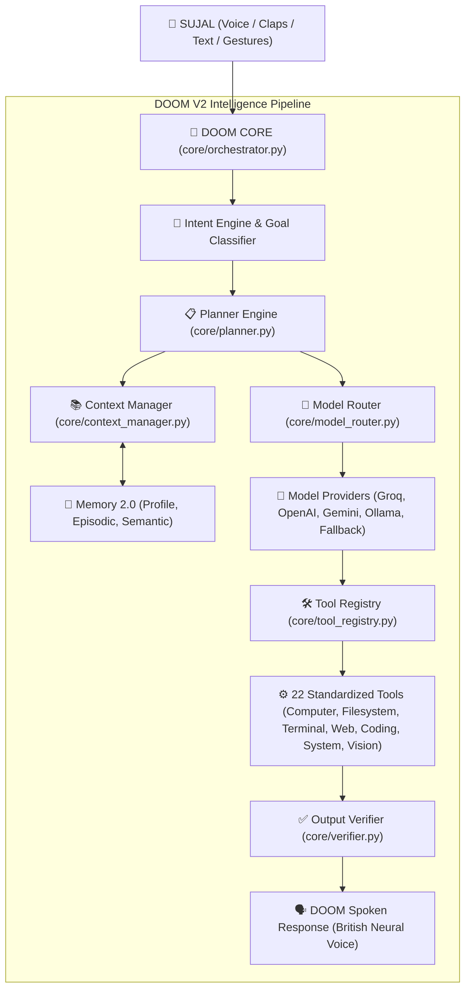

# 🤖 DOOM V2 — Personal AI OS (High-Tech Autonomous Foundation)
### *Custom Engineered for Sujal*

---

## 📌 Executive Architecture Overview

**DOOM V2** is a modular, autonomous **Personal AI Operating System** inspired by Iron Man’s **JARVIS**. Rather than hardcoding simple voice-command strings, DOOM V2 operates on a unified, high-tech intelligence pipeline:

$$\text{User Request} \longrightarrow \text{Intent Engine} \longrightarrow \text{Planner} \longrightarrow \text{Model Router} \longrightarrow \text{Tool Registry} \longrightarrow \text{Memory 2.0} \longrightarrow \text{Verifier} \longrightarrow \text{Voice Output}$$



---

## 🌟 5 Core Subsystems of DOOM V2

### 1. 🧠 DOOM Core Master Orchestrator ([`core/orchestrator.py`](file:///c:/Users/dell/Desktop/DOOM/core/orchestrator.py))
Executes the full 8-step lifecycle:
1. **Understand:** Ingests user voice/text into the short-term conversation stream.
2. **Context Assembly:** Builds dynamic prompt including Sujal's preferences, active projects, and system telemetry.
3. **Intent & Plan:** Decomposes complex goals into multi-step execution plans.
4. **Model Selection:** Routes task to the optimal LLM (Groq LLaMA 3.3 70B, GPT-4o, Gemini, Ollama, or Fallback).
5. **Tool Execution:** Executes validated tools with strict security guardrails.
6. **Observation & Verification:** Inspects tool outputs for errors and formats spoken text.
7. **Episodic Logging:** Records the entire goal, tools used, and outcome into episodic memory.
8. **Spoken Delivery:** Speaks the synthesized answer through the studio British neural voice.

---

### 2. 🛠️ Standardized Tool Registry ([`core/tool_registry.py`](file:///c:/Users/dell/Desktop/DOOM/core/tool_registry.py), [`tools/`](file:///c:/Users/dell/Desktop/DOOM/tools))
22 standardized tools with automated JSON Function-Calling schemas:

| Tool Domain | Tools Included | Capabilities |
| :--- | :--- | :--- |
| **Computer** | `computer_open_app`<br>`computer_close_app`<br>`computer_control_media`<br>`computer_stream_youtube` | Launches applications, closes processes, controls media, and streams music on YouTube |
| **Filesystem** | `filesystem_read_file`<br>`filesystem_write_file`<br>`filesystem_list_dir`<br>`filesystem_search_files` | Reads, writes, lists, and recursively searches files |
| **Terminal** | `terminal_execute` | Executes PowerShell / CMD commands with security guardrails |
| **Web** | `web_search`<br>`web_weather`<br>`web_news`<br>`web_stock_price` | Live DuckDuckGo search, weather forecasts, headlines, and stock quotes |
| **Coding** | `coding_write_script`<br>`coding_run_python` | Generates Python scripts, runs isolated code, and executes benchmarks |
| **System** | `system_get_status`<br>`system_take_screenshot`<br>`system_optimize`<br>`system_lock_pc` | Reads CPU/RAM/Disk metrics, takes screenshots, locks workstation |
| **Vision** | `vision_scan_gesture`<br>`vision_take_photo`<br>`vision_analyze_screen` | Hand gesture recognition, webcam snapshot, and display analysis |

---

### 3. 🤖 Model Router & Multi-Provider Architecture ([`core/model_router.py`](file:///c:/Users/dell/Desktop/DOOM/core/model_router.py))
* **Groq LLaMA 3.3 70B:** Ultra-fast 500 tokens/sec cloud reasoning.
* **OpenAI GPT-4o:** Complex reasoning and deep coding.
* **Google Gemini 2.0 Flash:** Fast web-grounded research.
* **Local Ollama:** 100% private offline LLM (`llama3`, `mistral`, `deepseek`).
* **Fallback Local Engine:** Rule-based instant tool dispatching with zero API keys required.

---

### 4. 💾 Memory 2.0 Subsystem ([`memory/`](file:///c:/Users/dell/Desktop/DOOM/memory))
* **User Profile (`memory/user_profile.py`):** Persistent identity for **Sujal** (Creator, Boss, and Lead AI Engineer).
* **Short-Term Memory (`memory/short_term.py`):** Multi-turn conversation sliding window buffer.
* **Episodic Memory (`memory/episodic.py`):** Logs past actions, tool invocations, and decisions with timestamps.
* **Semantic Memory (`memory/semantic.py`):** Structured facts and permanent knowledge store.

---

### 5. 🎙️ Acoustic Awakening & Sensory Subsystem
* **Acoustic Double-Clap Detector (`core/sound_detector.py`):** RMS energy peak detector triggers instant awakening on double claps (0.10s – 0.95s interval).
* **Natural Speech Recognizer (`core/listen.py`):** Non-blocking microphone listener with relaxed pause thresholds (1.0s).
* **British Neural Speech Engine (`core/cinematic_voice.py`):** Microsoft Edge-TTS studio voice (`en-GB-RyanNeural`) + ElevenLabs API support.
* **Mutual Exclusion Lock:** Prevents audio output from re-triggering the microphone.

---

## 📂 Project Directory Structure

```text
c:/Users/dell/Desktop/DOOM/
│
├── doom.py                  # 🚀 Main Interactive Terminal Runner (with Visual HUD)
├── doom_background.pyw      # 🔇 Silent Background Service (Windowless 0% CPU)
├── setup_autostart.py       # ⚙️ Windows Auto-Start Enable/Disable Manager
├── stop_doom.bat            # 🛑 1-Click Background Service Terminator
├── test_doom.py             # 🧪 6-Section Architecture Verification Suite
├── config_example.txt       # 🔑 Template for optional API keys
├── .env                     # 🔒 API Keys (Groq, OpenAI, Gemini, ElevenLabs)
│
├── core/                    # 🧠 DOOM Core Subsystem
│   ├── orchestrator.py      # 🎯 DOOMCore Master Orchestrator (8-step lifecycle)
│   ├── planner.py           # 📋 Goal Classifier & Plan Decomposition
│   ├── model_router.py      # 🔀 Multi-Model Router (Groq, OpenAI, Gemini, Ollama, Fallback)
│   ├── tool_registry.py     # 🛠️ Central Tool Registry & Schema Generator
│   ├── context_manager.py   # 📚 Context Builder (Memory 2.0 + System Telemetry)
│   ├── verifier.py          # ✅ Output Verifier & Spoken Polish
│   ├── sound_detector.py    # 👏 Acoustic Double-Clap & Peak Energy Detector
│   ├── cinematic_voice.py   # 🎙️ Studio British Edge-TTS & Voice Synthesizer
│   ├── listen.py            # 🎤 Speech Recognition & Natural Cadence Listener
│   ├── commands.py          # ⚡ Master Command Dispatcher
│   └── ui_effects.py        # 🎨 Terminal Visual HUD & Glowing Indicators
│
├── models/                  # 🤖 Model Providers
│   ├── base_provider.py     # BaseLLMProvider Abstract Interface
│   ├── groq_provider.py     # Groq LLaMA 3.3 70B Provider
│   ├── openai_provider.py   # OpenAI GPT-4o Provider
│   ├── gemini_provider.py   # Google Gemini 2.0 Provider
│   ├── ollama_provider.py   # Local Ollama Provider
│   └── fallback_provider.py # Zero-Config Local Autonomous Provider
│
├── tools/                   # ⚙️ Standardized 22-Tool Suite
│   ├── base.py              # BaseTool & ToolResult Data Structures
│   ├── computer_tools.py    # App Launching & Media Controls
│   ├── filesystem_tools.py  # File Read, Write, Search, List
│   ├── terminal_tools.py    # Safe Shell Execution
│   ├── web_tools.py         # DuckDuckGo Search, Weather, News, Stock
│   ├── coding_tools.py      # Dynamic Python Scripting & Runner
│   ├── system_tools.py      # Telemetry, Screenshot, Optimizer, Lock
│   └── vision_tools.py      # Gesture Scanner, Camera, Screen Analysis
│
├── memory/                  # 💾 Memory 2.0 Subsystem
│   ├── user_profile.py      # Sujal's Persistent Profile & Preferences
│   ├── short_term.py        # Multi-Turn Conversation Sliding Window
│   ├── episodic.py          # Action & Decision Logs with Timestamps
│   └── semantic.py          # Structured Facts & Knowledge Base
│
└── scripts/                 # 💾 Auto-Generated Python Scripts
```

---

## 🎯 Verification Results

Running `python test_doom.py` verifies all 6 subsystems:
* ✅ **Package Dependencies**
* ✅ **Memory 2.0 Subsystem** (User Profile, Short-Term, Episodic, Semantic)
* ✅ **Standardized Tool Registry** (22 Tools across all domains)
* ✅ **Model Router** (Multi-model routing & zero-key fallback)
* ✅ **DOOM Core Orchestrator** (Goal $\rightarrow$ Plan $\rightarrow$ Model $\rightarrow$ Tool $\rightarrow$ Verify $\rightarrow$ Result)
* ✅ **Voice & Acoustic Sensors** (Acoustic double-clap & British neural voice)

---

## 🚀 How to Run DOOM V2

```powershell
python doom.py
```

* **Awaken:** Double-clap 👏 or say **"Hey DOOM"** / **"Jarvis"**!
* **Try any goal:**
  * *"Open notepad"*
  * *"Who am I?"*
  * *"Write a python script to calculate Fibonacci numbers and run it"*
  * *"Weather in Mumbai"*
  * *"Play music"*
  * *"System status"*
  * *"Detect hand gesture"*

---
*Architected and engineered with ❤️ for **Sujal**.*
