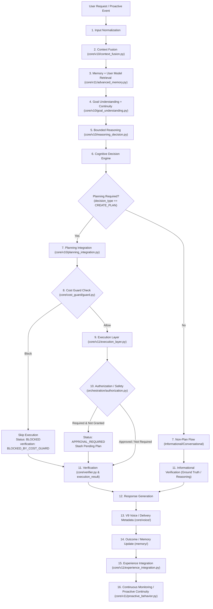

# DOOM V11.8 — End-to-End Integration Implementation Plan

## 1. Objective
The primary objective of DOOM V11.8 is **End-to-End Cognitive Integration**. V11.8 validates and ensures that the complete DOOM cognitive operating loop operates coherently, truthfully, and safely from initial user/event input through context fusion, goal understanding, reasoning, decision, planning, cost guard enforcement, plan execution, authorization gating, verification, response generation, voice delivery coordination, outcome tracking, experience recording, and proactive continuity.

V11.8 does NOT introduce new foundational execution engines, new voice DSP profiles, or alternate memory models. Instead, it bridges data contracts, propagates missing runtime identities and hashes, resolves false-failure modes in non-planning execution, and validates end-to-end scenarios under deterministic conditions.

---

## 2. Frozen Baseline
The following architectural layers remain strictly **frozen** or **accepted** and must NOT be redesigned or refactored:
- **DOOM-V8 (Historical Foundation)**: Frozen baseline (`origin/DOOM-V8`). Authorization, V8 Executor, Verifier, Goal Registry, Task Ledgers, Experience Store.
- **DOOM-V9 (Voice Architecture)**: Frozen baseline (`origin/DOOM-V9`, commit `fb8fac938f0a411801ab2595f32d3169aec09d6b`). Tactical voice profile, Kokoro bm_george, deterministic ProsodyController, DeliveryClassifier, SoundDevice output.
- **DOOM-V10 (Cognitive Core Pipeline)**: Semantically frozen baseline. Context Fusion (V10.1), Memory + User Model (V10.2), Goal Understanding (V10.3), Bounded Reasoning & Decision (V10.4), Planning Integration (V10.5).
- **V11.1 (Execution Layer)**: Accepted baseline.
- **V11.2 (Experience Integration)**: Accepted baseline.
- **V11.3 (Proactive Behavior)**: Accepted baseline.
- **V11.4 (Advanced Memory Systems)**: Accepted baseline.
- **V11.5 (Continuous Monitoring)**: Accepted baseline.
- **V11.6 (Integration & Cache Verification)**: Accepted baseline.
- **V11.7 (Safety / Verification / Cost Hardening)**: Complete / Accepted / Ready for Freeze.

All V11.8 work operates strictly within the V11 cognitive orchestrator and adjacent adapter layers without modifying earlier frozen contracts.

---

## 3. Current End-to-End Architecture

---

## 4. Actual Runtime Flow
Tracing `V11CognitiveOrchestrator.process_cognitive_cycle` in [`core/v11/cognitive_orchestrator.py`](file:///c:/Users/dell/Desktop/DOOM/core/v11/cognitive_orchestrator.py):

1. **Cycle Initiation**:
   - Generates `cycle_id = f"cycle_{int(start_time * 1000)}_{self.cycle_count}"`.
   - Initializes timing dict, provenance dict, and stages map.
2. **Context Fusion**:
   - Calls `fuse_context(request=user_input, owner_id=owner_id, session_id=session_id, language_hint=lang)`.
   - Queries `AdvancedMemorySystem` for episodic/semantic records and merges active goal, user profile, and system status into `FusedContext`.
3. **Goal Understanding**:
   - Calls `goal_understanding.understand_goal(...)`, producing `GoalUnderstandingResult` containing `GoalContinuity` (e.g., `NEW_GOAL`, `CONTINUE_GOAL`, `REFINE_GOAL`).
4. **Reasoning & Decision**:
   - Calls `reasoning_decision_integration(...)`, returning `ReasoningResult` and `DecisionResult`.
   - Evaluates `planning_required = (decision_result.decision_type == CognitiveDecisionType.CREATE_PLAN)`.
5. **Planning**:
   - If planning required, invokes `integrate_planning(...)` to produce a `PlanningResult` with a `GoalPlan`.
6. **Cost Guard**:
   - If a plan exists, builds `ResourceRequest` and evaluates `self.cost_guard.decision(request)`. If blocked, sets `skip_execution = True` and constructs a blocked execution dummy result.
7. **Execution**:
   - If not skipped, passes `planning_result` to `self.execution_layer.execute_plan(...)`.
   - If no planning was required, `ExecutionLayer` returns `_result(plan=None, status=ExecutionStatus.SUCCESS)`.
8. **Authorization**:
   - Checks `approval_required` and `approval_granted` from `execution_result`.
9. **Verification**:
   - Reads `execution_result.verification_state`. If `verification_state != "VERIFIED"`, sets `verified = False` and `overall_success = False`.
10. **Response Generation**:
    - Selects response text based on `execution_result.status`.
11. **Voice Delivery Coordination**:
    - Marks stage metadata for V9 delivery profiling and prosody control.
12. **Outcome & Experience**:
    - Sets outcome tracking metadata and invokes `self.experience_integration.integrate_execution_result(...)` to persist a `GoalExperience` record.

---

## 5. Integration Gaps Discovered

| ID | Component | Current Behavior | Expected Behavior | Downstream Impact | Severity | Planned Resolution |
| :--- | :--- | :--- | :--- | :--- | :--- | :--- |
| **GAP-01** | `core/v11/cognitive_orchestrator.py` & `execution_layer.py` | Non-planning cycles (Scenario A/B) produce `ExecutionResult` with empty `verification_state = ""`, causing Stage 11 to treat it as `NOT_VERIFIED` and forcing `overall_success = False`. | Informational / non-execution cycles should be truthfully verified against reasoning/understanding ground truth or assigned an explicit verified status (e.g. `VERIFIED`). | **All conversational and informational requests fail with `overall_success = False`.** | **CRITICAL** | Update `ExecutionLayer` non-plan result generation and Stage 11 verification handler to verify informational cycles truthfully without requiring tool execution. |
| **GAP-02** | `core/v11/cognitive_orchestrator.py` (Stage 12) | When `execution_result.status == SUCCESS` but `response_text` is empty (non-plan query), it outputs `"I have successfully executed the plan for your request. Execution ID: ..."` | For non-plan requests, response text should convey the informational answer or reasoning summary (e.g., from `reasoning_result.reasoning_summary` or direct answer). | Confusing, untruthful user-facing response stating a plan was executed when no plan was formed. | **HIGH** | In Stage 12, branch between plan execution success and informational/conversational response generation. |
| **GAP-03** | `core/v11/cognitive_orchestrator.py` & `experience_integration.py` (Stage 15) | `ExperienceIntegration` is called unconditionally on every cycle, even when `planning_result.plan is None`. It creates dummy experiences (`Execution <id>`) for pure conversational chit-chat and fails if store is unavailable. | `GoalExperience` records should only be created for actual goal plan executions, or non-plan cycles should not fail the pipeline if experience capture is bypassed or unavailable. | Pollution of experience memory with junk chitchat records; cycle failure if store returns unavailable. | **HIGH** | Guard experience integration to only trigger on actual goal executions (`if planning_result.planning_required and planning_result.plan is not None`), or record non-plan queries cleanly as informational interactions. |
| **GAP-04** | `core/v11/execution_layer.py` | `execute_plan` hardcodes `authorized_plan_hash=""` and `computer_session_id=""`. It does not accept or propagate an approved hash or session. | `execute_plan` must accept optional `authorized_plan_hash` and `computer_session_id` and pass them to V8 `execute_plan`. | Approved plans requiring authorization can never actually execute because the executor sees an empty authorized hash and rejects with `APPROVAL_REQUIRED`. | **CRITICAL** | Add `authorized_plan_hash: str = ""` and `computer_session_id: str = ""` arguments to `ExecutionLayer.execute_plan` and `V11CognitiveOrchestrator.process_cognitive_cycle`. |
| **GAP-05** | `core/v11/cognitive_orchestrator.py` (Stage 10) | When execution returns `ExecutionStatus.APPROVAL_REQUIRED`, the pending plan is not stashed into `_PENDING` via `stash_pending_plan`. | The unapproved plan should be stashed so that a pending authorization claim ID (`pending_id`) is available for subsequent approval. | Users / tests cannot claim authorization because no `pending_id` is generated or returned in the cycle response. | **HIGH** | In Stage 10, when `APPROVAL_REQUIRED` is encountered, call `stash_pending_plan(plan, identity)` and include `pending_id` in response/provenance. |
| **GAP-06** | `core/v11/cognitive_orchestrator.py` & `core/v10/context_fusion.py` | `process_cognitive_cycle(..., context=context)` accepts external context (e.g., from proactive monitor `monitoring_trigger=True`), but `fuse_context` drops the `context` parameter. | `fuse_context` should accept optional external context dictionary and merge non-sensitive keys into `FusedContext`. | Proactive triggers and background monitor events lose their trigger metadata during context fusion. | **MEDIUM** | Enable context fusion to accept and preserve caller-provided `context` dict safely in `FusedContext`. |
| **GAP-07** | `core/v11/cognitive_orchestrator.py` (Stage 14) | Stage 14 (Outcome / Memory Update) only records timing and a boolean flag; it does not update the active goal state or record episodic outcome. | Stage 14 should update the goal registry / episodic memory with the cycle outcome. | Lack of goal continuity memory across consecutive turns in a multi-turn session. | **MEDIUM** | Wire Stage 14 to record cycle summary into active goal state and episodic memory. |
| **GAP-08** | `core/v11/cognitive_orchestrator.py` (Stage 13) | Stage 13 has dummy voice timing without calling V9 delivery classification or prosody calculation. | Stage 13 should compute deterministic delivery category and prosody settings using V9 components without playing live audio. | Voice delivery metadata is not populated for downstream clients or voice dispatchers. | **LOW** | Hook `classify_response_category` and `ProsodyController` into Stage 13 to populate public delivery metadata deterministically. |

---

## 6. End-to-End Scenarios

### Scenario A — Simple Conversational Request
- **Input**: `"What is the capital of France?"`, `owner_id="user_1"`, `session_id="sess_1"`
- **Flow**:
  1. Input Normalization $\to$ Context Fusion (language="en", empty active goal).
  2. Memory Retrieval $\to$ No active plan needed.
  3. Goal Understanding $\to$ Intent: `CONVERSATION` / `QUERY`, Continuity: `NO_ACTIVE_GOAL`.
  4. Reasoning & Decision $\to$ Decision: `ANSWER_DIRECTLY`, `planning_required=False`.
  5. Cost Guard $\to$ Skipped (no external/computational resources requested).
  6. Execution Layer $\to$ Informational pass-through (`plan=None`).
  7. Authorization $\to$ Not required.
  8. Verification $\to$ Verified as ground truth / direct answer.
  9. Response Generation $\to$ Direct truthful response (e.g., Paris).
  10. Outcome / Experience $\to$ Conversational turn recorded; experience store bypassed.
- **Expected State**: `result["success"] == True`, `stages["planning"]["planning_required"] == False`, `stages["verification"]["verified"] == True`.
- **Safety Requirements**: No disk mutation, no execution authorization requested, HARD $0 preserved.
- **Expected Result**: Truthful answer returned, cycle marked successful.

---

### Scenario B — Goal-Establishing Request
- **Input**: `"I want to organize my project workspace files"`, `owner_id="user_1"`, `session_id="sess_1"`
- **Flow**:
  1. Context Fusion $\to$ Identifies user intent.
  2. Goal Understanding $\to$ Continuity: `NEW_GOAL`, normalized intent: `FILESYSTEM` or `PLAN`.
  3. Reasoning & Decision $\to$ Evaluates scope, decides `CREATE_PLAN`.
  4. Planning $\to$ Generates `GoalPlan` with goal ID and plan steps.
  5. Cost Guard $\to$ Evaluates local compute request (allowed under `LOCAL_FREE`).
  6. Response Generation $\to$ Confirms goal and plan formation.
- **Expected State**: `result["success"] == True`, `stages["planning"]["planning_successful"] == True`, `goal_understanding_result.continuity == "NEW_GOAL"`.
- **Safety Requirements**: Valid plan hash, bounded step timeouts, no unapproved execution.
- **Expected Result**: Plan created, active goal registered.

---

### Scenario C — Planning + Execution Request (Safe Local Action)
- **Input**: Plan execution with authorized safe step (e.g., `system_read` or safe observation).
- **Flow**:
  1. Planning produces validated `GoalPlan`.
  2. Cost Guard checks local provider $\to$ `ALLOW`.
  3. Execution Layer invokes V8 executor with valid `ExecutionIdentity`.
  4. Action completes $\to$ V8 executor verifies step $\to$ `status = SUCCESS`, `verification_state = "VERIFIED"`.
  5. Verification stage evaluates execution verification $\to$ `verified = True`.
  6. Response generated with execution ID.
  7. Experience integration records `Outcome.COMPLETED`.
- **Expected State**: `result["success"] == True`, `execution_result.status == ExecutionStatus.SUCCESS`, `experience_result.status == ExperienceResultStatus.OK`.
- **Safety Requirements**: Owner-scoped execution ledger, zero paid resources.
- **Expected Result**: Complete executed plan with verified outcome and recorded experience.

---

### Scenario D — Cost-Blocked Request
- **Input**: Plan requesting external cloud resource or paid capability (e.g. `provider="cloud_paid"`, `cost_class="PAID"`).
- **Flow**:
  1. Planning succeeds.
  2. Cost Guard evaluates request $\to$ `decision.is_allow == False` (`CostReason.PAID_PROVIDER_BLOCKED`).
  3. Execution Layer is completely bypassed (`skip_execution = True`).
  4. Blocked execution result returned with `verification_state = "BLOCKED_BY_COST_GUARD"`.
  5. Authorization is skipped.
  6. Verification marks `verified = False` (or truthfully reports blocked state).
  7. Response Generation explains cost guard rejection truthfully.
  8. `result["success"] == False`.
- **Expected State**: `stages["cost_guard_check"]["skip_execution"] == True`, executor was never invoked.
- **Safety Requirements**: HARD $0 strictly enforced; no secret leakage in error text.
- **Expected Result**: Truthful cost rejection response; execution halted.

---

### Scenario E — Authorization-Required Request (Two-Phase Approval)
- **Phase 1 (Creation & Hold)**:
  - Plan contains medium-risk computer action (e.g. `computer.CLICK`).
  - Cost Guard allows local compute.
  - Execution Layer invokes V8 executor without authorized hash $\to$ returns `ExecutionStatus.APPROVAL_REQUIRED`.
  - Stage 10 stashes pending plan $\to$ returns `pending_id` and `plan_hash`.
  - Response informs user that authorization is required.
  - `result["success"] == False` (pending authorization).
- **Phase 2 (Authorized Execution)**:
  - Caller claims authorization with `claim_authorization(pending_id, identity)`.
  - Follow-up cycle executes with `authorized_plan_hash`.
  - Executor validates `authorized_plan_hash == plan.plan_hash` $\to$ executes action $\to$ `ExecutionStatus.SUCCESS`.
- **Expected State**: Phase 1 yields `APPROVAL_REQUIRED`; Phase 2 yields `SUCCESS`.
- **Safety Requirements**: Plan hash tamper-detection; authorization TTL expiration.

---

### Scenario F — Execution Failure Containment
- **Input**: Step execution encounters a simulated failure (e.g., target UI element missing or filesystem path invalid).
- **Flow**:
  1. Execution Layer runs step $\to$ step fails $\to$ `ExecutionStatus.FAILED` or `STEP_FAILED`.
  2. Verification reflects `verification_state = "STEP_FAILED"`.
  3. Stage 11 marks `verified = False`, setting `overall_success = False`.
  4. Response generation reports failure truthfully without fabricating success.
  5. Experience integration records `Outcome.ABANDONED` with blocker details.
- **Expected State**: `result["success"] == False`, `result["stages"]["execution"]["execution_result"].status != SUCCESS`.
- **Safety Requirements**: No unhandled exceptions escaping; failure truthfully persisted in experience.

---

### Scenario G — Follow-Up Request Using Previous Context & Experience
- **Turn 1**: Executes goal $\to$ records experience with key tags and outcome in experience store.
- **Turn 2**: Follow-up request referencing the prior goal (e.g., `"How did the backup go?"`).
  - Context Fusion retrieves previous turn's goal state and recent experiences via `AdvancedMemorySystem`.
  - Goal Understanding identifies `CONTINUE_GOAL` or `REFINE_GOAL`.
  - Reasoning accesses prior experience outcomes in `FusedContext`.
  - Response correctly reflects continuity.
- **Expected State**: `fused_context` contains prior goal ID and experiences; `goal_understanding_result.continuity in ("CONTINUE_GOAL", "REFINE_GOAL")`.

---

### Scenario H — Proactive Event Continuation
- **Trigger**: Continuous monitoring background event (e.g. `MonitoringEventType.STATE_CHANGE` from `proactive_behavior.py`).
- **Flow**:
  1. Continuous monitor creates event and calls `process_v11_cognitive_cycle(..., context={"monitoring_trigger": True, ...})`.
  2. Context Fusion absorbs monitoring metadata into `fused_context`.
  3. Normal cognitive pipeline runs (Goal Understanding $\to$ Reasoning $\to$ Cost Guard $\to$ Execution $\to$ Verification).
  4. Action is fully bounded by rate limiters and cooldowns in `proactive_behavior.py`.
- **Expected State**: Proactive event processed through identical safety chain without bypassing Cost Guard or Authorization.

---

## 7. Integration Test Architecture

Tests will be placed in a dedicated test suite:
`test_v11_8_end_to_end_integration.py`

### Testing Characteristics:
- **No Paid APIs / No Cloud Dependencies**: Tests run locally and offline under HARD $0.
- **No Live Audio / No STT Activation**: Audio output is validated via V9 delivery/prosody metadata fixtures without playing real speaker audio.
- **Browser Automation OFF**: No Selenium/Playwright drivers instantiated.
- **Deterministic In-Memory State**: Uses `use_test_experience_store(True)` and `reset_authorization_store_for_tests()`.
- **Test Matrix**:
  1. `test_e2e_scenario_a_conversational_informational`: Validates non-plan informational queries succeed end-to-end.
  2. `test_e2e_scenario_b_goal_establishment`: Validates goal formation and plan generation.
  3. `test_e2e_scenario_c_plan_execution_success`: Validates successful local plan execution with mock adapter and truthful verification.
  4. `test_e2e_scenario_d_cost_guard_block`: Validates paid resource rejection halts execution before executor.
  5. `test_e2e_scenario_e_authorization_flow`: Validates two-phase approval (denial/stash $\to$ claim $\to$ execution).
  6. `test_e2e_scenario_f_execution_failure_truthfulness`: Validates failed steps do not fabricate success.
  7. `test_e2e_scenario_g_context_continuity`: Validates multi-turn context and experience recall.
  8. `test_e2e_scenario_h_proactive_monitoring_cycle`: Validates proactive event ingestion through standard pipeline.

---

## 8. Failure & Recovery Tests

The test suite will explicitly assert truthfulness across edge cases:
1. **Cost Denial Truthfulness**: Assert `overall_success == False` and verify executor was never called.
2. **Authorization Denial Truthfulness**: Assert unapproved high-risk steps cannot execute.
3. **Execution Exception Containment**: When an adapter raises an unexpected exception, verify the orchestrator catches it, populates `result["error"]`, and returns `overall_success == False`.
4. **Verification Failure Truthfulness**: When execution completes but verification fails, verify `overall_success` remains `False`.
5. **Session & Owner Mismatch**: Mismatched `owner_id` between context fusion and execution must raise `OwnerMismatchError` or reject.
6. **Plan Hash Tampering**: A plan modified after planning must fail with `PLAN_HASH_MISMATCH`.
7. **Experience Store Unavailable**: Failure in experience persistence must not corrupt the cycle or crash the process.

---

## 9. Security & Safety Validation

V11.8 strictly enforces:
- **HARD $0 Recurring Cost**: All operations are restricted to `LOCAL_FREE`. Any external paid endpoint is blocked by Cost Guard.
- **Owner & Session Scoping**: All cache keys, experience records, active goals, and execution ledgers include `owner_id` and `session_id`.
- **Zero Browser Automation**: Policy flag remains permanently disabled.
- **Secret Filtering**: Passwords, tokens, cookies, and authorization claims are scrubbed from experience notes and logs via regex patterns in `orchestration/experience/policy.py`.
- **Truthful Verification**: Verification state is derived exclusively from execution facts or ground truth.

---

## 10. Performance & Reliability Validation

- **Latency Tracking**: Every stage records `time_ms` in `result["timing"]`. Total cycle latency `total_time_ms` is validated to be bounded (< 1000ms for non-planning queries, < 2500ms for mock plan execution).
- **Context Caching Benefit**: Repeated context fusion requests with identical state utilize the V11.6 context cache.
- **Resource Growth**: Ensure memory records, active goals, and ledgers respect defined caps (`MAX_EXPERIENCES_PER_OWNER = 1000`, `MAX_CONTEXT_KEYS = 50`).

---

## 11. Files Expected to Change

During implementation (in a subsequent session), changes will be strictly restricted to:

1. [`core/v11/cognitive_orchestrator.py`](file:///c:/Users/dell/Desktop/DOOM/core/v11/cognitive_orchestrator.py):
   - Fix Stage 11 verification logic to properly verify informational / non-planning cycles.
   - Fix Stage 12 response generation to provide truthful conversational answers for non-plan queries.
   - Fix Stage 15 to cleanly handle experience integration for plan vs non-plan queries.
   - Accept and propagate `authorized_plan_hash` and `computer_session_id`.
   - Propagate external `context` into `fuse_context`.
   - Stash pending plans on `APPROVAL_REQUIRED` in Stage 10.
2. [`core/v11/execution_layer.py`](file:///c:/Users/dell/Desktop/DOOM/core/v11/execution_layer.py):
   - Update `_create_execution_result_from_planning_result` to populate `verification="VERIFIED"` and proper response text for non-plan outcomes.
   - Support `authorized_plan_hash` and `computer_session_id` parameters in `execute_plan`.
3. [`core/v10/context_fusion.py`](file:///c:/Users/dell/Desktop/DOOM/core/v10/context_fusion.py):
   - Allow optional `context: Optional[Dict[str, Any]] = None` in `fuse_context` to absorb caller-supplied metadata.
4. `test_v11_8_end_to_end_integration.py` (New test suite):
   - Contains end-to-end integration tests for Scenarios A through H.

*(No files in V8 or V9 will be modified. V10 semantic invariants will be preserved.)*

---

## 12. Implementation Sequence

The planned sequence for V11.8 implementation:

1. **Step 1: Contract Normalization for Informational Cycles (GAP-01, GAP-02, GAP-03)**
   - Update `core/v11/execution_layer.py` to return properly verified, informative `ExecutionResult` when no plan is required.
   - Update `core/v11/cognitive_orchestrator.py` Stage 11 (Verification), Stage 12 (Response), and Stage 15 (Experience) to handle non-planning queries cleanly.
   - Validate with `core/v11/test_v11_cognitive_orchestrator.py` to ensure all 5 tests pass cleanly.

2. **Step 2: Authorization & Execution Identity Propagation (GAP-04, GAP-05)**
   - Update `ExecutionLayer.execute_plan` and `V11CognitiveOrchestrator.process_cognitive_cycle` to accept and pass `authorized_plan_hash` and `computer_session_id`.
   - Stash pending plans upon `APPROVAL_REQUIRED` so they can be claimed and approved.

3. **Step 3: Context & Event Trigger Integration (GAP-06, GAP-07, GAP-08)**
   - Pass caller `context` through to `fuse_context` in `core/v10/context_fusion.py`.
   - Populate V9 voice classification and prosody metadata deterministically in Stage 13.

4. **Step 4: Comprehensive End-to-End Test Suite Creation**
   - Write `test_v11_8_end_to_end_integration.py` covering Scenarios A through H and failure/recovery modes.

5. **Step 5: Full Regression & Safety Verification**
   - Run `test_v11_7_safety.py`, `test_v11_6_cache_verification.py`, `test_v11_5_continuous_monitoring.py`, and `test_v11_8_end_to_end_integration.py`.
   - Confirm zero cost regressions and zero security boundary violations.

6. **Step 6: Final Documentation & V11.8 Acceptance Report**
   - Produce `V11.8_FINAL_ACCEPTANCE_REPORT.md`.

---

## 13. Acceptance Criteria

| # | Acceptance Criterion | Verification Method |
| :--- | :--- | :--- |
| **AC-1** | All 8 End-to-End Scenarios (A through H) pass deterministically. | Automated test run of `test_v11_8_end_to_end_integration.py`. |
| **AC-2** | Conversational and informational requests complete with `result["success"] == True` and truthful responses without claiming plan execution. | Assert `test_e2e_scenario_a_conversational_informational` passes. |
| **AC-3** | Plans requiring approval halt at `APPROVAL_REQUIRED`, return a stashed claim reference, and execute successfully when authorized with `authorized_plan_hash`. | Assert `test_e2e_scenario_e_authorization_flow` passes. |
| **AC-4** | Cost Guard strictly halts paid resources before executor invocation, maintaining HARD $0. | Assert `test_e2e_scenario_d_cost_guard_block` passes. |
| **AC-5** | Execution failures and verification failures truthfully report `overall_success == False`. | Assert `test_e2e_scenario_f_execution_failure_truthfulness` passes. |
| **AC-6** | Multi-turn goal continuity and experience recall function across successive turns. | Assert `test_e2e_scenario_g_context_continuity` passes. |
| **AC-7** | Existing V11 test suites (`test_v11_7_safety.py`, `test_v11_6_cache_verification.py`, `test_v11_5_continuous_monitoring.py`, `core/v11/test_v11_cognitive_orchestrator.py`) continue to pass without regression. | Regression test suite execution. |
| **AC-8** | Zero modifications to V8 foundation or frozen V9 voice engine. | `git diff --name-only origin/DOOM-V10` inspection. |

---

## 14. Explicit Non-Goals
- **No Browser Automation**: Browser automation remains OFF.
- **No Paid Cloud APIs**: No OpenAI, Anthropic, or external paid TTS/STT services.
- **No STT Changes**: Local Whisper pipeline remains frozen.
- **No V9 Voice Profile Redesign**: Tactical voice profile and parameters remain unchanged.
- **No Long-Session Benchmarking**: Long-session degradation and stress testing belong to V11.9.
- **No Final Freeze Commit**: Version freeze belongs to V11.10.

---

## 15. Risks & Dependencies
- **Risk 1: V10 Context Fusion Signature Invariance**: `fuse_context` is used across earlier V10 tests.
  - *Mitigation*: Ensure any new parameters (e.g. `context: Optional[Dict] = None`) have default values of `None` to preserve 100% backward compatibility.
- **Risk 2: Postgres Connection in Test Environments**: Without a live PostgreSQL database, `create_experience` might fail if test store is not active.
  - *Mitigation*: V11.8 integration tests must activate `use_test_experience_store(True)` or gracefully handle in-memory persistence.
- **Risk 3: Accidental Voice Engine Activation**: Running `process_cognitive_cycle` must not attempt to open real audio device streams in automated tests.
  - *Mitigation*: Stage 13 computes delivery metadata without calling `VoiceEngine.synthesize()` or `SoundDeviceOutput.play()`.

---

## 16. Rollback / Failure Strategy
- All V11.8 modifications are isolated to `core/v11/` orchestrator/execution adapters and `test_v11_8_end_to_end_integration.py`.
- If integration introduces unforeseen regressions in V11.7 safety or earlier suites, changes can be rolled back without impacting V8, V9, or accepted V10/V11 baselines.
